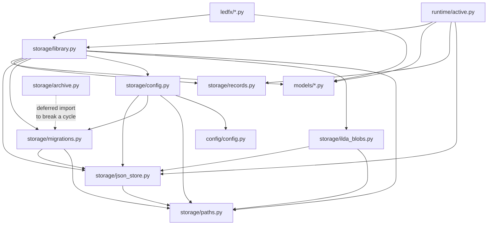
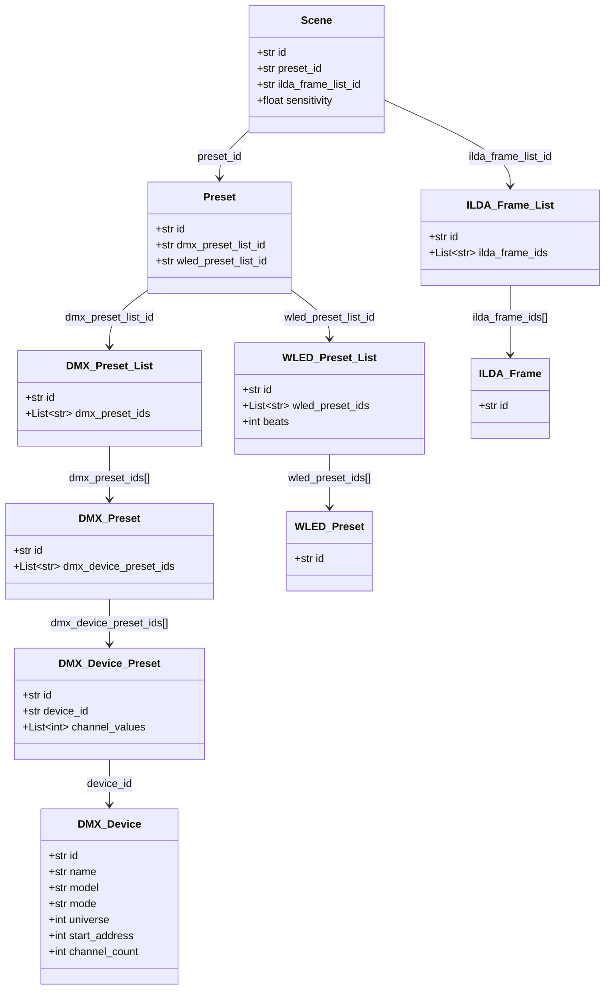
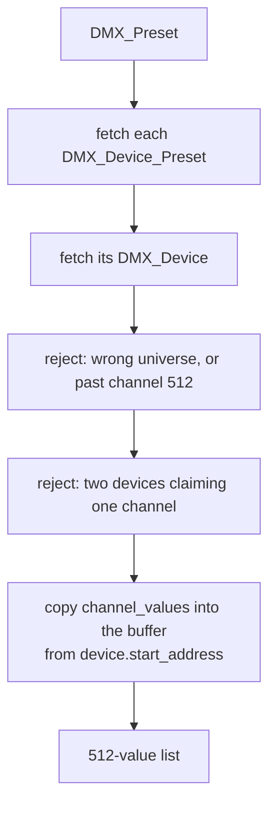
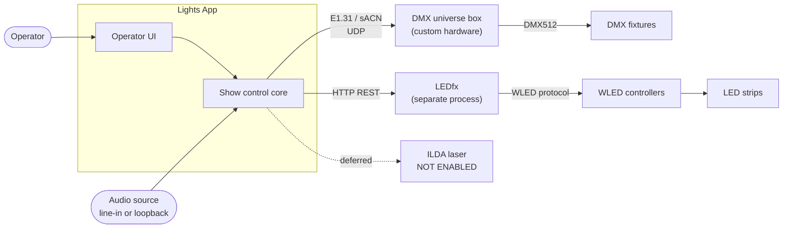
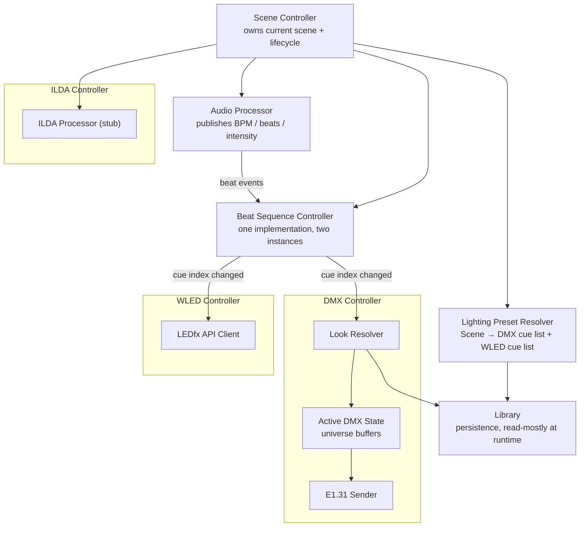
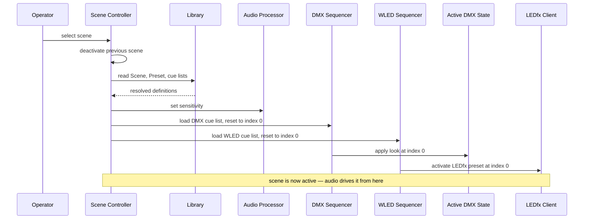
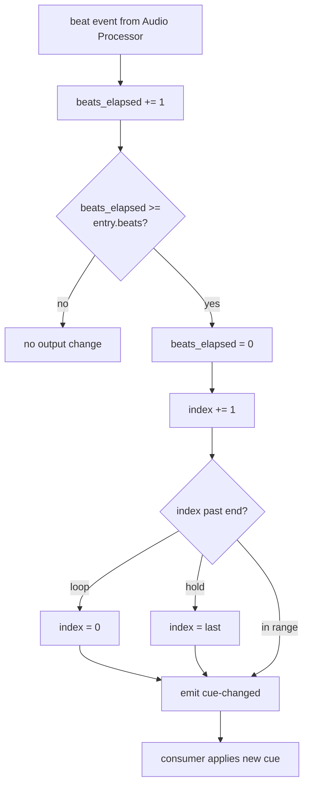
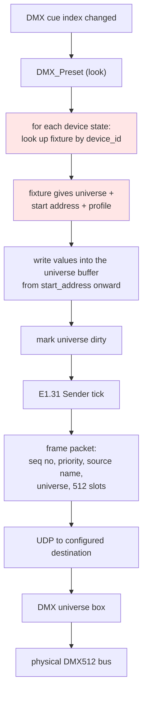
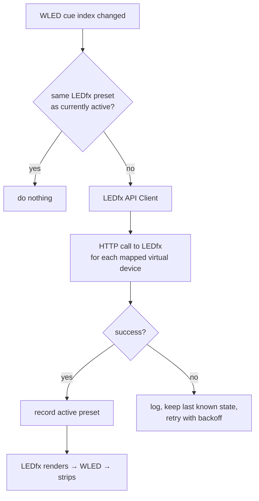
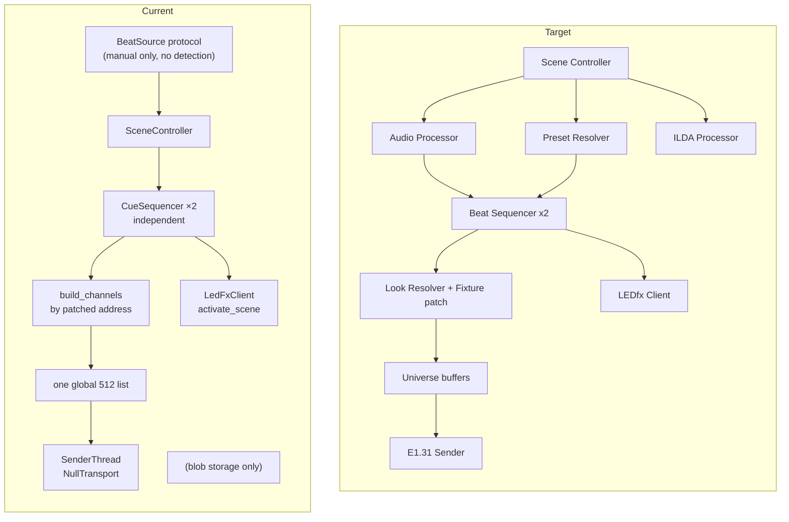

# Architecture

The primary architecture document. Assumes the terminology defined in
[project_overview.md](project_overview.md#key-terminology).

Throughout, **Current** describes code that exists in the repository today and
**Target** describes proposed design that does not. Sections marked Target have not
been implemented; show-control core modules are Current — see
[show_control_architecture.md](show_control_architecture.md).

---

## 1. Architectural goals

1. A scene selection must never construct a network packet directly. Layers between
   them are what make the system testable.
2. Audio processing publishes *timing*. It does not decide what any light does.
3. DMX and WLED must share one beat-sequencing concept, not two parallel
   implementations that drift.
4. Stable definitions (scenes, looks, cue lists, fixtures, network config) are
   persisted. High-frequency runtime state (universe buffer, cue index, beat count)
   is never written to disk.
5. Every hardware-touching component must be runnable against a null/simulated
   implementation so the show can be developed without the rig powered on.
6. Optimize for one basement installation. Generality is a later concern —
   see [decisions.md](decisions.md#d-010-basement-reliability-outranks-generality).

---

## 2. Current architecture

### 2.1 What physically exists

```text
backend/
├── config/
│   └── config.py            Compile-time defaults; seeds LedfxConfig in AppConfig
├── ledfx/
│   ├── client.py            HTTP adapter + NullLedFxClient
│   ├── scene_sync.py        Polls LEDfx; upserts WLED_Preset names
│   └── service.py           build_ledfx_stack factory
├── logging_setup.py         File + stderr logging into data-folder logs/
├── models/                  Runtime pydantic models (11 files)
│   ├── Scene.py             optional ilda_frame_list_id; sensitivity bounded 0–1
│   ├── Preset.py            wled_preset_list_id → WLED_Preset_List
│   ├── DMX_Preset_List.py   cue list + beats per entry
│   ├── DMX_Preset.py
│   ├── DMX_Device_Preset.py device_id + channel_values
│   ├── DMX_Device.py        the patch: universe, start_address, channel_count
│   ├── WLED_Preset.py       id = LEDfx scene name
│   ├── WLED_Preset_List.py  cue list + beats per entry
│   ├── ILDA_Frame_List.py
│   ├── ILDA_Frame.py
│   ├── Active_DMX_Channels.py
│   └── Active_ILDA_Frame.py  unreferenced; laser path severed
├── audio/
│   └── beat_source.py       BeatSource protocol + ManualBeatSource
├── runtime/
│   ├── active.py            Universe buffer + look flattening by address
│   ├── sequencer.py         CueSequencer: pure beat-driven state machine
│   ├── outputs.py           DmxOutput / WledOutput behind one apply()
│   └── scene_controller.py  Owns the active scene and both sequencers
├── seed_devices.py          Seeds the rig's patch into the library
└── storage/
    ├── paths.py             Data-folder layout, platformdirs
    ├── json_store.py        Atomic write, corrupt-file quarantine
    ├── records.py           On-disk schemas + the reference graph (10 collections)
    ├── library.py           In-memory object graph, CRUD, integrity, cascade
    ├── migrations.py        Schema v4; v3→v4 adds cue-list beats, clamps sensitivity
    ├── ilda_blobs.py        .ild file storage, id validation
    ├── config.py            AppConfig (dmx/ledfx/ilda/audio/ui)
    └── archive.py           Zip export/import with traversal guards

tests/                       pytest suite: storage, sequencing, outputs (temp data root)
pytest.ini                   pythonpath = backend
```

There is no `__init__.py` anywhere. Imports are absolute from the `backend/`
directory (`from models.Scene import Scene`). `pytest.ini` sets `pythonpath = backend`
for tests; see [platform_support.md](platform_support.md#import-root).

### 2.2 Current module dependency graph



Dependency direction is clean and acyclic. The one latent cycle
(`archive` ↔ `migrations`) is broken with a deliberate function-local import and
documented in place at [`archive.py:71`](../backend/storage/archive.py#L71). This
is a genuine strength — see [audit_findings.md](audit_findings.md#confirmed-strengths).

### 2.3 Current data model



This graph is declared once, canonically, in
[`storage/records.py`](../backend/storage/records.py) as the `REFERENCES` table and
is what drives integrity checks, cascade delete, orphan pruning and referrer lookup.
Encoding the schema as data rather than as traversal code is the strongest design
decision in the repository.

`dmx_devices` is a **root collection** alongside `scenes` and `ilda_frames`: the rig's
patch exists whether or not a look references it, so orphan pruning must leave a
newly-added device alone.

Remaining structural gaps:

- **Beat duration is per cue list, not per entry.** `DMX_Preset_List.beats` and
  `WLED_Preset_List.beats` each apply to every entry in their list, so a list cannot hold
  one look for 16 beats and the next for 4 ([AF-H02](audit_findings.md#af-h02)).
- **No loop-mode field.** `CueSequencer` supports hold-last, but nothing persists the
  choice, so every list loops.
- **One universe only.** `DMX_Device.universe` is persisted, but
  [`runtime/active.py`](../backend/runtime/active.py) buffers universe 1 and rejects
  anything else rather than silently dropping it.

### 2.4 Current DMX address derivation

From [`build_channels`](../backend/runtime/active.py):



**A device's start address comes from its own `DMX_Device` record**, so the patch is
stored once and every look resolves against it. `channel_values` is padded or truncated
to the device's `channel_count`, so a look that disagrees with the patch cannot spill
into a neighbour.

This replaced positional derivation, where a device's address was the sum of the
`channel_count` of every device before it in the look — finding
[AF-H01](audit_findings.md#af-h01), now resolved. What that fixed:

| Was | Now |
| --- | --- |
| The same fixture was a different row in every look, with no shared key | One `DMX_Device` per fixture, referenced by every look |
| The patch was implicitly restated in every look | Stored once, checkable against what is dialled into the fixtures |
| Changing one `channel_count` silently re-addressed every later device, in that look only | Addresses are independent; a channel-count change affects one device |
| Address gaps were inexpressible; devices had to be contiguous | Gaps are ordinary — the rig has one at channel 24 |
| Two devices overlapping silently overwrote each other | Overlap raises `StorageError` naming both devices and the channel |

Still open: **one universe.** `Active_DMX_Channels` is a single 512-value list, and a
device patched to any other universe is rejected rather than buffered.

### 2.5 Current runtime state

Runtime state now has three distinct homes, which is the division
[show_control_architecture.md](show_control_architecture.md#1-the-four-kinds-of-state)
sets out:

| State | Owner | Lifetime |
| --- | --- | --- |
| Universe buffer | `active_dmx_channels` in [`runtime/active.py`](../backend/runtime/active.py) | Process |
| Sequence state (index, beats elapsed) | One `CueSequencer` per cue list | One activation |
| Active scene | `SceneController` | One activation |

None of it is persisted (`Active_DMX_Channels` is absent from `RECORD_TYPES`). What is
still wrong:

- The universe buffer is a **process global with no owner, no lifecycle, and no
  locking**. `DmxOutput` accepts an injected buffer, which is what the tests use, but
  the module-level default remains and becomes a data race the moment a real beat source
  brings its own thread — [AF-M03](audit_findings.md#af-m03).
- `DmxOutput.apply` **replaces** `.channels` with a freshly built list rather than
  mutating it. A consumer holding the model object sees updates; one that cached
  `.channels` directly does not. This also happens to make the swap atomic under
  CPython's GIL — a useful accident, not a designed guarantee.
- `active_ilda_frame` is **gone**, along with the ILDA resolution functions. The laser
  path no longer exists in the runtime; see
  [laser_and_haze_safety.md](laser_and_haze_safety.md).

### 2.6 Current persistence boundaries

| State | Where it lives today | Correct? |
| --- | --- | --- |
| Scenes, presets, cue lists, device states | JSON in `data/*.json` | Yes |
| App config (dmx/wled/ilda/audio/ui) | `config.json` | Yes |
| `.ild` blobs | `ilda/*.ild`, id = filename | Yes |
| Universe buffer | Module global, never written | Yes |
| Active ILDA frame | Module global, never written | Yes |
| Cue index, beat count, BPM | *does not exist* | n/a |
| `ui.last_scene_id` | `config.json` | Borderline — this is session state in the config file. Acceptable for a single-operator app; noted as [AF-L03](audit_findings.md#af-l03). |

The separation is already correct in principle. One violation of read/write
purity: `Library.load()` calls `sync_ilda_folder(persist=True)`, so **opening the
library writes files** ([`library.py:134-135`](../backend/storage/library.py#L134-L135),
[`library.py:449-451`](../backend/storage/library.py#L449-L451)). See
[AF-M05](audit_findings.md#af-m05).

---

## 3. Target architecture

### 3.1 System context



The two transports are independent and must not be conflated: **E1.31 carries DMX
universe data; LEDfx owns everything about WLED output.** The application never
generates WLED pixel data — see
[wled_ledfx_architecture.md](wled_ledfx_architecture.md).

### 3.2 Target component boundaries



**Component responsibilities** (all Target; none exist today):

| Component | Owns | Must not |
| --- | --- | --- |
| Scene Controller | Current scene, activate/deactivate, propagating sensitivity | Know about channels, packets, or HTTP |
| Audio Processor | BPM, beat events, intensity, silence detection | Know about fixtures, presets, or devices |
| Lighting Preset Resolver | Turning `Scene` → concrete cue lists via `Library` | Cache runtime sequence state |
| Beat Sequence Controller | Cue index, beats elapsed, loop/reset rules | Know whether it drives DMX or WLED |
| Look Resolver | Turning a `DMX_Preset` + fixture patch → channel writes | Own the buffer or the socket |
| Active DMX State | Universe buffers, dirty tracking | Perform I/O |
| E1.31 Sender | Packet framing, sequence numbers, cadence, socket lifecycle | Interpret presets or fixtures |
| LEDfx API Client | HTTP calls, retry, dedup, connection state | Decide *when* to change preset |
| ILDA Processor | Frame handling behind an explicit safety gate | Emit anything until the gate exists |

The critical rule: **the Beat Sequence Controller is one class instantiated twice**
(once per cue list), not two implementations. Duplicating it is how DMX and WLED
sequencing drift apart. See
[decisions.md](decisions.md#d-003-dmx-and-wled-share-one-beat-sequencing-implementation).

### 3.3 Target scene activation flow



Deactivation must be explicit and deterministic: reset both sequencer indices,
clear beat counters, and decide the DMX blackout policy. The repository defines
none of this today — see
[show_control_architecture.md](show_control_architecture.md#3-scene-lifecycle).

### 3.4 Target beat-driven sequencing



The consumer differs (universe buffer write vs. LEDfx HTTP call) but the state
machine above is identical and belongs in one place. Note it emits on *change
only* — a beat that does not advance the index must not produce an HTTP call. See
[wled_ledfx_architecture.md](wled_ledfx_architecture.md#61-call-deduplication).

### 3.5 Target DMX / E1.31 output flow



Steps shaded red do not exist. Today the chain resolves looks by patched address
into one 512-value list, marks it dirty, and wakes
[`runtime/sender.py`](../backend/runtime/sender.py), which calls `NullTransport`.
Packet framing, sequence numbers, and UDP are still Target. Details and the open
questions on cadence, unicast/multicast, priority, and sequence numbering are in
[fixture_and_transport_strategy.md](fixture_and_transport_strategy.md).

### 3.6 Target WLED / LEDfx flow



The application's responsibility ends at "tell LEDfx which preset to run". It does
not generate pixels and must not be documented as doing so.

### 3.7 Current versus target, side by side



---

## 4. Known architectural debt

Full detail with severities in [audit_findings.md](audit_findings.md). Summary:

| # | Debt | Impact |
| --- | --- | --- |
| 1 | Single-universe buffer; `DMX_Device.universe` persisted but rejected beyond universe 1 | Blocks a second universe |
| 2 | Beat duration is per cue *list*, not per entry | Every cue in a list holds for the same time |
| 3 | No E1.31 packets | Symbolic `NullTransport` sender exists; the universe buffer still reaches no hardware |
| 4 | Model/record duplication with hand-written converters | Every field change requires multiple edits |
| 5 | Module-global universe buffer, no locking; LEDfx called on the beat path | Will race once an audio thread exists; a hung LEDfx stalls beats |
| 6 | No value-range validation on DMX channel values | Out-of-range values would reach the wire unclamped |
| 7 | No real beat detection | The show cannot run from audio |
| 8 | No app entry point, so nothing calls `configure_logging()` | Logging exists but only tests and scripts start it |

Item 4 deserves nuance: separating the on-disk schema (`records.py`) from the
runtime model (`models/`) is a *legitimate and deliberate* choice — it lets the
persisted format evolve independently under `migrations.py`. The cost is currently
paid in hand-written converters. That cost is acceptable now and should be
revisited only if the model grows substantially.

---

## 5. Migration principles

Rules for moving from Current to Target without a rewrite:

1. **Additive schema changes first.** Add `Fixture` and beat fields as new
   collections/fields with defaults; bump `SCHEMA_VERSION` and register a step in
   [`migrations.py`](../backend/storage/migrations.py). The snapshot-before-migrate
   machinery already exists and works.
2. **Keep `REFERENCES` canonical.** Any new relationship goes in
   [`records.py`](../backend/storage/records.py) first; integrity, cascade, and
   pruning then work for free. Never hand-roll traversal.
3. **Tests before transport.** No socket code lands before there is a test that
   asserts on generated bytes without opening a socket.
4. **Null implementations before real ones.** Every output component gets a
   no-op/dry-run variant that the default config selects, so nothing emits
   accidentally.
5. **Never persist transient state.** If a value changes on a beat, it does not go
   in a JSON collection.
6. **One sequencer.** Resist adding beat logic to either output controller.
7. **The universe box is opaque.** Do not encode assumptions about its internals;
   configure it as an IP address and a universe number.
