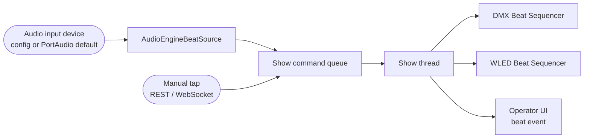

# Audio Reactivity Architecture

> **Terminology.** A "look" is a `dmx_preset` (`DMX_Preset`). Use `dmx_preset` going
> forward — [D-023](decisions.md#d-023-a-look-is-a-dmx_preset).

> **Status: live capture is wired into look cycling.** Detection lives in a separate
> library, [`lights-audio-engine`](https://github.com/glane339/lights-audio-engine)
> (pinned in `requirements.txt` at `1560d85`). This repo owns the
> [`BeatSource`](../backend/audio/beat_source.py) protocol, the
> [`AudioEngineBeatSource`](../backend/audio/audio_engine_source.py) adapter, and the
> show-queue delivery that advances cue lists. `ManualBeatSource` remains the test
> double and the fallback when no input device is usable.
>
> No accuracy, latency, or detection-quality guarantee is claimed. BPM is carried on
> the adapter for display later; sequencing consumes discrete beats only.

---

## 1. Current state

The consumer side was already finished: `SceneController.on_beat()` advances both cue
lists, writes the DMX buffer, and activates LEDfx scenes. Live audio now produces
those beats.

On app start, [`create_app`](../backend/server/app.py) resolves a capture selector and,
if one is usable, constructs `AudioEngineBeatSource`, subscribes it to
`ShowCommand(BEAT)`, and starts the worker in lifespan (after the show engine, before
serving). Stop order is the reverse.

Selector rules:

| `AudioConfig.input_device` | Capture |
| --- | --- |
| Non-empty string | That PortAudio device name |
| `null` / omitted | PortAudio default input index |
| Blank string, missing library, invalid selector, or no default | Live audio skipped; the show still runs; `/api/show/beat` still works |

The protocol a detector must satisfy is still small:

```python
# backend/audio/beat_source.py
class BeatSource(Protocol):
    @property
    def bpm(self) -> Optional[float]: ...
    @property
    def beat_count(self) -> int: ...
    def subscribe(self, callback: BeatCallback) -> None: ...
    def start(self) -> None: ...
    def stop(self) -> None: ...
```

The adapter publishes from one dedicated worker. Capture is a blocking
`InputStream.read` inside `lights_audio_engine.capture`, not a PortAudio callback.
Each `AudioAnalysisResult.beat_events` item becomes one subscriber call, which the
app factory turns into `ShowEngine.submit(ShowCommand(BEAT))` via `put_nowait`
([D-016](decisions.md#d-016-audio-event-delivery-mechanism)). Lighting never runs on
the capture thread. A full show queue drops the beat and logs a warning.

`Scene.sensitivity` and `AudioConfig.default_sensitivity` were removed in schema 5.
Detector threshold stays inside `AudioEngine`'s own config (library default `0.5`)
until a later change owns it.

---

## 2. Responsibilities

**The audio engine turns an audio stream into timing events. That is all.**

### 2.1 In scope

| Output | Type | Notes |
| --- | --- | --- |
| `bpm` | float | Estimated tempo. Advisory/display; not the sequencing input. The adapter keeps the latest value; `/api/status` and Performance do not show it yet. |
| `beat_detected` | event | The discrete signal everything downstream consumes. Delivered as `ShowCommand(BEAT)`. |
| `beat_count` | int | Monotonic count since the adapter started. |
| `intensity` | float, normalised | Short-window loudness in the engine result. Nothing in this app consumes it yet. |
| `is_silent` | bool | Required so downstream can distinguish "quiet" from "audio device dead". **Not yet surfaced** on `/api/status` or the UI. |

Frequency-band energies (low/mid/high) are a plausible later addition and are
explicitly **not** part of the initial scope.

### 2.2 Explicitly not in scope

The audio adapter and the engine must not:

- Know that fixtures, universes, or channels exist.
- Read the `Library` or any `Scene`, `Preset`, or cue list.
- Select, advance, or reset any cue list.
- Call LEDfx, open a UDP socket, or write to `Active_DMX_Channels`.
- Persist anything.

If `backend/audio/` ever imports from `backend/storage/` or `backend/models/`, the
boundary has been violated. See
[decisions.md](decisions.md#d-002-audio-processing-owns-timing-not-lighting-decisions).
The app factory is allowed to subscribe the adapter to the show queue; that is
wiring, not analysis.

---

## 3. Inputs and outputs



A working snapshot from the adapter (not yet an operator-facing `AudioState`):

```text
AudioEngineBeatSource
├── bpm: Optional[float]          # last engine result; display later
├── beat_count: int
└── running: bool                 # worker thread alive; not silence-vs-dead
```

Delivery is a pushed beat event on the show thread, not a polled snapshot. See §6.

---

## 4. BPM generation

Implemented in `lights-audio-engine`, not in this repository. Constraints that still
apply here:

- BPM is an *estimate over a window*, not an instantaneous value, and will lag
  tempo changes by seconds. Any UI showing it should indicate that.
- BPM must not gate beat events. A beat is emitted when a beat is detected,
  regardless of whether the tempo estimator has converged.
- There is no requirement to detect downbeats, bars, or time signature. Do not
  build a beat grid; the sequencing model in
  [show_control_architecture.md](show_control_architecture.md#5-beat-driven-sequencing)
  does not need one.

No claim is made about tempo-detection accuracy, genre robustness, or minimum
convergence time.

---

## 5. Beat-event generation and sensitivity semantics

### 5.1 Sensitivity

**Deferred.** Per-scene sensitivity was unused at runtime and was dropped in schema 5
(`migrate_drop_scene_sensitivity`). `AudioEngine` is constructed with the library
default. A later change can pass `AudioEngineConfig(sensitivity=…)` and rebuild the
engine; frozen engine config cannot be patched in place.

Direction, if it returns: higher = more sensitive = more events.

### 5.2 Debouncing

Minimum inter-beat interval is the engine's job. The sequencer has no rate limiting
of its own: a burst of beats jumps a cue list several entries at once. That is why
a full show queue drops detected beats rather than blocking capture.

---

## 6. Timing ownership and event delivery

**The audio path owns show time.** No other component may run its own timer to
advance cues. The E1.31 sender's fixed-cadence loop (see
[fixture_and_transport_strategy.md](fixture_and_transport_strategy.md#52-open-transport-decisions))
is a *transport* clock and must never be used to advance a cue list.

**Decision: queue** ([D-016](decisions.md#d-016-audio-event-delivery-mechanism)
Accepted). The capture worker must not run lighting logic. The adapter's subscriber
only enqueues `ShowCommand(BEAT)`; `ShowEngine` dispatches `SceneController.on_beat()`
on the show thread. Manual tap uses the same command kind, so Performance does not
need to know the source.

Overflow policy: `put_nowait`; on `ShowBusyError`, drop the beat and log. Detected
beats currently share the 64-slot show queue with activate, deactivate, and
blackout — a residual risk under dense live audio, not a reason to put lighting on
the capture thread.

---

## 7. Latency

Perceptible lighting lag comes from the sum of: audio buffer size, analysis window,
event queue delay, and transport cadence. The engine's default capture read is 960
frames (20 ms at 48 kHz). `DMXConfig.refresh_hz` is still the only figure this app
configures ([`storage/config.py`](../backend/storage/config.py)).

The 20 ms read is an alignment choice in the engine, not a measured
physical-event-to-light budget.

---

## 8. Error and silence behaviour

| Condition | Required behaviour | Current |
| --- | --- | --- |
| No usable input device | Start cleanly with the audio path disabled; the show still runs manually. Do not crash. | **Met** — blank selector, failed import, or missing default leaves `audio_source` as `None`. Unset config tries the PortAudio default rather than disabling. |
| Configured device missing at startup | Surface a clear error naming the device; do not fall back silently to a different one. | **Not met** — open happens inside the capture iterator on the worker; a bad device becomes a discontinuity and the worker exits. |
| Device disappears mid-show | Stop emitting beats, set `is_silent`, keep the process alive, surface the failure. Lights hold their last look. | **Partial** — beats stop and looks hold; no `is_silent` bit and no named failure on `/api/status` or Performance. |
| Genuine silence | Emit no beats. Do not free-run. See [show_control_architecture.md](show_control_architecture.md#8-behaviour-when-beats-are-not-detected). | **Met** for sequencing. Silence and dead capture still look identical to the operator. |
| Analysis exception | Must not kill the show thread or the process. | **Met** — adapter catches worker and subscriber exceptions. |

The distinction between *silence* and *failure* has to be visible to the operator.
Both produce a static-looking rig. Logging exists
([`logging_setup.py`](../backend/logging_setup.py)); the missing piece is a health
field on `/api/status` and a Performance readout.

---

## 9. Testability

Three layers, of which 1 and the adapter half of 2 exist:

1. **Sequencing without audio.** Synthetic beats into `CueSequencer` /
   `SceneController` / `ManualBeatSource`. No audio dependency.
2. **Adapter and command bridge.** Fake `run_engine` results drive
   `AudioEngineBeatSource`; a scripted runner activates a scene and asserts the cue
   list advances. Tests autouse-stub the default-device probe so `TestClient` never
   opens PortAudio.
3. **Detection against fixtures.** Engine-side: short WAV files with known beat
   positions, in the `lights-audio-engine` repo. Not this suite.
4. **Live device.** Manual, not automated.

---

## 10. Open questions

| # | Question | Status |
| --- | --- | --- |
| 1 | Sensitivity range, direction, and `default_sensitivity` | Closed as unused — schema 5 dropped both stored fields. Engine default remains until a later config owns it. |
| 2 | Audio library and WASAPI loopback | Library chosen: `lights-audio-engine` + `sounddevice`. Loopback is still a raw `input_device` name; default input is usually a microphone, not system loopback. |
| 3 | Callback versus queue delivery (§6) | **Decided: queue** (D-016). |
| 4 | Whether `intensity` has a consumer | Deferred. |
| 5 | Operator-visible silence vs dead capture | Open. Blocks trustworthy live use more than further detector work. |
