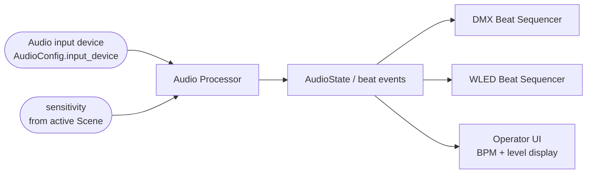

# Audio Reactivity Architecture

> **Terminology.** A "look" is a `dmx_preset` (`DMX_Preset`). Use `dmx_preset` going
> forward — [D-023](decisions.md#d-023-a-look-is-a-dmx_preset).

> **Status: the boundary exists; the signal processing does not.**
> [`audio/beat_source.py`](../backend/audio/beat_source.py) defines the `BeatSource`
> protocol that everything downstream consumes, plus `ManualBeatSource`, which emits
> beats the caller supplies — a scripted list in tests, or a tap-tempo key.
>
> **No audio is captured and no beat is detected anywhere in this repository.** There is
> no FFT, no onset detection, no tempo estimation, and no audio input. `bpm` is a value
> something else sets, not a measurement. Choosing and adapting a real library is
> [WS-9](current_sprint.md#ws-9--real-beat-detection), and no accuracy, latency, or
> detection-quality guarantee is claimed for anything here.
>
> What the boundary does buy: everything from a beat to light on the wall is built and
> tested, so the audio work is genuinely isolated to producing beat events.

---

## 1. Current state

The consumer side is finished. `SceneController.on_beat()` is the single method a beat
source has to call, and everything after it — advancing two cue lists, writing the DMX
buffer, activating LEDfx scenes — is implemented and tested. The protocol a real
detector must satisfy is small:

```python
# backend/audio/beat_source.py
class BeatSource(Protocol):
    @property
    def bpm(self) -> Optional[float]: ...
    @property
    def beat_count(self) -> int: ...
    def subscribe(self, callback: BeatCallback) -> None: ...
    def start(self) -> None: ...
    def stop(self) -> None: ...
```

Wiring a source to a show is two lines, which is the point of keeping the seam this
narrow:

```python
beats = ManualBeatSource(bpm=128.0)
beats.subscribe(controller.on_beat)
```

Two config artefacts still anticipate audio and are still read by nothing:
`AudioConfig.input_device` / `default_sensitivity`
([`storage/config.py`](../backend/storage/config.py)), and `Scene.sensitivity`, which is
now bounded to 0.0–1.0 and exposed as `SceneController.sensitivity` for a processor to
pick up.

---

## 2. Responsibilities

**The Audio Processor turns an audio stream into timing events. That is all.**

### 2.1 In scope

| Output | Type | Notes |
| --- | --- | --- |
| `bpm` | float | Estimated tempo. Advisory/display; not the sequencing input. |
| `beat_detected` | event | The discrete signal everything downstream consumes. |
| `beat_count` | int | Monotonic count since processor start. Useful for logging and tests. |
| `intensity` | float, normalised | Short-window loudness. Available for future effects; nothing consumes it yet. |
| `is_silent` | bool | Explicit silence state, so downstream can distinguish "quiet" from "audio device dead". |

Frequency-band energies (low/mid/high) are a plausible later addition and are
explicitly **not** part of the initial scope.

### 2.2 Explicitly not in scope

The Audio Processor must not:

- Know that fixtures, universes, or channels exist.
- Read the `Library` or any `Scene`, `Preset`, or cue list.
- Select, advance, or reset any cue list.
- Call LEDfx, open a UDP socket, or write to `Active_DMX_Channels`.
- Persist anything.

If audio code ever imports from `backend/storage/` or `backend/models/` (other
than for a sensitivity value type), the boundary has been violated. See
[decisions.md](decisions.md#d-002-audio-processing-owns-timing-not-lighting-decisions).

---

## 3. Inputs and outputs



A conceptual snapshot, matching the shape suggested in the project brief:

```text
AudioState
├── bpm: float
├── beat_detected: bool
├── beat_count: int
├── intensity: float
└── is_silent: bool
```

Whether this is delivered as a polled snapshot or a pushed event is deliberately
left open in §6.

---

## 4. BPM generation

**Target, unimplemented.** Design constraints rather than an algorithm:

- BPM is an *estimate over a window*, not an instantaneous value, and will lag
  tempo changes by seconds. Any UI showing it should indicate that.
- BPM must not gate beat events. A beat is emitted when a beat is detected,
  regardless of whether the tempo estimator has converged.
- There is no requirement to detect downbeats, bars, or time signature. Do not
  build a beat grid; the sequencing model in
  [show_control_architecture.md](show_control_architecture.md#5-beat-driven-sequencing)
  does not need one.

No claim is made about tempo-detection accuracy, genre robustness, or minimum
convergence time. Those are properties of an implementation that does not exist.

---

## 5. Beat-event generation and sensitivity semantics

### 5.1 Sensitivity

**Unresolved.** `Scene.sensitivity: float` is unbounded and undocumented. Before
any audio work begins, three questions need answers, and the answers should be
recorded in [decisions.md](decisions.md):

1. **What is the range?** `0.0–1.0` is the obvious reading given
   `default_sensitivity = 0.5`, but nothing enforces it. Add a `Field(ge=0.0, le=1.0)`
   constraint to both `Scene` and `SceneRecord` — see [AF-M02](audit_findings.md#af-m02).
2. **Which direction?** Does higher mean *more* beats detected (lower threshold) or
   *less* reactive? Recommended: higher = more sensitive = more events.
3. **What is `AudioConfig.default_sensitivity` for?** Candidate readings: a seed
   value for newly created scenes (recommended — it is UI-layer default, not a
   runtime input), a global multiplier, or dead config to remove. It should not
   silently participate in runtime detection.

### 5.2 Debouncing

Whatever the detection method, a minimum inter-beat interval is required, or a
single loud transient produces a burst of events and jumps a cue list several
entries at once. This is a correctness requirement of the sequencing model, not an
audio nicety: the sequencer has no rate limiting of its own.

---

## 6. Timing ownership and event delivery

**The Audio Processor owns show time.** No other component may run its own timer to
advance cues. In particular the E1.31 sender's fixed-cadence loop (see
[fixture_and_transport_strategy.md](fixture_and_transport_strategy.md#52-open-transport-decisions))
is a *transport* clock and must never be used to advance a cue list — that would
couple lighting sequence to network frame rate.

Delivery mechanism is an open decision. Both are viable:

| Approach | Pro | Con |
| --- | --- | --- |
| **Callback/observer** — processor calls registered listeners on the audio thread | Lowest latency; simple | Listener work runs on the audio callback thread; a slow listener causes audio dropouts |
| **Queue** — processor pushes events; consumers drain on their own thread | Isolates the audio thread; naturally testable | One more moving part; needs a bounded queue and an overflow policy |

Recommended: **queue**, with beat handling on a dedicated show-control thread. It
keeps the hard-real-time audio callback free of lighting logic and makes the race
conditions in
[show_control_architecture.md](show_control_architecture.md#6-concurrency-and-race-conditions)
tractable. Recorded as proposed, not decided.

---

## 7. Latency

Perceptible lighting lag comes from the sum of: audio buffer size, analysis window,
event queue delay, and transport cadence. Only the last is currently even
configurable (`DMXConfig.refresh_hz`, [`storage/config.py:16`](../backend/storage/config.py#L16)).

No latency budget can be stated from the repository. When implementation begins,
the buffer size should be a named constant, not an inline literal, and the
end-to-end figure should be measured rather than assumed.

---

## 8. Error and silence behaviour

| Condition | Required behaviour |
| --- | --- |
| No input device configured | Start cleanly with the audio path disabled; the show still runs manually. Do not crash. |
| Configured device missing at startup | Surface a clear error naming the device; do not fall back silently to a different one. |
| Device disappears mid-show | Stop emitting beats, set `is_silent`, keep the process alive, surface the failure. Lights hold their last look. |
| Genuine silence | Emit no beats. Do not free-run. See [show_control_architecture.md](show_control_architecture.md#8-behaviour-when-beats-are-not-detected). |
| Analysis exception | Must not propagate into the audio callback and kill the stream. |

The distinction between *silence* and *failure* has to be visible to the operator.
Both produce a static-looking rig, and during a show the operator needs to know
which one they are looking at. The repository has no logging framework at all
today ([AF-M08](audit_findings.md#af-m08)), so this needs to be established before
audio work starts.

---

## 9. Testability

The audio subsystem should be testable in three independent layers:

1. **Sequencing without audio.** Feed a synthetic list of beat events to the Beat
   Sequencer. No audio dependency at all. This is the most valuable suite and can
   be written today.
2. **Detection against fixtures.** Run the detector over short, checked-in WAV
   files with known beat positions, asserting on counts and rough positions —
   never on exact sample indices.
3. **Live device.** Manual, not automated.

A `NullAudioProcessor` that emits nothing, and a `ScriptedAudioProcessor` that
emits a fixed beat pattern, should exist from the first commit of this subsystem.
Everything downstream then develops with no microphone.

---

## 10. Open questions

| # | Question | Blocks |
| --- | --- | --- |
| 1 | Sensitivity range, direction, and relationship to `default_sensitivity` | Any detector implementation |
| 2 | Which audio library (`sounddevice`, `pyaudio`, `soundcard`) and its Windows/WASAPI loopback story | Capturing system audio rather than a line-in |
| 3 | Callback versus queue delivery (§6) | Threading design |
| 4 | Whether `intensity` has a consumer, or is deferred | Scope of the first implementation |

Question 2 is the important one for this deployment: if the source material is
playing on the same PC, WASAPI loopback capture is required, and that constrains
the library choice. See [platform_support.md](platform_support.md#audio-devices).
