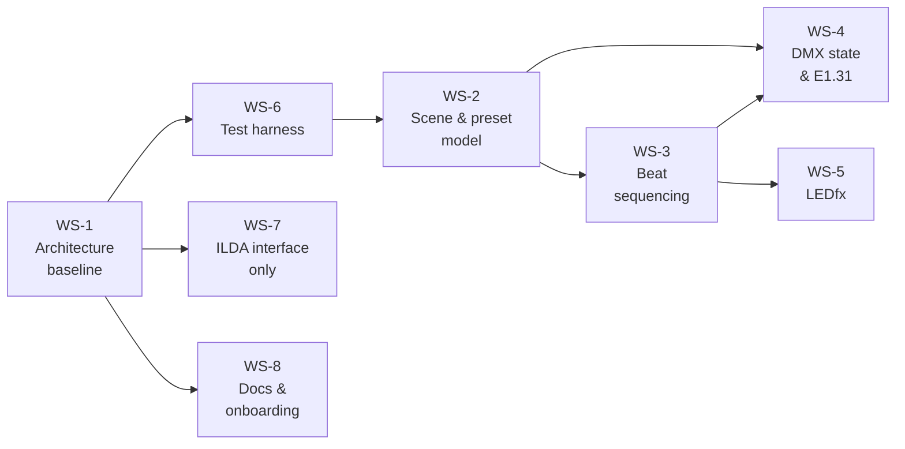

# Current Sprint

Near-term implementation plan, grounded in [audit_findings.md](audit_findings.md).
No dates — the repository contains no schedule, and inventing one would be noise.
Longer horizon in [roadmap.md](roadmap.md).

**Status key:** `Not started` · `In progress` · `Done` · `Blocked`

## Ordering

WS-6 comes before every schema change deliberately: the storage layer's cascade and
pruning logic is the code most likely to break under the WS-2 changes, and it is
currently unverified ([AF-H05](audit_findings.md#af-h05)).

---

## WS-1 · Architecture stabilization

### 1.1 Establish the documentation baseline
- **Goal.** A contributor can understand the system without re-reading every file.
- **Why.** The repository had no `docs/`, and the gap between the intended system
  and the implementation was undocumented and substantial.
- **Dependencies.** None.
- **Acceptance.** `docs/` contains the 13 documents indexed in
  [project_overview.md](project_overview.md#where-to-go-next); every file path
  referenced resolves; current versus target is labelled throughout.
- **Status.** **Done** — this task.
- **Files.** `docs/*`, [`README.md`](../README.md).

### 1.2 Remove the dead config path
- **Goal.** Delete the empty `backend/config/` directory.
- **Why.** Two plausible import paths for "config", one of them a 0-byte file, is a
  trap ([AF-M07](audit_findings.md#af-m07)).
- **Dependencies.** None.
- **Acceptance.** `backend/config/` is gone; nothing imports it (nothing does today).
- **Status.** Not started — deliberately out of scope for the documentation task.
- **Files.** `backend/config/config.py`.

### 1.3 Clean up `requirements.txt`
- **Goal.** Drop `typing==3.7.4.3` and the direct `typing_extensions` pin.
- **Why.** `typing` is a Python 3.4–3.6 backport with no purpose on 3.12 and is not
  imported from PyPI by any code here; `typing_extensions` is a pydantic transitive
  dependency ([AF-L02](audit_findings.md#af-l02)).
- **Dependencies.** None.
- **Acceptance.** A fresh venv installs from `requirements.txt` and all modules
  import successfully.
- **Status.** Not started.
- **Files.** [`requirements.txt`](../requirements.txt).

### 1.4 Add logging
- **Goal.** A `logging` setup writing to the already-created `logs/` directory.
- **Why.** Quarantined files, vanished ILDA frames, and cascade deletes are all
  currently silent, and the runtime will need this from its first line
  ([AF-M08](audit_findings.md#af-m08)).
- **Dependencies.** None.
- **Acceptance.** Storage-layer events appear in `logs/`; no `print` anywhere.
- **Status.** Not started.
- **Files.** new `backend/logging_setup.py`; [`storage/`](../backend/storage/);
  `logs/` path already exists at [`paths.py:21`](../backend/storage/paths.py#L21).

---

## WS-2 · Scene and preset model

The schema changes. All are additive and migratable; all must go through
`REFERENCES` in [`records.py`](../backend/storage/records.py)
([D-015](decisions.md#d-015-the-reference-graph-stays-declarative)).

### 2.1 Introduce the `Fixture` collection
- **Goal.** A persisted fixture (id, name, universe, start_address, channel_count);
  `DMX_Device_Preset.order` → `fixture_id`.
- **Why.** [AF-H01](audit_findings.md#af-h01) — positional address derivation is the
  root blocker for correct multi-look rigs, address gaps, and multi-universe.
- **Dependencies.** WS-6.1 (storage tests) must land first.
- **Acceptance.** Fixtures round-trip; `build_channels` resolves addresses from
  fixtures rather than a cursor; a look with non-contiguous addresses produces the
  correct buffer; a look referencing a missing fixture fails the integrity check at
  load; a migration converts existing `order`-based data and is covered by a test.
- **Status.** Not started; begins after WS-6.1.
- **Files.** new `backend/models/Fixture.py`;
  [`models/DMX_Device_Preset.py`](../backend/models/DMX_Device_Preset.py);
  [`storage/records.py`](../backend/storage/records.py);
  [`storage/library.py`](../backend/storage/library.py);
  [`storage/migrations.py`](../backend/storage/migrations.py);
  [`runtime/active.py`](../backend/runtime/active.py).

### 2.2 Add per-entry beat durations to both cue lists
- **Goal.** Cue-list entries carrying `(target_id, beats)` for DMX and WLED alike.
- **Why.** [AF-H02](audit_findings.md#af-h02) — beat duration is unrepresentable
  today, which blocks the core feature.
- **Dependencies.** WS-6.1.
- **Acceptance.** Both lists hold ordered entries with a per-entry beat count;
  `beats < 1` is rejected at load; migration preserves existing ordering with a
  documented default; both lists share one entry shape.
- **Status.** Not started.
- **Files.** [`models/DMX_Preset_List.py`](../backend/models/DMX_Preset_List.py);
  [`models/WLED_Preset_List.py`](../backend/models/WLED_Preset_List.py);
  `storage/records.py`; `storage/migrations.py`.

### 2.3 Make the WLED path modellable
- **Goal.** Register `WLED_Preset_List` with the storage layer, add
  `ledfx_preset_id` to `WLED_Preset`, change `Preset.wled_preset_id` →
  `wled_preset_list_id`.
- **Why.** [AF-H03](audit_findings.md#af-h03) — the list is unreachable, the preset
  identifies nothing, and the `Preset` asymmetry makes WLED sequencing structurally
  impossible.
- **Dependencies.** 2.2 (same entry shape); ideally
  [D-018](decisions.md#d-018-ledfx-preset-identifier-form) resolved first, though
  an opaque string field is safe to add regardless.
- **Acceptance.** `WLED_Preset_List` appears in `RECORD_TYPES`, `COLLECTION_ORDER`,
  `MODEL_TYPES`, and `REFERENCES`; it round-trips; `Library.add()` accepts it;
  a `Preset` resolves to a WLED cue list; integrity and cascade behave correctly for
  the new relationship.
- **Status.** Not started.
- **Files.** `models/WLED_Preset.py`; `models/WLED_Preset_List.py`;
  `models/Preset.py`; `storage/records.py`; `storage/library.py`;
  `storage/migrations.py`.

### 2.4 Add field validation
- **Goal.** Bound `channel_values` to 0–255, `channel_count` to 1–512,
  `sensitivity` to 0.0–1.0, `beats` to ≥ 1.
- **Why.** [AF-M01](audit_findings.md#af-m01), [AF-M02](audit_findings.md#af-m02) —
  invalid values currently validate and would reach the wire.
- **Dependencies.** [D-016](decisions.md#d-016-audio-event-delivery-mechanism) is
  not required, but sensitivity semantics should be recorded when this lands.
- **Acceptance.** Out-of-range values raise at model construction and at load;
  constraints applied to both the model and the record; tests cover each boundary.
- **Status.** Not started.
- **Files.** [`models/`](../backend/models/), `storage/records.py`.

---

## WS-3 · Shared beat sequencing

### 3.1 `BeatSequencer`
- **Goal.** One class: entries, index, beats elapsed, loop mode; consumes beat
  events, emits cue-changed. No I/O, no knowledge of DMX or WLED.
- **Why.** [D-003](decisions.md#d-003-dmx-and-wled-share-one-beat-sequencing-implementation) —
  duplicated sequencing drifts. This is also the highest-value test target in the
  project and needs no audio or hardware.
- **Dependencies.** WS-2.2.
- **Acceptance.** Advances exactly on the beat completing an entry's count; loop and
  hold-last both correct; reset returns to index 0 with a cleared counter; a beat
  that does not advance emits nothing; the full suite runs with a synthetic beat
  list and zero I/O.
- **Status.** Not started.
- **Files.** new `backend/runtime/sequencer.py`; new `tests/test_sequencer.py`.

### 3.2 Scene Controller
- **Goal.** Activate/deactivate a scene: resolve definitions once, reset both
  sequencers, apply cue 0 immediately, propagate sensitivity.
- **Why.** No component owns the current scene today; `ui.last_scene_id` is the only
  acknowledgement the concept exists.
- **Dependencies.** 3.1.
- **Acceptance.** Activation applies cue 0 without waiting for a beat; switching
  scenes discards outgoing sequence state entirely; an empty cue list is a clean
  activation error, not a crash; the controller holds resolved snapshots rather than
  live `Library` references.
- **Status.** Not started.
- **Files.** new `backend/runtime/scene_controller.py`;
  [`runtime/active.py`](../backend/runtime/active.py).

### 3.3 Runtime state ownership
- **Goal.** Move the module globals in
  [`runtime/active.py:19-20`](../backend/runtime/active.py#L19-L20) into an owned
  object with explicit lifecycle and locking.
- **Why.** [AF-M03](audit_findings.md#af-m03) — three concurrent activities are
  coming and there is no synchronisation.
- **Dependencies.** 3.2.
- **Acceptance.** No mutable module-level state; buffer updates and sender reads are
  race-free by construction, not by GIL accident.
- **Status.** Not started.
- **Files.** `backend/runtime/`.

---

## WS-4 · DMX state and E1.31 output

### 4.1 Multi-universe active state with dirty tracking
- **Goal.** Per-universe 512-value buffers, dirty flags, clamped writes, blackout.
- **Why.** Single-universe and no change detection today; clamping closes
  [AF-M01](audit_findings.md#af-m01) at the boundary as well as the model.
- **Dependencies.** WS-2.1.
- **Acceptance.** Writes clamp to 0–255; dirty set on write, cleared on send;
  blackout zeroes and marks dirty; buffers are never persisted.
- **Status.** Not started.
- **Files.** [`models/Active_DMX_Channels.py`](../backend/models/Active_DMX_Channels.py),
  `backend/runtime/`.

### 4.2 Sender interface with a null default
- **Goal.** `send(universe, channels)` / `start()` / `stop()`, with `Null` and
  `Recording` implementations. **No real sender yet.**
- **Why.** [D-013](decisions.md#d-013-hardware-output-defaults-to-a-null-implementation) —
  null-by-default is what makes everything downstream safe to develop and test.
- **Dependencies.** 4.1.
- **Acceptance.** Default config selects null; `RecordingDmxSender` captures frames
  for assertions; no socket is opened anywhere in the test suite.
- **Status.** Not started.
- **Files.** new `backend/output/dmx_sender.py`.

### 4.3 Network configuration
- **Goal.** Reshape `DMXConfig`: destination, unicast/multicast, source name,
  priority, per-universe destinations; fix the invalid `universe: 0` default and the
  `refresh_hz: 120` default.
- **Why.** [AF-M06](audit_findings.md#af-m06), [AF-L01](audit_findings.md#af-l01);
  the current three fields cannot describe a working sACN setup.
- **Dependencies.** [D-017](decisions.md#d-017-sacn-unicast-versus-multicast), and
  verification against the actual universe box.
- **Acceptance.** Config expresses a complete destination; defaults are valid;
  no IPs or hostnames appear in the repository.
- **Status.** **Blocked** — the box's expectations are unverified
  ([fixture_and_transport_strategy.md](fixture_and_transport_strategy.md#6-the-custom-universe-box-boundary)).
- **Files.** [`storage/config.py`](../backend/storage/config.py).

### 4.4 Real sACN sender
- **Goal.** Packet framing, sequence numbers, cadence, hybrid change/keepalive
  transmission, socket lifecycle, blackout on shutdown.
- **Why.** The last link between the universe buffer and the rig.
- **Dependencies.** 4.2, 4.3. Requires a new production dependency (an sACN
  library), so it needs explicit sign-off.
- **Acceptance.** Generated bytes asserted in tests without opening a socket;
  sequence numbers increment per universe and wrap; clean shutdown sends blackout
  then closes; a send failure logs and retries without taking the show down.
- **Status.** Blocked on 4.3.
- **Files.** `backend/output/`.

---

## WS-5 · LEDfx integration

### 5.1 Resolve the identifier question
- **Goal.** Answer [D-018](decisions.md#d-018-ledfx-preset-identifier-form) against a
  running LEDfx instance — which entity, what identifier form, is it stable across
  restarts.
- **Why.** If identifiers are unstable, storing them produces config that silently
  breaks. This determines the WS-2.3 field.
- **Dependencies.** LEDfx installed. It runs without physical WLED devices, so this
  risks nothing.
- **Acceptance.** Answers recorded in
  [wled_ledfx_architecture.md](wled_ledfx_architecture.md#31-preset-identifiers) and
  D-018 moved to Accepted.
- **Status.** Not started.
- **Files.** docs only.

### 5.2 LEDfx client adapter
- **Goal.** The only module that knows LEDfx exists: HTTP calls, explicit timeouts,
  bounded retry, dedup of repeat activations, reachability state. Null and recording
  variants; null is the default.
- **Why.** [D-004](decisions.md#d-004-ledfx-owns-wled-output),
  [D-013](decisions.md#d-013-hardware-output-defaults-to-a-null-implementation).
- **Dependencies.** 5.1, WS-2.3. Requires an HTTP client dependency.
- **Acceptance.** N beats within one entry produce exactly one call; the dedup cache
  is invalidated on unreachability and the current preset re-applied on recovery;
  every call has an explicit timeout; LEDfx being down never stalls beat handling or
  DMX; no call runs on the beat thread.
- **Status.** Not started.
- **Files.** new `backend/output/ledfx_client.py`;
  [`storage/config.py`](../backend/storage/config.py) (`WLEDConfig` → `LedfxConfig`).

---

## WS-6 · Hardware-independent testing

### 6.1 Test harness and storage suite
- **Goal.** pytest configured; the storage layer covered.
- **Why.** [AF-H05](audit_findings.md#af-h05) — the subtlest code in the repository
  (recursive cascade with cycle guarding, reachability pruning, atomic writes,
  quarantine, folder reconciliation) is entirely unverified, and every WS-2 change
  touches it.
- **Dependencies.** None. `LIGHTSAPP_DATA_DIR`
  ([`paths.py:15`](../backend/storage/paths.py#L15)) and the `root` parameter already
  provide the injection point.
- **Acceptance.** Tests run against a temp directory and never touch the real data
  folder; round-trip, dangling-reference rejection, cascade delete (including the
  Scene-destroying single-reference path), orphan pruning, ILDA folder sync,
  corrupt-file quarantine, and migration version handling are all covered.
- **Status.** Not started. **Should land with or before WS-2.1.**
- **Files.** new `tests/`; `requirements.txt` (dev dependency).

### 6.2 Null and recording implementations everywhere
- **Goal.** Null/recording variants for the DMX sender, LEDfx client, and audio
  processor; null selected by default.
- **Why.** [D-013](decisions.md#d-013-hardware-output-defaults-to-a-null-implementation).
- **Dependencies.** WS-4.2, WS-5.2, and the audio work.
- **Acceptance.** The full suite runs with no network, no audio device, and no
  hardware. `ScriptedAudioProcessor` drives an end-to-end scene test.
- **Status.** Not started.
- **Files.** `backend/output/`, `tests/`.

---

## WS-7 · ILDA interface only

### 7.1 Define the boundary; implement nothing behind it
- **Goal.** A stub ILDA Controller accepting a frame list and doing nothing,
  reachable only from the Scene Controller.
- **Why.** [D-008](decisions.md#d-008-ilda-stays-behind-a-separate-processor-boundary) —
  fixing the seam now prevents laser concerns leaking into the lighting path later.
- **Dependencies.** WS-3.2.
- **Acceptance.** One interface; no device access, no enumeration, no partial output
  implementation; nothing outside the Scene Controller references it; the
  prerequisites in
  [laser_and_haze_safety.md](laser_and_haze_safety.md#4-what-must-exist-before-output-is-enabled)
  remain unmet and unstarted.
- **Status.** Not started.
- **Files.** new `backend/runtime/ilda_controller.py`.

**Explicit non-goal for this sprint:** no laser output code of any kind.

---

## WS-8 · Documentation and contributor onboarding

### 8.1 Document how to run and test
- **Goal.** Record the import root, the data-folder location and override, and the
  test command.
- **Why.** [AF-D02](audit_findings.md#af-d02) — imports are absolute from `backend/`
  with no `__init__.py` and nothing says so.
- **Dependencies.** WS-6.1 for the test command.
- **Acceptance.** A new contributor can install, import, and run tests from the docs
  alone.
- **Status.** Partially done — captured in
  [platform_support.md](platform_support.md); the test command awaits WS-6.1.
- **Files.** [`platform_support.md`](platform_support.md), [`README.md`](../README.md).

### 8.2 Keep decisions current
- **Goal.** Move D-016, D-017, D-018 from Open to Accepted as they are answered.
- **Why.** Three open decisions block WS-3, WS-4, and WS-5 respectively.
- **Dependencies.** The corresponding investigations.
- **Acceptance.** No Open decision blocks an in-progress workstream.
- **Status.** Ongoing.
- **Files.** [`decisions.md`](decisions.md).
