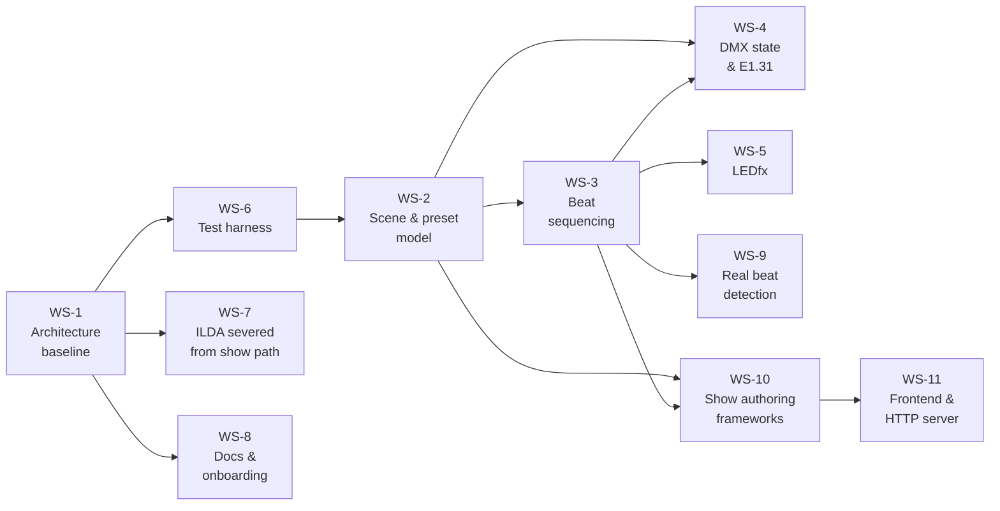

# Current Sprint

Near-term implementation plan, grounded in [audit_findings.md](audit_findings.md).
No dates — the repository contains no schedule, and inventing one would be noise.
Longer horizon in [roadmap.md](roadmap.md).

**Status key:** `Not started` · `In progress` · `Done` · `Blocked`

## Future plans

> **Session closed 2026-08-10.** Nothing below is in progress — it is the queue for
> when work resumes. Current maturity in
> [project_overview.md](project_overview.md#current-maturity).

### Landed (no action needed)

| Area | Status |
| --- | --- |
| Storage, schema v4, migrations | Done |
| DMX fixture model (`DMX_Device`, patch-based resolution) | Done |
| WLED list registration, `Preset.wled_preset_list_id` | Done |
| List-level `beats`, bounded `sensitivity` | Done (schema v4) |
| `CueSequencer`, `SceneController`, outputs, `BeatSource` protocol | Done (WS-3) |
| 84-test suite (storage + sequencing + outputs) | Done |
| Audit v2 merge + post-audit doc refresh | Done (this session) |

### Build next (dependency order)

1. **WS-4 · E1.31 transport** — parked until the universe box is verified; unblocks
   hardware DMX.
2. **WS-5 · LEDfx integration** — wire `WledOutput` into a live process; client/sync
   tests ([AF2-M03](audit_findings.md#af2-m03)).
3. **WS-9 · Real beat detection** — live audio; `ManualBeatSource` stays for tests.
4. **App entry point** — open `Library`, wire `SceneController` + beat source +
   outputs (+ optional LEDfx); see [WS-11.1](#111-app-entry-point-and-process-lifecycle).
5. **WS-10 · Show authoring frameworks** — typed create/update for cue lists,
   presets, and scenes; HTTP API; frontend contract. **Required before authoring UI.**
6. **WS-11 · Frontend and HTTP server** — `frontend/` client over WS-10 API.

Longer arc: [roadmap.md](roadmap.md) phases 4 → 5 → 7 → **7a** → 8.

### Deferred (revisit when a real show needs them)

| Item | Workstream | Why wait |
| --- | --- | --- |
| Per-entry beat durations | WS-2.2 / WS-3.5 | List-level `beats` unblocked sequencing |
| `channel_values` 0–255 clamp | WS-2.4 | Sensitivity/beats done; values still open |
| Module-global buffer → owned state | WS-3.4 | Matters once a real beat thread exists |
| Multi-universe buffers | WS-4.1 | One universe matches current rig |
| ILDA output | WS-7 / phase 9 | Laser path severed; safety gates first |
| CI workflow | WS-6 / audit P0 | No blocker for local dev |

### Before building frontend or server

Read [WS-10](#ws-10--show-authoring-frameworks) first. The UI must not call
`Library.add()` directly — go through the authoring service (10.5) and HTTP surface
(10.6). Scene → lighting preset → DMX cue list + WLED cue list is the creation
hierarchy.

---

WS-6 comes before schema changes deliberately: the storage layer's cascade and
pruning logic is the code most likely to break under model changes. WS-6.1 is
**done** ([AF-H05](audit_findings.md#af-h05) partially addressed). WS-10 is the
authoring layer a frontend or HTTP server will call — it is not started and does
not block WS-3 through WS-9.

---

## WS-1 · Architecture stabilization

### 1.1 Establish the documentation baseline
- **Goal.** A contributor can understand the system without re-reading every file.
- **Why.** The repository had no `docs/`, and the gap between the intended system
  and the implementation was undocumented and substantial.
- **Dependencies.** None.
- **Acceptance.** `docs/` contains the 13 documents indexed in
  [project_overview.md](project_overview.md#where-to-go-next); every file path
  referenced resolves; current versus target is labelled throughout.
- **Status.** **Done** — this task.
- **Files.** `docs/*`, [`README.md`](../README.md).

### 1.2 Reconcile the two config modules
- **Goal.** Make the split intentional and documented (do **not** delete
  `backend/config/`).
- **Why.** [AF-M07](audit_findings.md#af-m07) assumed `backend/config/config.py`
  was empty/dead. It now holds compile-time LEDfx defaults that seed
  [`storage/config.py`](../backend/storage/config.py) `LedfxConfig`. Two modules
  remain, with distinct roles.
- **Dependencies.** None.
- **Acceptance.** Module docstrings state the split; docs no longer call
  `backend/config/` dead.
- **Status.** **Done.**
- **Files.** [`backend/config/config.py`](../backend/config/config.py),
  [`storage/config.py`](../backend/storage/config.py).

### 1.3 Clean up `requirements.txt`
- **Goal.** Drop `typing==3.7.4.3` and the direct `typing_extensions` pin; keep
  real direct deps (`httpx`, `platformdirs`, `pydantic`, `pytest`).
- **Why.** `typing` is a Python 3.4–3.6 backport with no purpose on 3.12;
  `typing_extensions` is a pydantic transitive dependency
  ([AF-L02](audit_findings.md#af-l02)).
- **Dependencies.** None.
- **Acceptance.** A fresh venv installs from `requirements.txt` and all modules
  import successfully.
- **Status.** **Done.**
- **Files.** [`requirements.txt`](../requirements.txt).

### 1.4 Add logging
- **Goal.** A `logging` setup writing to the already-created `logs/` directory.
- **Why.** Quarantined files, vanished ILDA frames, and cascade deletes are all
  currently silent, and the runtime will need this from its first line
  ([AF-M08](audit_findings.md#af-m08)).
- **Dependencies.** None.
- **Acceptance.** Storage-layer events appear in `logs/`; no `print` anywhere.
- **Status.** **Done.**
- **Files.** [`backend/logging_setup.py`](../backend/logging_setup.py);
  [`storage/`](../backend/storage/);
  `logs/` path already exists at [`paths.py:21`](../backend/storage/paths.py#L21).

---

## WS-2 · Scene and preset model

> **2.1 (devices), 2.3 (WLED lists), and list-level `beats` (schema v4) are done.**
> Per-entry beat durations (2.2) remain deferred. Field validation (2.4) is partly
> done — `sensitivity` and `beats` are bounded; `channel_values` 0–255 is not.

The schema changes below are historical sprint text. All would be additive and
migratable through `REFERENCES` in [`records.py`](../backend/storage/records.py)
([D-015](decisions.md#d-015-the-reference-graph-stays-declarative)) if revived.

### 2.1 Introduce the `DMX_Device` collection
- **Goal.** A persisted device (id, name, model, mode, universe, start_address,
  channel_count); `DMX_Device_Preset.order` → `device_id`.
- **Why.** [AF-H01](audit_findings.md#af-h01) — positional address derivation was the
  root blocker for correct multi-look rigs, address gaps, and multi-universe.
- **Dependencies.** WS-6.1 (storage tests) — landed first, as planned.
- **Acceptance.** Fixtures round-trip; `build_channels` resolves addresses from
  fixtures rather than a cursor; a look with non-contiguous addresses produces the
  correct buffer; a look referencing a missing fixture fails the integrity check at
  load; a migration converts existing `order`-based data and is covered by a test.
- **Status.** **Done** — `dmx_devices` is a registered root collection; `build_channels`
  resolves addresses from the patch and rejects overlaps and out-of-universe devices;
  schema v3 migration synthesises devices from `order`. Named `DMX_Device` rather than
  `Fixture` to match the existing `DMX_*` naming. Multi-universe buffers deferred; the
  runtime raises for any universe but 1.
- **Files.** new [`backend/models/DMX_Device.py`](../backend/models/DMX_Device.py);
  [`models/DMX_Device_Preset.py`](../backend/models/DMX_Device_Preset.py);
  [`storage/records.py`](../backend/storage/records.py);
  [`storage/library.py`](../backend/storage/library.py);
  [`storage/migrations.py`](../backend/storage/migrations.py);
  [`runtime/active.py`](../backend/runtime/active.py).

### 2.2 Add per-entry beat durations to both cue lists
- **Goal.** Cue-list entries carrying `(target_id, beats)` for DMX and WLED alike.
- **Why.** [AF-H02](audit_findings.md#af-h02) — variable hold times per cue entry
  are still unrepresentable.
- **Dependencies.** WS-6.1.
- **Acceptance.** Both lists hold ordered entries with a per-entry beat count;
  `beats < 1` is rejected at load; migration preserves existing ordering with a
  documented default; both lists share one entry shape.
- **Status.** **Deferred.** Schema v4 added one `beats` scalar per list, which
  unblocked WS-3; revisit when a real show needs different hold times per cue.
- **Files.** [`models/DMX_Preset_List.py`](../backend/models/DMX_Preset_List.py);
  [`models/WLED_Preset_List.py`](../backend/models/WLED_Preset_List.py);
  `storage/records.py`; `storage/migrations.py`.

### 2.3 Make the WLED path modellable
- **Goal.** Register `WLED_Preset_List` with the storage layer; change
  `Preset.wled_preset_id` → `wled_preset_list_id`.
- **Why.** [AF-H03](audit_findings.md#af-h03) — the list was unreachable and the
  `Preset` shape was asymmetric with the DMX side.
- **Dependencies.** None (landed independently of parked WS-2.1/2.2).
- **Acceptance.** `WLED_Preset_List` appears in `RECORD_TYPES`, `COLLECTION_ORDER`,
  `MODEL_TYPES`, and `REFERENCES`; it round-trips; `Library.add()` accepts it;
  a `Preset` resolves to a WLED cue list; schema v2 migration wraps legacy data.
- **Status.** **Done.**
- **Files.** `models/Preset.py`; `models/WLED_Preset_List.py`;
  `storage/records.py`; `storage/library.py`; `storage/migrations.py`;
  `tests/test_library.py`; `tests/test_migrations.py`.

### 2.4 Add field validation
- **Goal.** Bound `channel_values` to 0–255, `sensitivity` to 0.0–1.0, `beats` to ≥ 1.
  `DMX_Device.start_address`/`channel_count`/`universe` are already bounded.
- **Why.** [AF-M01](audit_findings.md#af-m01), [AF-M02](audit_findings.md#af-m02) —
  invalid values currently validate and would reach the wire.
- **Dependencies.** [D-016](decisions.md#d-016-audio-event-delivery-mechanism) is
  not required, but sensitivity semantics should be recorded when this lands.
- **Acceptance.** Out-of-range values raise at model construction and at load;
  constraints applied to both the model and the record; tests cover each boundary.
- **Status.** **Partly done** — `sensitivity` and cue-list `beats` bounded in schema
  v4; `channel_values` 0–255 still open ([AF-M01](audit_findings.md#af-m01)).
- **Files.** [`models/`](../backend/models/), `storage/records.py`.

---

## WS-3 · Shared beat sequencing

> **Unparked and largely built.** The control model settled as: beats per cue *list*
> (not per entry), two independent sequencers off one beat stream, and the beat source
> behind a protocol so no audio library choice was needed to build any of it.

### 3.1 `CueSequencer`
- **Goal.** One class: entries, index, beats elapsed, loop mode; consumes beat
  events, emits cue-changed. No I/O, no knowledge of DMX or WLED.
- **Why.** [D-003](decisions.md#d-003-dmx-and-wled-share-one-beat-sequencing-implementation) —
  duplicated sequencing drifts. This is also the highest-value test target in the
  project and needs no audio or hardware.
- **Acceptance.** Advances exactly on the beat completing an entry's count; loop and
  hold-last both correct; reset returns to index 0 with a cleared counter; a beat
  that does not advance emits nothing; the full suite runs with a synthetic beat
  list and zero I/O.
- **Status.** **Done.** One addition beyond the acceptance criteria: a one-entry list
  reports no change ever, so LEDfx is not re-told to run the scene it already runs.
- **Files.** [`runtime/sequencer.py`](../backend/runtime/sequencer.py),
  [`tests/test_sequencer.py`](../tests/test_sequencer.py).

### 3.2 Scene Controller
- **Goal.** Activate/deactivate a scene: resolve definitions once, reset both
  sequencers, apply cue 0 immediately, propagate sensitivity.
- **Why.** No component owned the current scene; `ui.last_scene_id` was the only
  acknowledgement the concept existed.
- **Acceptance.** Activation applies cue 0 without waiting for a beat; switching
  scenes discards outgoing sequence state entirely; an empty cue list is a clean
  activation error, not a crash; the controller holds resolved snapshots rather than
  live `Library` references.
- **Status.** **Done.** Sensitivity is exposed for an audio processor to read rather
  than pushed, since there is no processor to push to. A failed activation leaves the
  previous scene running.
- **Files.** [`runtime/scene_controller.py`](../backend/runtime/scene_controller.py),
  [`runtime/outputs.py`](../backend/runtime/outputs.py),
  [`tests/test_scene_controller.py`](../tests/test_scene_controller.py),
  [`tests/test_outputs.py`](../tests/test_outputs.py).

### 3.3 Beat source boundary
- **Goal.** A `BeatSource` protocol emitting discrete beats, with a manual
  implementation, so the sequencing core is built and tested without an audio library.
- **Why.** The library choice is the least certain part of the audio work — aubio is
  GPL and unmaintained, the newer options are unproven — and it should not be able to
  block show logic.
- **Acceptance.** The controller runs off subscribed beats; a stopped source emits
  nothing; BPM is carried for display and never drives sequencing.
- **Status.** **Done** for the boundary. No real detector exists; see WS-9.
- **Files.** [`audio/beat_source.py`](../backend/audio/beat_source.py).

### 3.4 Runtime state ownership
- **Goal.** Move the universe buffer global in
  [`runtime/active.py`](../backend/runtime/active.py) into an owned object with
  explicit lifecycle and locking.
- **Why.** [AF-M03](audit_findings.md#af-m03) — concurrent activities are coming and
  there is no synchronisation. `DmxOutput` already accepts an injected buffer, which is
  half the work; the remaining half is removing the module-level default and adding a
  lock shared with beat handling.
- **Dependencies.** Matters once a real beat source brings its own thread.
- **Acceptance.** No mutable module-level state; buffer updates and sender reads are
  race-free by construction, not by GIL accident.
- **Status.** Not started.
- **Files.** `backend/runtime/`.

### 3.5 Per-entry beat counts
- **Goal.** Let one cue hold 16 beats and the next 4, by making cue lists hold
  `{preset_id, beats}` entries instead of a flat list of ids.
- **Why.** [AF-H02](audit_findings.md#af-h02). Deliberately deferred: `beats` per list
  unblocked everything else, and the library holds almost no authored content, so
  changing shape later stays cheap.
- **Dependencies.** The integrity checker, orphan pruner, and cascade delete all have
  to understand nested references first.
- **Status.** Not started — revisit after a real show.

---

## WS-4 · DMX state and E1.31 output — **PARKED**

> **Parked** pending a verified transport story for the universe box and a
> redesigned show-control model. Null/recording sender ideas may still apply
> later; do not build sACN on the current assumptions.

### 4.1 Multi-universe active state with dirty tracking
- **Goal.** Per-universe 512-value buffers, dirty flags, clamped writes, blackout.
- **Why.** Single-universe and no change detection today; clamping closes
  [AF-M01](audit_findings.md#af-m01) at the boundary as well as the model.
- **Dependencies.** WS-2.1.
- **Acceptance.** Writes clamp to 0–255; dirty set on write, cleared on send;
  blackout zeroes and marks dirty; buffers are never persisted.
- **Status.** Not started.
- **Files.** [`models/Active_DMX_Channels.py`](../backend/models/Active_DMX_Channels.py),
  `backend/runtime/`.

### 4.2 Sender interface with a null default
- **Goal.** `send(universe, channels)` / `start()` / `stop()`, with `Null` and
  `Recording` implementations. **No real sender yet.**
- **Why.** [D-013](decisions.md#d-013-hardware-output-defaults-to-a-null-implementation) —
  null-by-default is what makes everything downstream safe to develop and test.
- **Dependencies.** 4.1.
- **Acceptance.** Default config selects null; `RecordingDmxSender` captures frames
  for assertions; no socket is opened anywhere in the test suite.
- **Status.** Not started.
- **Files.** new `backend/output/dmx_sender.py`.

### 4.3 Network configuration
- **Goal.** Reshape `DMXConfig`: unicast/multicast, source name, per-universe
  destinations; fix the `refresh_hz: 120` default.
- **Partly done.** `universe` (now 1), `host`, `port`, and `priority` exist, recovered
  from the previous app's config file — unverified against the box.
- **Why.** [AF-M06](audit_findings.md#af-m06), [AF-L01](audit_findings.md#af-l01);
  the current three fields cannot describe a working sACN setup.
- **Dependencies.** [D-017](decisions.md#d-017-sacn-unicast-versus-multicast), and
  verification against the actual universe box.
- **Acceptance.** Config expresses a complete destination; defaults are valid;
  no IPs or hostnames appear in the repository.
- **Status.** **Blocked** — the box's expectations are unverified
  ([fixture_and_transport_strategy.md](fixture_and_transport_strategy.md#6-the-custom-universe-box-boundary)).
- **Files.** [`storage/config.py`](../backend/storage/config.py).

### 4.4 Real sACN sender
- **Goal.** Packet framing, sequence numbers, cadence, hybrid change/keepalive
  transmission, socket lifecycle, blackout on shutdown.
- **Why.** The last link between the universe buffer and the rig.
- **Dependencies.** 4.2, 4.3. Requires a new production dependency (an sACN
  library), so it needs explicit sign-off.
- **Acceptance.** Generated bytes asserted in tests without opening a socket;
  sequence numbers increment per universe and wrap; clean shutdown sends blackout
  then closes; a send failure logs and retries without taking the show down.
- **Status.** Blocked on 4.3.
- **Files.** `backend/output/`.

---

## WS-5 · LEDfx integration

### 5.1 Resolve the identifier question
- **Goal.** Answer [D-018](decisions.md#d-018-ledfx-preset-identifier-form) against a
  running LEDfx instance — which entity, what identifier form, is it stable across
  restarts.
- **Why.** If identifiers are unstable, storing them produces config that silently
  breaks.
- **Dependencies.** LEDfx installed. It runs without physical WLED devices, so this
  risks nothing.
- **Acceptance.** Answers recorded in
  [wled_ledfx_architecture.md](wled_ledfx_architecture.md#31-preset-identifiers) and
  D-018 moved to Accepted.
- **Status.** **Done** (accepted: `WLED_Preset.id` = LEDfx scene name; slug resolved
  in memory). Still needs live verification when hardware arrives.
- **Files.** docs; [`backend/ledfx/`](../backend/ledfx/).

### 5.2 LEDfx client adapter
- **Goal.** The only module that knows LEDfx exists: HTTP calls, explicit timeouts,
  bounded retry, dedup of repeat activations, reachability state. Null and recording
  variants; null is the default.
- **Why.** [D-004](decisions.md#d-004-ledfx-owns-wled-output),
  [D-013](decisions.md#d-013-hardware-output-defaults-to-a-null-implementation).
- **Dependencies.** 5.1. Requires an HTTP client dependency.
- **Acceptance.** Client + null client exist; scene sync can upsert names into
  `wled_presets`; nothing activates unless `ledfx.enabled` is true. Full
  beat-thread isolation awaits a show loop (WS-3 parked).
- **Status.** **Done for the adapter/sync slice** (`backend/ledfx/`). Not wired to
  a Scene Controller. Live box test still pending.
- **Files.** [`backend/ledfx/`](../backend/ledfx/);
  [`storage/config.py`](../backend/storage/config.py) (`WLEDConfig` → `LedfxConfig`).

---

## WS-6 · Hardware-independent testing

### 6.1 Test harness and storage suite
- **Goal.** pytest configured; the storage layer covered.
- **Why.** [AF-H05](audit_findings.md#af-h05) — the subtlest code in the repository
  (recursive cascade with cycle guarding, reachability pruning, atomic writes,
  quarantine, folder reconciliation) is entirely unverified, and every WS-2 change
  touches it.
- **Dependencies.** None. `LIGHTSAPP_DATA_DIR`
  ([`paths.py:15`](../backend/storage/paths.py#L15)) and the `root` parameter already
  provide the injection point.
- **Acceptance.** Tests run against a temp directory and never touch the real data
  folder; round-trip, dangling-reference rejection, cascade delete (including the
  Scene-destroying single-reference path), orphan pruning, ILDA folder sync,
  corrupt-file quarantine, and migration version handling are all covered.
- **Status.** **Done.**
- **Files.** [`tests/`](../tests/); [`pytest.ini`](../pytest.ini);
  [`requirements.txt`](../requirements.txt).

### 6.2 Null and recording implementations everywhere
- **Goal.** Null/recording variants for the DMX sender, LEDfx client, and audio
  processor; null selected by default.
- **Why.** [D-013](decisions.md#d-013-hardware-output-defaults-to-a-null-implementation).
- **Dependencies.** WS-4.2, WS-5.2, and the audio work.
- **Acceptance.** The full suite runs with no network, no audio device, and no
  hardware. `ScriptedAudioProcessor` drives an end-to-end scene test.
- **Status.** Not started.
- **Files.** `backend/output/`, `tests/`.

---

## WS-7 · ILDA severed from the show path

### 7.1 Take ILDA out of the runtime rather than stubbing it
- **Goal.** No laser concern anywhere on the path a scene takes to output.
- **Why.** Superseded the original plan of a stub ILDA Controller. A stub still has to
  be called from somewhere, and the cheapest correct answer while laser work is parked
  is for nothing to call it at all.
- **Status.** **Done.** `Scene.ilda_frame_list_id` is optional, so scenes are complete
  without one; `runtime/active.py` no longer resolves frames and no longer holds an
  `Active_ILDA_Frame`; `SceneController` never mentions ILDA; and the folder sync is
  opt-in rather than running on every open.
- **Deliberately left alone.** The ILDA models, records, blob store, archive support,
  and their tests are all intact and simply unreferenced — ILDA runs through 112 places
  in `backend/`, and tearing that out would have damaged the integrity checker and
  archive for no gain. Making `ilda_frame_list_id` required again is all it takes to
  bring the path back.
- **Files.** [`models/Scene.py`](../backend/models/Scene.py),
  [`runtime/active.py`](../backend/runtime/active.py),
  [`storage/library.py`](../backend/storage/library.py).

**Explicit non-goal, unchanged:** no laser output code of any kind.

---

## WS-9 · Real beat detection

### 9.1 Choose and adapt an audio library
- **Goal.** A `BeatSource` implementation driven by real audio, behind the protocol
  WS-3.3 already established.
- **Why.** `ManualBeatSource` proves the show logic but cannot run a show.
- **Open questions, none of them settled.**
  - **Licensing.** aubio is the best technical fit — C, causal, built for live beat
    tracking — but it is GPL, not MIT/BSD, which constrains distribution. It has also
    seen no release in years, so Python 3.12 wheels on Windows are a risk.
  - **Alternatives.** `libsonare` (C++ core, permissive, has a streaming analyzer) and
    `sonara` (Rust, fast, but beat tracking looks batch-oriented). Neither is as proven
    for live use.
  - **Capture is separate.** All of these take buffers; getting audio in needs
    `sounddevice` or equivalent.
  - **LEDfx already captures audio** on the same machine. Two processes competing for
    the same input or loopback device is a real Windows problem, and it is worth
    checking whether LEDfx can supply beat data before adding a second analyzer.
- **Acceptance.** Beats arrive from live audio; the suite still runs with no audio
  device; BPM is display-only.
- **Status.** Not started.
- **Files.** `backend/audio/`.

---

## WS-8 · Documentation and contributor onboarding

### 8.1 Document how to run and test
- **Goal.** Record the import root, the data-folder location and override, and the
  test command.
- **Why.** [AF-D02](audit_findings.md#af-d02) — imports are absolute from `backend/`
  with no `__init__.py` and nothing says so.
- **Dependencies.** WS-6.1 for the test command.
- **Acceptance.** A new contributor can install, import, and run tests from the docs
  alone.
- **Status.** **Done** — [`README.md`](../README.md) and
  [platform_support.md](platform_support.md) document install, import root, data
  folder override, and `pytest`.
- **Files.** [`platform_support.md`](platform_support.md), [`README.md`](../README.md).

### 8.2 Keep decisions current
- **Goal.** Move D-016, D-017, D-018 from Open to Accepted as they are answered.
- **Why.** Three open decisions block WS-3, WS-4, and WS-5 respectively.
- **Dependencies.** The corresponding investigations.
- **Acceptance.** No Open decision blocks an in-progress workstream.
- **Status.** D-018 **Accepted**. D-016 and D-017 remain Open.
- **Files.** [`decisions.md`](decisions.md).

---

## WS-10 · Show authoring frameworks

> **Not started.** [`Library`](../backend/storage/library.py) already supports
> `add()`, `get()`, and `delete()` per collection, but there is no typed layer for
> building the show graph from a UI or HTTP server. Raw `Library` calls require
> knowing `COLLECTION_ORDER`, forward-reference rules, and cascade semantics —
> easy to get wrong from a frontend. WS-10 is that layer.

Depends on WS-2 (model) and WS-3 (semantics of `beats` and scene activation).
Blocks WS-11 (frontend and HTTP server).

### 10.1 DMX cue list creation framework
- **Goal.** Create, update, reorder, and validate `DMX_Preset_List` objects: ordered
  `dmx_preset_ids`, list-level `beats`, non-empty guard before a preset references
  the list.
- **Why.** A UI editor needs to assemble looks into a sequence without hand-editing
  JSON or calling `Library.add()` in the wrong order.
- **Dependencies.** WS-2.1, WS-2.4 (partial — `beats` bounded).
- **Acceptance.** A caller can create a list from an ordered id sequence; reorder
  and replace entries; get a clear error when a referenced `DMX_Preset` is missing;
  round-trip through save/load; tests use a temp `Library` root only.
- **Status.** Not started.
- **Files.** new `backend/authoring/` (or `backend/services/`), tests alongside.

### 10.2 WLED cue list creation framework
- **Goal.** Same as 10.1 for `WLED_Preset_List`: ordered `wled_preset_ids`, `beats`,
  validation that each id names a known LEDfx scene (from sync or manual add).
- **Why.** WLED cue lists mirror DMX cue lists; the UI should treat them symmetrically.
- **Dependencies.** 10.1 pattern; WS-2.3; WS-5 when live LEDfx sync is wired.
- **Acceptance.** Parallel API shape to 10.1; rejects empty lists and dangling preset
  ids; tests cover reorder and beats update.
- **Status.** Not started.
- **Files.** `backend/authoring/`, tests.

### 10.3 Lighting preset creation framework
- **Goal.** Create or update a `Preset` that pairs one DMX cue list with one WLED cue
  list — either linking existing lists or creating both as part of one operation.
- **Why.** Scenes point at presets, not at cue lists directly; the preset is the
  natural unit an operator names (“Red wash + stripes”).
- **Dependencies.** 10.1, 10.2.
- **Acceptance.** Atomic create: both lists exist and are referenced before save;
  update can swap either list id; delete refuses or returns cascade plan when scenes
  reference the preset ([AF-H04](audit_findings.md#af-h04)).
- **Status.** Not started.
- **Files.** `backend/authoring/`, tests.

### 10.4 Scene creation framework
- **Goal.** Create, update, and list `Scene` objects: `preset_id`, `sensitivity`
  (default from `AudioConfig.default_sensitivity`), optional `ilda_frame_list_id`.
- **Why.** Scene selection is the operator’s top-level action; creation must validate
  that the preset’s cue lists are playable (non-empty) before activation would succeed.
- **Dependencies.** 10.3; [`SceneController`](../backend/runtime/scene_controller.py)
  for optional dry-run / preview activation in tests.
- **Acceptance.** Create scene with bounded sensitivity; reject missing preset;
  reject preset whose cue lists are empty (same rules as `SceneController.activate`);
  list and fetch for UI tables; update sensitivity without touching sequence state.
- **Status.** Not started.
- **Files.** `backend/authoring/`, tests.

### 10.5 Authoring service owner
- **Goal.** One module (or small package) that owns all `Library` mutations from
  non-test callers: batch adds in `COLLECTION_ORDER`, single `save()`, mapped errors.
- **Why.** [AF2-H01](audit_findings.md#af2-h01) — background LEDfx sync must not
  share unsynchronized `Library` access with the UI thread; the authoring service is
  the main-thread mutation path.
- **Dependencies.** 10.1–10.4.
- **Acceptance.** All authoring operations go through one entry type; exposes
  `plan_delete()` (or equivalent) before destructive deletes; no route handler or UI
  code calls `Library.add()` directly; unit tests cover error mapping.
- **Status.** Not started.
- **Files.** `backend/authoring/`, [`storage/library.py`](../backend/storage/library.py)
  (read-only integration).

### 10.6 HTTP API surface
- **Goal.** REST (or equivalent) endpoints for scenes, lighting presets, and both cue
  list types — thin handlers delegating to 10.5.
- **Why.** WS-11 frontend needs a stable contract; handlers stay dumb so business
  rules live in one place.
- **Dependencies.** 10.5; app entry point (process lifecycle, `configure_logging()`).
- **Acceptance.** CRUD routes for each authoring type; consistent error JSON for
  validation and `StorageError`; OpenAPI or documented request/response shapes;
  integration tests against an in-memory or temp-root server; no auth scope in v1
  (single-operator LAN).
- **Status.** Not started.
- **Files.** new `backend/server/` or `backend/api/`, tests.

### 10.7 Frontend integration contract
- **Goal.** Document the DTOs and flows the `frontend/` app will use: list views,
  create/edit forms, and the scene → preset → cue lists → looks hierarchy.
- **Why.** Avoid duplicating graph knowledge in TypeScript; keep the UI a thin client
  over 10.6.
- **Dependencies.** 10.6 draft shapes stable enough to document.
- **Acceptance.** Doc section (or OpenAPI) lists every endpoint, field, and error
  code; example payloads for “create DMX cue list”, “create preset from two lists”,
  “create scene”; notes which ids are user-visible names vs opaque hex.
- **Status.** Not started.
- **Files.** `docs/` (authoring section or extension to
  [architecture.md](architecture.md)); generated or hand-written API doc from 10.6.

---

## WS-11 · Frontend and HTTP server

> **Not started.** Depends on WS-10. Operator UI for scene *selection* and show
> health may land earlier (roadmap phase 8); full *authoring* UI depends on WS-10.

### 11.1 App entry point and process lifecycle
- **Goal.** A runnable process: open `Library`, `configure_logging()`, wire
  `SceneController` + beat source + outputs + optional LEDfx stack.
- **Dependencies.** WS-3, WS-4/WS-5 as needed for hardware paths.
- **Status.** Not started.

### 11.2 Frontend application
- **Goal.** `frontend/` client consuming WS-10.6/10.7: scene list, scene select,
  authoring forms for cue lists / presets / scenes.
- **Dependencies.** WS-10 complete.
- **Status.** Not started.

---
