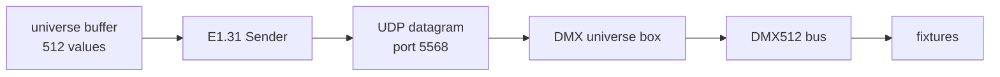
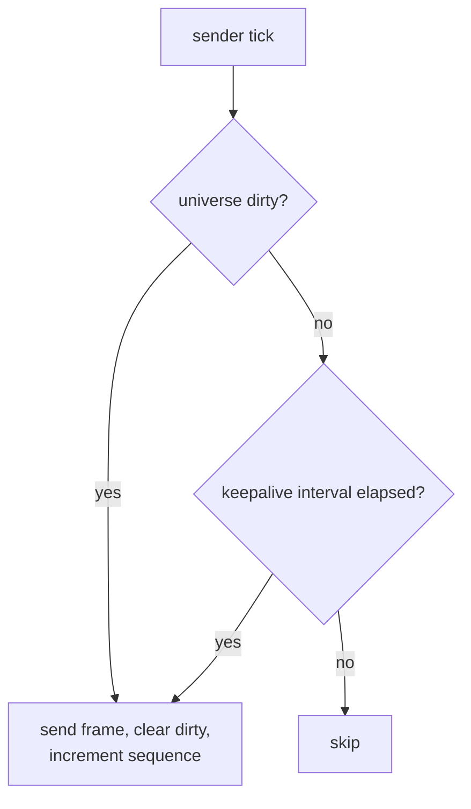

# Fixture and Transport Strategy

How DMX data is modelled, addressed, held in memory, and (eventually) put on the
wire. Companion to [architecture.md](architecture.md).

> **Status: model partially implemented, transport entirely absent.** There is no
> E1.31/sACN code, no socket, no UDP, and no networking dependency in this
> repository. Everything in §5 onward is Target.

---

## 1. Current device model

There is no device model. There is only a *device state*:

```python
# backend/models/DMX_Device_Preset.py
class DMX_Device_Preset(BaseModel):
    id: str
    order: int
    channel_count: int
    channel_values: List[int]
```

A `DMX_Preset` (a **look**) owns a list of these
([`models/DMX_Preset.py`](../backend/models/DMX_Preset.py)). That is the entire DMX
data model.

Note what is **not** present anywhere in the repository:

- device / fixture identity (`device_id`)
- device name
- universe assignment
- DMX start address
- fixture profile or channel layout
- semantic parameters (dimmer, red, green, blue, pan, tilt, strobe)

### 1.1 How addressing actually works today

From [`runtime/active.py:23-50`](../backend/runtime/active.py#L23-L50), device
states are sorted by `order` and packed contiguously from channel 0:

```python
channels = [0] * UNIVERSE_SIZE
cursor = 0
for device in devices:
    ...
    channels[cursor : cursor + device.channel_count] = values
    cursor += device.channel_count
```

**A device's start address is the running sum of the `channel_count` of every
device before it.** The docstring states this explicitly, so it is intentional
rather than accidental. It is nevertheless the repository's most significant
architectural problem.

| Problem | Detail |
| --- | --- |
| **No cross-look identity** | The same physical fixture is a distinct `DMX_Device_Preset` row in every look, with nothing linking them. Renaming, re-patching, or replacing a fixture means editing every look by hand. |
| **The patch is restated per look** | There is no single source of truth to compare against the fixtures' physical DIP switches. Two looks can silently disagree about the rig. |
| **Fragile under edit** | Changing one device's `channel_count` re-addresses every subsequent device in that look only. |
| **Gaps are inexpressible** | A real patch (fixture at 1, next at 20) cannot be represented; devices must be contiguous from channel 0. |
| **Raw values only** | `channel_values` is an opaque `List[int]`. Nothing knows that index 3 is "red". |
| **One universe** | `Active_DMX_Channels` is a single 512-value list; `build_channels` raises when the cursor exceeds 512 ([`active.py:40-45`](../backend/runtime/active.py#L40-L45)). |

Tracked as [AF-H01](audit_findings.md#af-h01).

### 1.2 Raw versus semantic: what the repository does

**Raw channel values, exclusively.** No semantic parameter appears anywhere. To be
clear about what this means in practice: setting a wash light to red requires
knowing, out of band, that its third channel is red, and writing
`channel_values = [255, 255, 0, 0]` by hand.

The current approach is not *wrong* for a small fixed rig — raw values are simple,
have no profile-database dependency, and always work. It is the missing *identity*
and *address*, not the missing semantics, that cause the problems in §1.1. Semantic
profiles are a recommendation (§3), not a prerequisite.

---

## 2. Current active DMX state

```python
# backend/models/Active_DMX_Channels.py
UNIVERSE_SIZE = 512

class Active_DMX_Channels(BaseModel):
    """The one channel map the DMX sender reads. Rebuilt in place, never persisted."""
    channels: List[int] = Field(default_factory=lambda: [0] * UNIVERSE_SIZE)
```

A single module-level instance lives at
[`runtime/active.py:19`](../backend/runtime/active.py#L19). Correctly excluded from
`RECORD_TYPES` and therefore never written to disk — the persistence boundary here
is right, and the docstring says so. Gaps:

- **No dirty tracking.** Every update rebuilds all 512 values, so change-only
  transmission is impossible without adding it.
- **No merge semantics.** A look fully replaces the buffer; channels not covered by
  any device state are forced to 0. There is no concept of layering or of leaving a
  channel untouched.
- **No clamping.** `channel_values` is `List[int]` with no `0..255` constraint, and
  `build_channels` truncates and pads the list length but never checks values.
  A stored `300` or `-1` will be copied straight into the buffer.
  See [AF-M01](audit_findings.md#af-m01).
- **Single universe** (§1.1).
- **No lock**, and it is a process global — see
  [show_control_architecture.md](show_control_architecture.md#6-concurrency-and-race-conditions).

---

## 3. Target fixture model

**Proposed, not implemented.** The minimum change that solves §1.1 is to introduce
a persisted `Fixture` collection holding the patch, and to reference it by id from
device states:

```text
Fixture                          (new persisted collection — the rig's patch)
├── id
├── name                         "front wash L"
├── universe                     1..63999
├── start_address                1..512
├── channel_count
└── profile_id                   optional, deferred

DMX_Device_Preset                (existing — a device's values inside one look)
├── id
├── fixture_id                   NEW: replaces positional `order`
└── channel_values
```

Why this specific shape:

- It removes `order`-based address derivation without changing the storage
  architecture. `fixture_id` becomes one more entry in the `REFERENCES` table in
  [`records.py`](../backend/storage/records.py) and integrity checking, cascade
  delete, and orphan pruning then work for it automatically.
- `channel_count` moves to the fixture, where it belongs — it is a property of the
  hardware, not of a look.
- Multi-universe falls out for free: the universe is a fixture property, so a look
  can span universes with no change to the look model.
- Semantic profiles can be added later as an optional `profile_id`, without
  reworking anything.

**Migration path.** This is an additive schema change: add the `fixtures`
collection, bump `SCHEMA_VERSION`, and register a step in
[`migrations.py`](../backend/storage/migrations.py) that synthesises one `Fixture`
per distinct `order` and rewrites device states to point at it. The
snapshot-before-migrate machinery already exists
([`migrations.py:66`](../backend/storage/migrations.py#L66)) and covers the risk.

**Fixture profiles** (mapping `dimmer`/`red`/`green`/`blue`/`pan`/`tilt`/`strobe`
to channel offsets) are a genuine convenience for a rig with a handful of fixture
types, but they are a *second* step. Getting identity and addressing right is what
unblocks everything else. Do not build a profile library before the patch exists.

---

## 4. Target universe state

```text
ActiveUniverses
└── per universe number:
    ├── channels[512]
    ├── dirty: bool
    └── last_sent_at
```

The important behaviours to add alongside it:

- **Clamp on write** to `0..255`. Do it at the buffer boundary so no path can put
  an invalid value on the wire, in addition to model-level validation.
- **Dirty flag per universe**, set on write and cleared on send — the prerequisite
  for any change-detection strategy in §7.
- **Explicit blackout**, so shutdown and deactivation policies
  ([show_control_architecture.md](show_control_architecture.md#32-deactivation))
  have something to call.

---

## 5. E1.31 / sACN transport

> **Nothing below is implemented.** There is no sACN library in
> [`requirements.txt`](../requirements.txt), no socket call, and no packet code
> anywhere in the repository. This section documents intent and the open decisions,
> and deliberately makes no claim about how the receiving hardware behaves.

E1.31 (ANSI E1.31, "sACN") carries DMX512 universe data over UDP. Its role in this
system is narrow: **take a 512-byte universe buffer and put it on the network.** It
knows nothing about scenes, looks, fixtures, or beats.



### 5.1 Current configuration surface

```python
# backend/storage/config.py:13
class DMXConfig(BaseModel):
    universe: int = 0
    interface: Optional[str] = None
    refresh_hz: int = 120
```

Three fields, and **all three need attention** before transport work:

| Field | Issue |
| --- | --- |
| `universe: int = 0` | sACN universes are numbered from **1**; 0 is not a valid sACN universe. A default of 0 will not work against a conforming receiver. Verify against the actual box before changing. [AF-M06](audit_findings.md#af-m06) |
| `interface` | Ambiguous: is this a local NIC to bind to, or a destination? Both are needed and this is one field. |
| `refresh_hz = 120` | Physical DMX512 tops out near 44 Hz for a full 512-slot frame. 120 Hz of E1.31 traffic cannot be reproduced on the bus and will be coalesced or dropped by the gateway. [AF-L01](audit_findings.md#af-l01) |

Absent entirely: destination IP, unicast/multicast selection, source name, priority,
and per-universe destination mapping.

### 5.2 Open transport decisions

Each of these needs a recorded decision before code is written. None can be
answered from the repository.

| Decision | Options | Note |
| --- | --- | --- |
| **Unicast vs multicast** | Unicast to the box's IP; multicast to `239.255.x.y` derived from universe | **Unicast recommended** for a single known receiver on a home LAN: no IGMP snooping concerns, no multicast flooding to unrelated devices, trivially debuggable. Multicast is for rigs with many receivers. |
| **Destination** | Static IP in config; discovery | Static. Discovery is unnecessary complexity for one box. |
| **Universe numbering** | Must match the box's expectation | **Unverified.** Do not guess. |
| **Cadence** | Continuous at N Hz; on change only; hybrid | **Hybrid recommended:** send immediately on change, plus a keepalive refresh (~1 Hz or slower) so a receiver that missed a packet or rebooted re-syncs. Pure change-only is fragile over UDP; pure continuous at 120 Hz is wasteful. |
| **Sequence numbers** | Per-universe `uint8`, incrementing, wrapping | Required by the protocol for out-of-order detection. Must be per universe. |
| **Priority** | Default 100 | Only matters with multiple sources. Expose it, default it, do not agonise over it. |
| **Source name** | A stable, human-readable CID/name | Helps enormously when sniffing traffic. Pick one and keep it constant. |
| **Library vs hand-rolled** | `sacn`, `python-sacn`; or build the packet | A library is the right call — the packet layout, CID handling, and sequence semantics are fiddly and already solved. Adding one is a new production dependency and therefore out of scope for this documentation task. |

### 5.3 Error handling and shutdown

Requirements, none of which are currently met because no transport exists:

- **A network failure must never touch persistent configuration.** The sender has
  no reason to hold a `Library` reference at all. See
  [decisions.md](decisions.md#d-012-network-failures-must-not-reach-persistent-state).
- **Send errors are logged and retried, never fatal.** A transient `ENETUNREACH`
  should not take the show down.
- **Explicit start and stop.** The sender owns a socket; the socket needs a defined
  lifecycle, and shutdown must be idempotent.
- **Clean shutdown sends a blackout frame**, then closes. Otherwise the box holds
  the last received values indefinitely and the rig stays lit after the app exits.

---

## 6. The custom universe box boundary

The repository contains **no information whatsoever** about the custom DMX universe
box — no firmware, no schematic, no protocol notes, no IP, no model number.

It is therefore treated as an opaque network endpoint characterised entirely by:
an IP address, the universe number(s) it listens for, and whether it expects
unicast or multicast. Nothing about its internal PCB, refresh behaviour, buffering,
or failure modes should be documented or assumed until it is measured.

Three things need to be established empirically and written down here:

1. What universe number(s) does it accept?
2. Does it require multicast, or accept unicast?
3. What does it do when packets stop — hold last values, or blackout?

Question 3 determines whether the shutdown-blackout requirement in §5.3 is
essential or merely tidy.

---

## 7. Change detection

With dirty tracking (§4) the sender can skip unchanged universes. Recommended
policy, matching §5.2:



This gives immediate response on cue changes, bounded idle traffic, and recovery
for a receiver that rebooted — without either flooding the network or risking a
silently-stale rig.

---

## 8. Hardware abstraction, simulation, and testing

This is the part that makes the rest safe to develop, and it should exist **before**
any real sender.

Define one narrow interface — conceptually `send(universe: int, channels: bytes)`
plus `start()`/`stop()` — with three implementations:

| Implementation | Purpose | Default? |
| --- | --- | --- |
| `NullDmxSender` | Discards everything | **Yes** — nothing transmits unless explicitly configured |
| `RecordingDmxSender` | Captures frames in memory for assertions | Test only |
| `SacnDmxSender` | The real thing | Opt-in via config |

With that in place, the testable surface without any hardware or network is:

- `build_channels` / look resolution → expected 512-value buffer, including the
  over-512 error path at [`active.py:40-45`](../backend/runtime/active.py#L40-L45)
  which is currently untested.
- Fixture address resolution → correct slot ranges, gap handling, multi-universe.
- Clamping and padding behaviour on malformed `channel_values`.
- Packet framing → assert on generated bytes with `RecordingDmxSender`; never open
  a socket in a unit test.
- Dirty/keepalive logic → drive a fake clock, assert on send counts.

**No test in this repository should ever transmit a real packet.** Integration
against the physical box is a manual, deliberate activity. See
[current_sprint.md](current_sprint.md#ws-6--hardware-independent-testing).

---

## 9. Failure behaviour summary

| Failure | Required behaviour |
| --- | --- |
| Destination unreachable | Log once, keep retrying, keep the show running. Never crash. |
| Socket creation fails at startup | Surface clearly; fall back to `NullDmxSender` rather than exiting. |
| Look references a missing fixture | Reject at load time via the `REFERENCES` integrity check, not at send time. |
| Channel value out of range | Clamp at the buffer boundary and log. Never transmit invalid data. |
| App exits | Blackout frame, then close the socket (§5.3). |
| App crashes | The box holds its last state — behaviour unverified (§6). A watchdog is out of scope for now. |
