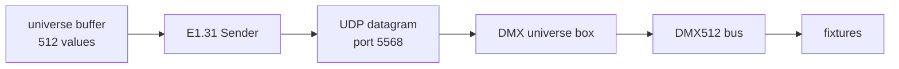
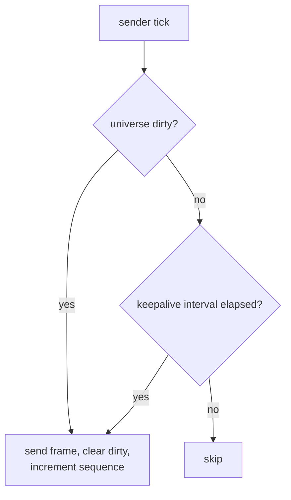

# Fixture and Transport Strategy

How DMX data is modelled, addressed, held in memory, and (eventually) put on the
wire. Companion to [architecture.md](architecture.md).

> **Terminology.** A "look" is a `dmx_preset` (`DMX_Preset`). Use `dmx_preset` going
> forward — [D-023](decisions.md#d-023-a-look-is-a-dmx_preset).

> **Status: model implemented; E1.31 packets absent.** Looks resolve into
> [`Active_DMX_Channels`](../backend/models/Active_DMX_Channels.py) by patched
> address. [`runtime/sender.py`](../backend/runtime/sender.py) is a symbolic sender:
> `DmxTransport` + `NullTransport` + a send-on-change/keepalive thread. There is no
> packet framing, no socket, and no UDP. Everything in §5 (the real sACN path) remains
> Target.

---

## 1. Current device model

There is no device model. There is only a *device state*:

```python
# backend/models/DMX_Device_Preset.py
class DMX_Device_Preset(BaseModel):
    id: str
    order: int
    channel_count: int
    channel_values: List[int]
```

A `DMX_Preset` (a **look**) owns a list of these
([`models/DMX_Preset.py`](../backend/models/DMX_Preset.py)). That is the entire DMX
data model.

Note what is **not** present anywhere in the repository:

- device / fixture identity (`device_id`)
- device name
- universe assignment
- DMX start address
- fixture profile or channel layout
- semantic parameters (dimmer, red, green, blue, pan, tilt, strobe)

### 1.1 How addressing actually works today

From [`runtime/active.py:23-50`](../backend/runtime/active.py#L23-L50), device
states are sorted by `order` and packed contiguously from channel 0:

```python
channels = [0] * UNIVERSE_SIZE
cursor = 0
for device in devices:
    ...
    channels[cursor : cursor + device.channel_count] = values
    cursor += device.channel_count
```

**A device's start address is the running sum of the `channel_count` of every
device before it.** The docstring states this explicitly, so it is intentional
rather than accidental. It is nevertheless the repository's most significant
architectural problem.

| Problem | Detail |
| --- | --- |
| **No cross-look identity** | The same physical fixture is a distinct `DMX_Device_Preset` row in every look, with nothing linking them. Renaming, re-patching, or replacing a fixture means editing every look by hand. |
| **The patch is restated per look** | There is no single source of truth to compare against the fixtures' physical DIP switches. Two looks can silently disagree about the rig. |
| **Fragile under edit** | Changing one device's `channel_count` re-addresses every subsequent device in that look only. |
| **Gaps are inexpressible** | A real patch (fixture at 1, next at 20) cannot be represented; devices must be contiguous from channel 0. |
| **Raw values only** | `channel_values` is an opaque `List[int]`. Nothing knows that index 3 is "red". |
| **One universe** | `Active_DMX_Channels` is a single 512-value list; `build_channels` raises when the cursor exceeds 512 ([`active.py:40-45`](../backend/runtime/active.py#L40-L45)). |

Tracked as [AF-H01](audit_findings.md#af-h01).

### 1.2 Raw versus semantic: what the repository does

**Raw channel values, exclusively.** No semantic parameter appears anywhere. To be
clear about what this means in practice: setting a wash light to red requires
knowing, out of band, that its third channel is red, and writing
`channel_values = [255, 255, 0, 0]` by hand.

The current approach is not *wrong* for a small fixed rig — raw values are simple,
have no profile-database dependency, and always work. It is the missing *identity*
and *address*, not the missing semantics, that cause the problems in §1.1. Semantic
profiles are a recommendation (§3), not a prerequisite.

---

## 2. Current active DMX state

```python
# backend/models/Active_DMX_Channels.py
UNIVERSE_SIZE = 512

class Active_DMX_Channels(BaseModel):
    """The one channel map the DMX sender reads. Rebuilt in place, never persisted."""
    channels: List[int] = Field(default_factory=lambda: [0] * UNIVERSE_SIZE)
```

A single module-level instance lives at
[`runtime/active.py:19`](../backend/runtime/active.py#L19). Correctly excluded from
`RECORD_TYPES` and therefore never written to disk — the persistence boundary here
is right, and the docstring says so. Gaps:

- **No dirty tracking.** Every update rebuilds all 512 values, so change-only
  transmission is impossible without adding it.
- **No merge semantics.** A look fully replaces the buffer; channels not covered by
  any device state are forced to 0. There is no concept of layering or of leaving a
  channel untouched.
- **No clamping.** `channel_values` is `List[int]` with no `0..255` constraint, and
  `build_channels` truncates and pads the list length but never checks values.
  A stored `300` or `-1` will be copied straight into the buffer.
  See [AF-M01](audit_findings.md#af-m01).
- **Single universe** (§1.1).
- **No lock**, and it is a process global — see
  [show_control_architecture.md](show_control_architecture.md#6-concurrency-and-race-conditions).

---

## 3. Target fixture model

**Implemented**, as `DMX_Device` rather than `Fixture` — the name matches the existing
`DMX_*` models and the term the rig owner uses.

```text
DMX_Device                       persisted root collection — the rig's patch
├── id
├── name                         "front wash L"
├── model                        "chauvet_gigbar_move" → docs/fixtures/<model>.md
├── mode                         the manual's max-channel mode name
├── universe                     1.. (only 1 is rendered today)
├── start_address                1..512
└── channel_count                1..512

DMX_Device_Preset                a device's values inside one look
├── id
├── device_id                    replaces positional `order`
└── channel_values
```

Per-channel semantics are **documented, not stored** — see
[docs/fixtures/](fixtures/README.md). `model` is the link between the two.

Why this specific shape:

- It removes `order`-based address derivation without changing the storage
  architecture. `fixture_id` becomes one more entry in the `REFERENCES` table in
  [`records.py`](../backend/storage/records.py) and integrity checking, cascade
  delete, and orphan pruning then work for it automatically.
- `channel_count` moves to the fixture, where it belongs — it is a property of the
  hardware, not of a look.
- Multi-universe falls out for free: the universe is a fixture property, so a look
  can span universes with no change to the look model.
- Semantic profiles can be added later as an optional `profile_id`, without
  reworking anything.

**Migration path.** Landed as the schema v2 → v3 step in
[`migrations.py`](../backend/storage/migrations.py): one `DMX_Device` per distinct
`order`, addressed by the old packing rule so existing looks resolve to the same
channels, then device states rewritten to point at it. Where looks disagreed on
`channel_count` for the same `order`, the widest claim wins so no device loses
channels.

**Fixture profiles** (mapping `dimmer`/`red`/`green`/`blue`/`pan`/`tilt`/`strobe`
to channel offsets) are a genuine convenience for a rig with a handful of fixture
types, but they are a *second* step. Getting identity and addressing right is what
unblocks everything else. Do not build a profile library before the patch exists.

---

## 4. Target universe state

```text
ActiveUniverses
└── per universe number:
    ├── channels[512]
    ├── dirty: bool
    └── last_sent_at
```

The important behaviours to add alongside it:

- **Clamp on write** to `0..255`. Do it at the buffer boundary so no path can put
  an invalid value on the wire, in addition to model-level validation.
- **Dirty flag per universe**, set on write and cleared on send — the prerequisite
  for any change-detection strategy in §7.
- **Explicit blackout**, so shutdown and deactivation policies
  ([show_control_architecture.md](show_control_architecture.md#32-deactivation))
  have something to call.

---

## 5. E1.31 / sACN transport

> **Nothing below is implemented.** The symbolic sender in
> [`runtime/sender.py`](../backend/runtime/sender.py) stops at `NullTransport.send`.
> There is no sACN library in [`requirements.txt`](../requirements.txt), no socket
> call, and no packet code anywhere in the repository. This section documents intent
> and the open decisions, and deliberately makes no claim about how the receiving
> hardware behaves.

E1.31 (ANSI E1.31, "sACN") carries DMX512 universe data over UDP. Its role in this
system is narrow: **take a 512-byte universe buffer and put it on the network.** It
knows nothing about scenes, looks, fixtures, or beats.



### 5.1 Current configuration surface

```python
# backend/storage/config.py
class DMXConfig(BaseModel):
    universe: int = Field(default=1, ge=1, le=63999)
    host: str = "127.0.0.1"
    port: int = Field(default=5568, ge=1, le=65535)
    priority: int = Field(default=100, ge=0, le=200)
    interface: Optional[str] = None
    refresh_hz: int = Field(default=120, ge=1)
```

`host`, `port`, and `priority` were recovered from the previous version of the app's
config file, which is the only record of what the rig was actually driven with;
`universe` was corrected from an invalid 0 at the same time
([AF-M06](audit_findings.md#af-m06)). **None of it is verified against the universe box on the wire** — it is a starting
point recovered from history, not a tested configuration. **Universe 1 and a single
universe are confirmed for this rig** ([§6](#6-the-custom-universe-box-boundary));
`host` must be set to the **network switch static IP** (from the switch manual) in
local `config.json` before real E1.31 output — not the loopback default below.

What still needs attention for a **fresh install** (production values go in local
`config.json` only):

| Field | Issue |
| --- | --- |
| `host = "127.0.0.1"` | Loopback placeholder from dev/testing. Production: set to the **network switch IP** from the switch manual in local `config.json` ([§6](#6-the-custom-universe-box-boundary)). |
| `transport = "null"` | Safe default (D-013). Set to `"e131"` only when ready for real output. |
| `mode = "unicast"` | **Decided** for this rig ([D-017](decisions.md#d-017-sacn-unicast-versus-multicast)). Multicast remains available in code but is not used here. |

Resolved in code: `source_name`, `bind_address`, `refresh_hz` default 44 (was 120;
[AF-L01](audit_findings.md#af-l01)). Slot count is deliberately not configurable — it
is `UNIVERSE_SIZE`, fixed by the protocol.

### 5.2 Transport decisions

| Decision | Status | Note |
| --- | --- | --- |
| **Unicast vs multicast** | **Decided — unicast** ([D-017](decisions.md#d-017-sacn-unicast-versus-multicast)) | Unicast to the switch IP. One known receiver on a home LAN: no IGMP snooping, no multicast flooding, trivially debuggable. `mode: "multicast"` remains in code for other rigs. |
| **Destination** | **Decided — static IP** | Static switch IP in local `config.json`. Discovery is unnecessary for one box. |
| **Universe numbering** | **Verified — universe 1 only** ([§6](#6-the-custom-universe-box-boundary)) | |
| **Cadence** | **Decided — hybrid** ([D-019](decisions.md#d-019-send-on-change--keepalive-cadence)) | Implemented in `SenderThread`; keepalive from `DMXConfig.refresh_hz` |
| **Sequence numbers** | **Decided** | Per-universe `uint8`, incrementing, wrapping — required by the protocol |
| **Priority** | **Decided — default 100** | Only matters with multiple sources |
| **Source name** | **Decided — `"Lights App"` default** | On `DMXConfig.source_name`; helps when sniffing traffic |
| **Library vs hand-rolled** | **Decided — hand-rolled** ([D-020](decisions.md#d-020-hand-rolled-e131-framing)) | In [`runtime/e131.py`](../backend/runtime/e131.py); `sacn` remains the fallback |

### 5.3 Error handling and shutdown

Requirements for the **real** transport (`E131Transport`, not yet in the tree):

- **A network failure must never touch persistent configuration.** The sender has
  no reason to hold a `Library` reference at all. See
  [decisions.md](decisions.md#d-012-network-failures-must-not-reach-persistent-state).
- **Send errors are logged and retried, never fatal.** A transient `ENETUNREACH`
  should not take the show down.
- **Explicit start and stop.** The transport owns a socket; shutdown must be
  idempotent.
- **Clean shutdown sends a blackout frame**, then closes. The box also **blackouts
  when packets stop** ([§6](#6-the-custom-universe-box-boundary)), so a crash stops
  DMX output — but an explicit shutdown frame is still required for a controlled
  exit, Stream_Terminated semantics, and LEDfx coordination ([D-011](decisions.md#d-011-hold-between-scenes-blackout-on-clean-shutdown)).

`NullTransport` today satisfies none of the wire requirements by design — it only
proves the wake path.

### 5.4 The E1.31 transport (WS-4.4)

Landed 2026-08-16, without rewriting `SenderThread`.

| Step | State |
| --- | --- |
| 1. Config | **Done** — `transport`, `mode`, `source_name`, `bind_address` on `DMXConfig`; `interface` removed as ambiguous |
| 2. Framing | **Done** — [`runtime/e131.py`](../backend/runtime/e131.py): `build_data_packet()`, `SequenceCounter`, `cid_from_source_name()`, `multicast_host()` ([D-020](decisions.md#d-020-hand-rolled-e131-framing)) |
| 3. Transport | **Done** — `E131Transport` in [`runtime/sender.py`](../backend/runtime/sender.py): lazy socket, `send()` never raises, `close()` blacks out then terminates the stream |
| 4. Opt-in | **Done** — `build_transport()` returns `NullTransport` unless `dmx.transport == "e131"` |
| 5. Accept | **Partly** — byte tests pass against an injected fake socket; a manual activation against the physical box and a p99 re-measure with the real transport are outstanding |

Config for real output, in the user's local `config.json` only:

```json
"dmx": {
  "transport": "e131",
  "mode": "unicast",
  "universe": 1,
  "host": "<universe-box-ip>",
  "bind_address": "<this-machine's-nic-ip>",
  "port": 5568,
  "priority": 100,
  "refresh_hz": 44
}
```

`mode: "multicast"` ignores `host` and sends to the universe's group instead
(`239.255.0.1` for universe 1). This rig uses **unicast** only
([D-017](decisions.md#d-017-sacn-unicast-versus-multicast)).

Full checklist: [current_sprint.md § 4.4](current_sprint.md#44-real-sacn-sender--next-hardware-milestone).

---

## 6. The custom universe box boundary

The custom DMX universe box is treated as an **opaque network endpoint** — no
firmware, schematic, or protocol notes live in this repository. Its internals
(PCB, refresh behaviour, buffering) are not documented or assumed.

### Verified rig configuration (2026-08-16)

| Fact | Value | Where it lives |
| --- | --- | --- |
| **Universe count** | **1** — entire rig on a single sACN stream | Code assumes one buffer ([`runtime/active.py`](../backend/runtime/active.py)); multi-universe is out of scope |
| **Universe number** | **1** | `DMXConfig.universe` default; all patched fixtures use universe 1 ([`docs/fixtures/README.md`](fixtures/README.md)) |
| **E1.31 destination** | **Network switch** (static IP from the switch manual) | `dmx.host` in the user's local `config.json` only — **never committed** ([`paths.py`](../backend/storage/paths.py)) |
| **Transport mode** | **Unicast** to switch IP | `DMXConfig.mode = "unicast"` ([D-017](decisions.md#d-017-sacn-unicast-versus-multicast)) |
| **Port** | **5568** (sACN default) | `DMXConfig.port` |
| **Packet-stop behaviour** | **Blackout** — rig goes dark when sACN packets stop | Confirmed on hardware; aligns with [D-011](decisions.md#d-011-hold-between-scenes-blackout-on-clean-shutdown) shutdown requirement |

Set the switch IP when enabling real output:

```json
"dmx": {
  "universe": 1,
  "mode": "unicast",
  "host": "<switch-static-ip-from-manual>",
  "port": 5568
}
```

No IP addresses, hostnames, or MAC addresses belong in the repository.

### Still to verify empirically

1. One end-to-end activation with `transport = "e131"` — lights respond as expected
   (WS-4.4 hardware sign-off).

---

## 7. Change detection

This is now implemented, symbolically, in [`SenderThread`](../backend/runtime/sender.py):
`publish()` sets `dmx_dirty`, the sender wakes immediately, and a keepalive timeout
re-sends the last buffer. The transport it calls is still `NullTransport`. The
diagram below is the same policy a real E1.31 class will inherit.



This gives immediate response on cue changes, bounded idle traffic, and recovery
for a receiver that rebooted — without either flooding the network or risking a
silently-stale rig.

---

## 8. Hardware abstraction, simulation, and testing

This is the part that makes the rest safe to develop. The symbolic half exists
**before** any real sender.

The live interface is `DmxTransport.send(channels)` plus `SenderThread.start()` /
`stop()`, with one implementation today:

| Implementation | Purpose | Default? |
| --- | --- | --- |
| `NullTransport` | Counts frames, opens no socket | **Yes** — nothing transmits |
| `RecordingDmxSender` | Captures frames in memory for assertions | Test only (not a named class; tests use a local fake) |
| `E131Transport` | Frames sACN and sends it over UDP | Opt-in via `dmx.transport = "e131"` |

With that in place, the testable surface without any hardware or network is:

- `build_channels` / look resolution → expected 512-value buffer, including the
  over-512 error path at [`active.py:40-45`](../backend/runtime/active.py#L40-L45)
  which is currently untested.
- Fixture address resolution → correct slot ranges, gap handling, multi-universe.
- Clamping and padding behaviour on malformed `channel_values`.
- Packet framing → assert on generated bytes with `RecordingDmxSender`; never open
  a socket in a unit test.
- Dirty/keepalive logic → drive a fake clock, assert on send counts.

**No test in this repository should ever transmit a real packet.** Integration
against the physical box is a manual, deliberate activity. See
[current_sprint.md](current_sprint.md#ws-6--hardware-independent-testing).

---

## 9. Failure behaviour summary

| Failure | Required behaviour |
| --- | --- |
| Destination unreachable | Log once, keep retrying, keep the show running. Never crash. |
| Socket creation fails at startup | Surface clearly; fall back to `NullTransport` rather than exiting. |
| Look references a missing fixture | Reject at load time via the `REFERENCES` integrity check, not at send time. |
| Channel value out of range | Clamp at the buffer boundary and log. Never transmit invalid data. |
| App exits | Blackout frame, then close the socket (§5.3). |
| App crashes | DMX **blackouts** when packets stop ([§6](#6-the-custom-universe-box-boundary)). LEDfx may keep rendering until explicitly stopped. A watchdog is out of scope for now. |
