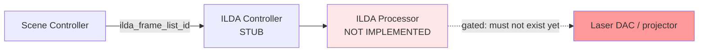

# Laser (ILDA) and Haze — Status and Safety Boundary

> **This document does not certify anything as safe.** It records what the
> repository contains, what it does not, and what would have to exist before laser
> output could responsibly be enabled. No legal or regulatory conclusion is offered
> — the repository contains no regulatory research, standards references, or
> hardware documentation to base one on.

---

## 1. Current implementation status

**No laser output capability exists in this repository.** There is no ILDA
processor, no point-stream generation, no DAC or interface driver, no scanner
control, no output-enable path, and no code that could cause a laser to emit.

A search for `laser`, `galvo`, `scanner`, `dac`, `etherdream`, `helios`, and
`interlock` across all source files returns **zero matches**. The only ILDA-related
code is file storage.

### 1.1 What does exist

| Component | File | What it does |
| --- | --- | --- |
| `ILDA_Frame` | [`models/ILDA_Frame.py`](../backend/models/ILDA_Frame.py) | An id only. The id **is** the `.ild` filename ([`records.py:56-59`](../backend/storage/records.py#L56-L59)) |
| `ILDA_Frame_List` | [`models/ILDA_Frame_List.py`](../backend/models/ILDA_Frame_List.py) | An ordered list of frame ids |
| `Scene.ilda_frame_list_id` | [`models/Scene.py:8`](../backend/models/Scene.py#L8) | Links a scene to one frame list |
| `Active_ILDA_Frame` | [`models/Active_ILDA_Frame.py`](../backend/models/Active_ILDA_Frame.py) | One `Optional[str]` frame id; module global at [`active.py:20`](../backend/runtime/active.py#L20); never persisted |
| Blob storage | [`storage/ilda_blobs.py`](../backend/storage/ilda_blobs.py) | Copies `.ild` files into the data folder, validates ids, atomic write |
| Folder sync | [`library.py:427-452`](../backend/storage/library.py#L427-L452) | Reconciles `ilda/*.ild` on disk with `ilda_frames.json` |
| Path handoff | [`library.py:418-425`](../backend/storage/library.py#L418-L425) | `ilda_path()` returns a filesystem path "to hand to the ILDA system" |

**File contents are never parsed.** This is stated explicitly and repeatedly in the
code — `store_ild_file` copies "byte for byte; nothing about its contents is
inspected" ([`ilda_blobs.py:62-66`](../backend/storage/ilda_blobs.py#L62-L66)), and
`frame_path` notes "Contents are never parsed here"
([`ilda_blobs.py:26-28`](../backend/storage/ilda_blobs.py#L26-L28)).

So the current state is: **the app is a file manager for `.ild` blobs.** It cannot
validate, bound, or reason about their contents in any way.

### 1.2 Note on the ILDA blob path

Two behaviours worth knowing about, neither safety-critical today:

- Deleting an `ILDA_Frame` deletes the underlying `.ild` file from disk
  ([`library.py:362-363`](../backend/storage/library.py#L362-L363)). Cascade
  deletion therefore destroys user files. Relevant to
  [AF-H04](audit_findings.md#af-h04).
- `sync_ilda_folder` removes frames whose file has vanished and detaches them from
  frame lists, and **writes to disk during `load()`**
  ([`library.py:449-451`](../backend/storage/library.py#L449-L451)). See
  [AF-M05](audit_findings.md#af-m05).

Path-traversal protection on frame ids is implemented and correct —
`validate_frame_id` rejects separators, `.`, `..`, and anything that is not a bare
filename ([`ilda_blobs.py:17-23`](../backend/storage/ilda_blobs.py#L17-L23)). That
is a genuine strength given the ids come from filenames.

---

## 2. Intended architectural boundary

Laser work is explicitly lower priority than DMX and WLED. The correct thing to do
now is **define the boundary and build nothing behind it.**

Boundary rules:

1. The ILDA subsystem sits behind **one** interface reached only from the Scene
   Controller. Nothing else in the codebase may reference it.
2. It never touches `Active_DMX_Channels`, the E1.31 sender, or the LEDfx client. A
   laser fault must not affect the rest of the rig, and vice versa.
3. The stub accepts a frame list and does nothing. It does not open a device, does
   not enumerate hardware, and does not partially implement output.
4. `Active_ILDA_Frame` stays in memory and stays unpersisted — already correct.
5. No laser output code is added until §4 is satisfied.

See [decisions.md](decisions.md#d-008-ilda-stays-behind-a-separate-processor-boundary).

---

## 3. Explicit safety limitations

Stated plainly so that no future reader mistakes the current state for readiness:

- **The repository provides no laser safety mechanism of any kind.** There is no
  emergency stop, no interlock, no output enable, no scan-fail detection, no power
  limiting, no beam-zone masking, and no watchdog.
- **The repository cannot validate ILDA content.** `.ild` files are opaque blobs.
  The app cannot tell a safe frame from one that parks a stationary beam.
- **A stationary or slow-scanning beam is the primary hazard** in projection lasers,
  and it is exactly the failure mode that software must not be able to cause — for
  example by stalling, crashing, or halting a frame mid-scan while output is on.
  Nothing in this design addresses that today.
- **No hardware is documented.** No projector, DAC, interface, or power class is
  identified anywhere in the repository. `ILDAConfig` in
  [`storage/config.py:24-27`](../backend/storage/config.py#L24-L27) has
  `device: Optional[str] = None` and `points_per_second: int = 30000` — an
  unvalidated default with no verified relationship to any real device.
- **This documentation is not a safety assessment** and was not produced by anyone
  qualified to perform one.

---

## 4. What must exist before output is enabled

A prerequisite list, not a plan. None of it is scheduled, and it is deliberately
placed after everything else on the [roadmap](roadmap.md#phase-9--ilda-integration-behind-safety-boundaries).

**Hardware and physical layer**

- [ ] Identified projector and interface, with manufacturer documentation on hand.
- [ ] A physical emergency stop that cuts laser power **independently of this
      software**. Software must never be the only thing standing between the
      operator and beam-off.
- [ ] Hardware-level scan-fail / beam-stop protection, verified to work.
- [ ] Fixed, physically-constrained projection geometry — beam paths that cannot
      reach people, reflective surfaces, or windows.

**Software gates**

- [ ] Output disabled by default in config, requiring an explicit, deliberate
      opt-in that is not the default in any checked-in file.
- [ ] A single, obvious kill path in the UI.
- [ ] A watchdog that halts output if the show-control loop stops advancing.
- [ ] Defined behaviour on every failure: crash, unhandled exception, audio loss,
      scene deactivation, clean shutdown. In every case the safe state is
      **beam off**.
- [ ] `.ild` content validation, or an explicit accepted-content policy.

**Process**

- [ ] Independent review by someone with laser display experience.
- [ ] Whatever local rules apply to the installation, established from primary
      sources by the operator — **not** from this document.

---

## 5. Testing restrictions

Until §4 is complete:

- **No test, script, or development run may enable laser output.** The default
  configuration must make output impossible, not merely unlikely.
- The ILDA subsystem is tested only at the storage and reference level — importing
  `.ild` files, syncing the folder, resolving a frame list — all of which is
  already the current scope and is safe.
- Any future output code is developed against a null or recording sink first, per
  the same pattern as DMX and LEDfx
  ([fixture_and_transport_strategy.md](fixture_and_transport_strategy.md#8-hardware-abstraction-simulation-and-testing)).
- Hardware bring-up, when it happens, is a manual, supervised activity with the
  physical E-stop in reach and the beam pointed somewhere harmless.

---

## 6. Production readiness

**The ILDA subsystem is not production-ready and is not close.** It is a storage
schema. Any documentation, comment, UI affordance, or commit message implying
otherwise should be corrected.

Two comments in the codebase are worth flagging as slightly ahead of reality — not
wrong, but forward-looking: `Active_ILDA_Frame`'s "The one frame the ILDA sender
reads" and `ilda_path`'s "The path to hand to the ILDA system for playback". There
is no ILDA sender and no ILDA system. They describe intent, and they are accurate
about the *boundary*; a reader should not infer that a playback path exists.

---

## 7. Haze

**No haze, fog, or atmospheric-effect control exists in this repository.** There is
no model, no config section, no DMX device state identified as a hazer, and no
mention of it anywhere in the source.

If haze is added later it will most plausibly arrive as an ordinary DMX fixture,
which means it inherits the fixture model discussed in
[fixture_and_transport_strategy.md](fixture_and_transport_strategy.md#3-target-fixture-model)
and needs no special software architecture.

Operational considerations, recorded now because they are easy to forget once a
hazer is patched:

- Haze makes laser beams visible, which changes the hazard picture of any laser
  work. The two subsystems interact even though the software does not.
- Haze interacts with smoke detection. Establish what the room's detection setup is
  before running haze unattended.
- Density is not instantaneous — a hazer keeps outputting after its channel drops,
  and the room clears slowly. Beat-synchronised haze bursts are a bad idea for this
  reason.
- Ventilation and dwell time are room properties, not software concerns, and belong
  in operator notes rather than in code.

None of the above is currently actionable, and no haze control should be added
until there is a hazer to control.
