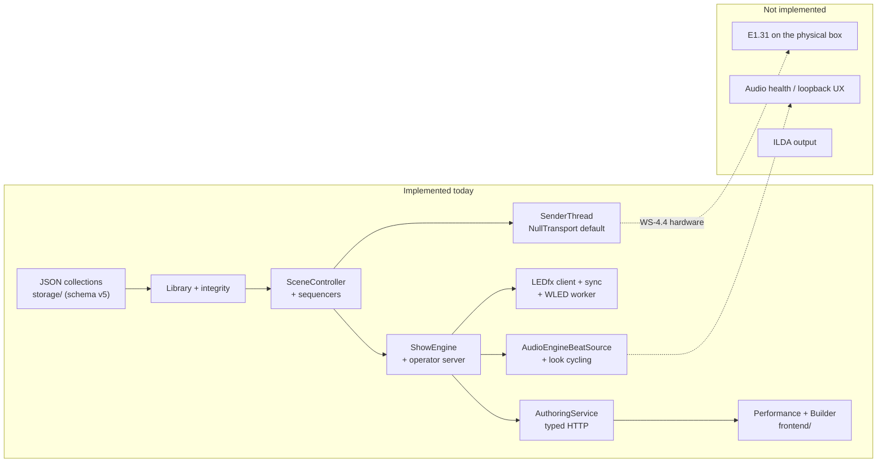

# Project Overview

Entry point for the Lights App documentation set. Read this first, then
[architecture.md](architecture.md).

> **Terminology.** A "look" is a `dmx_preset` (`DMX_Preset`). Use `dmx_preset` going
> forward — [D-023](decisions.md#d-023-a-look-is-a-dmx_preset).

---

## Purpose

Lights App is a show-control application for a single, specific installation: a
home/basement lighting rig. An operator manually selects a **scene**; the scene
drives conventional DMX fixtures, addressable LED strips (via WLED/LEDfx), and —
eventually — an ILDA laser projector. Sequencing within a scene is meant to be
driven by beats detected from live audio.

The immediate target is *one reliable room*, not a general-purpose lighting
console. See [decisions.md](decisions.md#d-009-basement-deployment-is-the-immediate-target).

## Intended users

A single operator (the repository owner) running the app on a Windows machine on
the same LAN as the lighting hardware. There is no multi-user, authentication, or
remote-access requirement in the repository today.

---

## Current maturity

> **The repository has a persistence layer, a beat-driven show-control core, an
> operator HTTP server, live audio into look cycling, Performance + Builder UI, and
> an E1.31 sender that stays off until opted in.**
> It is not yet a complete show: capture health is not on the UI, and nothing
> transmits E1.31 until `dmx.transport` is `"e131"`.

There is an app entry point (`backend/main.py`) and a no-build Performance / Builder
UI.
Live audio starts with the process when a capture device is usable. A pytest suite
covers storage, sequencing, outputs, the sender wake path, the server, and the audio
adapter (without opening PortAudio).

The server/runtime layer was **independently audited at `acc52a7`**
([Audit v3](audit_findings.md#audit-v3--operator-server--runtime), 2026-08-13):
verdict **READY WITH MINOR FIXES** — no blocker to *beginning* E1.31, with
recommended fixes (F-01/F-02/F-04/F-05, none yet implemented) folded into the
WS-4.4 window. Universe **1**, single universe, and switch destination are
documented; transport mode is **unicast** ([D-017](decisions.md#d-017-sacn-unicast-versus-multicast)).
Packet-stop behaviour verified: **blackout**.
Nothing is hardware-proven; the latency evidence is software-path only.

| Layer | Status | Evidence |
| --- | --- | --- |
| Persistence / storage | **Substantially implemented** | [`backend/storage/`](../backend/storage/) — schema v5, migrations, integrity |
| Data model | **Mostly implemented** | 12 models; `DMX_Device` and cue-list `beats` per list; per-*entry* beats still absent |
| Runtime / sequencing | **Core implemented, wired in server** | [`runtime/scene_controller.py`](../backend/runtime/scene_controller.py), [`sequencer.py`](../backend/runtime/sequencer.py), [`outputs.py`](../backend/runtime/outputs.py); driven by [`server/engine.py`](../backend/server/engine.py) |
| Operator server | **M1 done + authoring HTTP** | [`backend/main.py`](../backend/main.py), FastAPI on `0.0.0.0:8800`, WebSocket `/ws/show`, REST `/api/show/*` and typed authoring CRUD |
| Beat source boundary | **Protocol + live adapter** | [`audio/beat_source.py`](../backend/audio/beat_source.py), [`audio/audio_engine_source.py`](../backend/audio/audio_engine_source.py); manual tap still works |
| Audio / beat detection | **Wired into look cycling** | `lights-audio-engine` on a worker; beats are `ShowCommand(BEAT)`. Silence vs dead capture is not on `/api/status` |
| DMX transport (E1.31/sACN) | **Code landed, unverified on hardware** | [`runtime/e131.py`](../backend/runtime/e131.py) + `E131Transport`; default is still `NullTransport` until `dmx.transport` is `"e131"` |
| WLED / LEDfx integration | **Wired off show thread** | [`AsyncCueOutput`](../backend/runtime/outputs.py) + worker in [`server/engine.py`](../backend/server/engine.py); `LedfxConfig.enabled` defaults false |
| ILDA processing | **Storage only** | [`.ild` blob store](../backend/storage/ilda_blobs.py); nothing parses or plays |
| UI / frontend | **WS-11.2 done** | Performance + Builder in [`frontend/`](../frontend/); [frontend_architecture.md](frontend_architecture.md) |
| Tests | **211 tests** | storage, sequencing, outputs, sender, e131, server, authoring, latency |
| CI | **Absent** | no workflow files |
| Logging | **Implemented** | [`backend/logging_setup.py`](../backend/logging_setup.py); storage events log to `logs/` |

Roughly 2,000+ lines of Python across backend and tests; storage remains the largest
single subsystem, with runtime sequencing now the second.

---

## Supported lighting systems

Nothing is *supported* yet in the sense of working output. The repository models
three intended output domains:

1. **DMX512 over E1.31/sACN** — data modelled ([`DMX_Device`](../backend/models/DMX_Device.py),
   [`DMX_Preset`](../backend/models/DMX_Preset.py),
   [`DMX_Device_Preset`](../backend/models/DMX_Device_Preset.py),
   [`Active_DMX_Channels`](../backend/models/Active_DMX_Channels.py)); framing and
   `E131Transport` exist, default transport is still `NullTransport`
   ([`runtime/sender.py`](../backend/runtime/sender.py),
   [`runtime/e131.py`](../backend/runtime/e131.py)). Channel tables per model in
   [docs/fixtures/](fixtures/README.md).
2. **WLED via LEDfx** — [`WLED_Preset`](../backend/models/WLED_Preset.py) stores the
   LEDfx scene name as `id`; [`WLED_Preset_List`](../backend/models/WLED_Preset_List.py)
   is persisted and referenced from [`Preset`](../backend/models/Preset.py). HTTP
   client in [`backend/ledfx/`](../backend/ledfx/); activated from the show engine when
   `ledfx.enabled` is true.
3. **ILDA laser** — file storage and reference-tracking only; no processing, and
   **no output path exists or should be enabled**. See
   [laser_and_haze_safety.md](laser_and_haze_safety.md).

---

## Current capabilities

What the code actually does today:

- Opens a per-user data folder (`%LOCALAPPDATA%\LightsApp` on Windows) and creates
  the `data/`, `ilda/`, `backups/`, `logs/` layout — [`storage/paths.py`](../backend/storage/paths.py).
- Loads and saves ten normalized JSON collections, one file per model class,
  with crash-safe atomic writes and corrupt-file quarantine —
  [`storage/json_store.py`](../backend/storage/json_store.py).
- Enforces referential integrity across the object graph on load, on save, and on
  insert; supports cascade delete, orphan pruning, and referrer lookup —
  [`storage/library.py`](../backend/storage/library.py).
- Versions the data folder (schema **v4**), snapshots before migrating, wraps legacy
  `Preset.wled_preset_id` values into one-entry WLED lists, synthesises
  `DMX_Device` rows from the old positional `order`, and lifts cue-list beat counts
  to a usable default —
  [`storage/migrations.py`](../backend/storage/migrations.py).
- Exports/imports the whole data folder as a zip, with zip-slip protection —
  [`storage/archive.py`](../backend/storage/archive.py).
- Imports `.ild` files as opaque blobs and reconciles the folder with the
  database on load — [`storage/ilda_blobs.py`](../backend/storage/ilda_blobs.py).
- Resolves a look into a 512-value DMX buffer using each device's patched start
  address, rejecting overlaps and out-of-universe devices —
  [`runtime/active.py`](../backend/runtime/active.py).
- Activates a scene, runs two independent cue sequencers off a beat stream, and
  applies looks to the universe buffer and LEDfx scenes —
  [`runtime/scene_controller.py`](../backend/runtime/scene_controller.py),
  [`runtime/sequencer.py`](../backend/runtime/sequencer.py),
  [`runtime/outputs.py`](../backend/runtime/outputs.py).
- Emits beats via a `BeatSource` protocol with a manual implementation for tests —
  [`audio/beat_source.py`](../backend/audio/beat_source.py).
- Polls LEDfx for scene names and upserts `WLED_Preset` rows when enabled —
  [`ledfx/scene_sync.py`](../backend/ledfx/scene_sync.py).
- Runs the operator server: scene activate/deactivate/blackout/beat over WebSocket
  and REST, with latency instrumentation showing a ≤ 13 ms **software path** —
  measured from scene selection (command received on the server) through
  `DmxTransport.send` returning;
  no packet, network, DMX line, or fixture time is included —
  [`backend/server/`](../backend/server/), [`frontend/`](../frontend/).
- Wakes the DMX sender on buffer change (`publish()` → `dmx_dirty` →
  `SenderThread` → `NullTransport` or `E131Transport`) —
  [`runtime/sender.py`](../backend/runtime/sender.py), [`runtime/active.py`](../backend/runtime/active.py).
- Creates and updates the show graph through `AuthoringService` and typed REST
  (`/api/scenes`, `/api/presets`, cue lists, looks) —
  [`authoring/service.py`](../backend/authoring/service.py), [authoring.md](authoring.md).
- Serves Performance (scene grid + beat flash) and Builder (fixture editors, looks,
  cue lists, scenes) as static pages — [`frontend/`](../frontend/),
  [frontend_architecture.md](frontend_architecture.md).
- Runs a pytest suite against temp data roots — [`tests/`](../tests/).

## Major incomplete areas

Ranked by how much they block a working system:

1. **One universe only — universe 1.** The rig runs a single sACN universe
   (number **1**). E1.31 is sent to the **network switch** (static IP from the switch
   manual, set as `dmx.host` in local `config.json` only). `DMX_Device.universe` is
   persisted but [`runtime/active.py`](../backend/runtime/active.py) buffers one
   universe and raises for anything else. See
   [fixture_and_transport_strategy.md §6](fixture_and_transport_strategy.md#6-the-custom-universe-box-boundary).
2. **Per-entry beat duration is still absent.** Both cue lists carry one `beats`
   scalar for the whole list (schema v4); the sequencers are built and tested against
   that shape. Variable hold times per cue entry remain future work
   ([AF-H02](audit_findings.md#af-h02)).
3. **Capture health is not operator-visible** — beats stop and looks hold when the
   device dies, which is correct lighting behaviour, but `/api/status` and Performance
   cannot tell silence from a dead input
   ([audio_reactivity_architecture.md §8](audio_reactivity_architecture.md#8-error-and-silence-behaviour)).
4. **E1.31 is written but unproven.** [`runtime/e131.py`](../backend/runtime/e131.py)
   and `E131Transport` frame and send real packets, verified over loopback and by
   byte-level tests. `dmx.transport` defaults to `"null"`, so nothing transmits until
   it is opted in, and no frame has reached the physical rig yet.
5. **Operator UI is Performance + Builder** — pages are in `frontend/`; remaining
   work is capture health on Performance (WS-9), not a second UI. See
   [frontend_architecture.md](frontend_architecture.md).

## System boundaries

The application is responsible for scene selection, preset resolution, beat
sequencing, DMX universe state, and E1.31 packet emission. It is **not**
responsible for:

- Rendering WLED pixels — LEDfx owns that. The app selects LEDfx presets.
- DMX512 electrical signalling — a custom DMX universe box receives E1.31 over
  Ethernet (via the network switch) and drives the physical bus. Its internals are
  not described in this repository; see
  [fixture_and_transport_strategy.md §6](fixture_and_transport_strategy.md#6-the-custom-universe-box-boundary)
  for verified addressing (universe 1, switch IP in local config).
- Parsing or rendering ILDA content — `.ild` files are stored byte-for-byte and
  never inspected ([`ilda_blobs.py:62-66`](../backend/storage/ilda_blobs.py#L62-L66)).

---

## Key terminology

The repository uses "preset" for five different things at five different levels.
This documentation set uses the disambiguated terms in the left column and always
names the concrete repository type.

| Term used in docs | Meaning | Repository type |
| --- | --- | --- |
| **Scene** | The top-level unit an operator selects manually | [`Scene`](../backend/models/Scene.py) |
| **Lighting preset** | Pairs one DMX side with one WLED side | [`Preset`](../backend/models/Preset.py) |
| **DMX cue list** | Ordered, beat-advanced sequence of `dmx_preset` ids | [`DMX_Preset_List`](../backend/models/DMX_Preset_List.py) |
| **dmx_preset** | One complete lighting state across all devices. Older docs called this a **look** | [`DMX_Preset`](../backend/models/DMX_Preset.py) |
| **Device state** | One device's channel values inside a `dmx_preset` | [`DMX_Device_Preset`](../backend/models/DMX_Device_Preset.py) |
| **Device / fixture** | A physical device and its patch (universe, start address, channel count) | [`DMX_Device`](../backend/models/DMX_Device.py) |
| **Universe buffer** | The live 512 channel values sent to the wire | [`Active_DMX_Channels`](../backend/models/Active_DMX_Channels.py) |
| **WLED cue list** | Ordered sequence of LEDfx presets | [`WLED_Preset_List`](../backend/models/WLED_Preset_List.py) |
| **LEDfx preset** | An effect configuration owned by LEDfx | [`WLED_Preset`](../backend/models/WLED_Preset.py) — `id` is the scene name |
| **Transport** | E1.31/sACN packet emission over Ethernet | [`DmxTransport`](../backend/runtime/sender.py) — `NullTransport` default; `E131Transport` when `dmx.transport` is `"e131"` |

A **dmx_preset** is a static state; a **cue list** is a time-ordered sequence of
those states. Do not call a `dmx_preset` a "look" in new writing
([D-023](decisions.md#d-023-a-look-is-a-dmx_preset)).

---

## End-to-end summary

**Intended** flow, in one paragraph: the operator picks a scene; the scene's
sensitivity configures the audio processor, which emits beat events; the scene's
lighting preset resolves to a DMX cue list and a WLED cue list; a shared beat
sequencer advances both lists independently according to each entry's beat
duration; the DMX side resolves the current look into a 512-channel universe
buffer which an E1.31 sender transmits to the DMX universe box; the WLED side
calls the LEDfx HTTP API when the active preset changes; the scene's ILDA frame
list is handed to an ILDA processor.

**Actual** flow today: the operator server opens a `Library`, starts
[`ShowEngine`](../backend/server/engine.py) (show thread + sender thread + WLED worker),
and accepts scene commands over WebSocket or REST. A scene activation resolves looks,
writes the universe buffer, calls `publish()`, and the sender thread invokes
`NullTransport.send`. Detected beats and manual taps both enqueue `ShowCommand(BEAT)`.
LEDfx calls happen on a background worker when enabled. Nothing leaves the machine as
E1.31 until `dmx.transport` is `"e131"`.

---

## Next steps (priority order)

1. **Prove the E1.31 transport on hardware (WS-4.4)** — the code is written
   ([`runtime/e131.py`](../backend/runtime/e131.py), `E131Transport`) and covered by
   byte tests; what remains is setting `dmx.transport = "e131"` with the switch IP and
   `mode = "unicast"`, confirming one activation lights the rig, and re-measuring p99
   with the real transport ([D-013](decisions.md#d-013-hardware-output-defaults-to-a-null-implementation),
   [D-017](decisions.md#d-017-sacn-unicast-versus-multicast),
   [D-020](decisions.md#d-020-hand-rolled-e131-framing)).
2. **Finish WS-9 operator loop** — WASAPI loopback as `input_device` when the music
   is on the same PC; silence vs dead capture on `/api/status` and Performance; BPM
   display-only. `ManualBeatSource` stays for tests. Performance + Builder pages
   already exist ([frontend_architecture.md](frontend_architecture.md)).

Detail: [current_sprint.md § Future plans](current_sprint.md#future-plans) and
[WS-4.4](current_sprint.md#44-real-sacn-sender).

---

## Current state versus target state

---

## Where to go next

| Question | Document |
| --- | --- |
| How is the system structured, and how should it be? | [architecture.md](architecture.md) |
| How does a scene run? | [show_control_architecture.md](show_control_architecture.md) |
| Where do beats come from? | [audio_reactivity_architecture.md](audio_reactivity_architecture.md) |
| How does DMX reach the wire? | [fixture_and_transport_strategy.md](fixture_and_transport_strategy.md) |
| How does WLED work? | [wled_ledfx_architecture.md](wled_ledfx_architecture.md) |
| What about the laser? | [laser_and_haze_safety.md](laser_and_haze_safety.md) |
| What is wrong with the code today? | [audit_findings.md](audit_findings.md) |
| What should I build next? | [current_sprint.md](current_sprint.md) · [Next steps (actual sender)](project_overview.md#next-steps-priority-order) |
| How do I create scenes/presets from a UI? | [frontend_architecture.md](frontend_architecture.md) · [authoring.md](authoring.md) |
| What pages does the frontend have? | [frontend_architecture.md](frontend_architecture.md) |
| What is the long-term plan? | [roadmap.md](roadmap.md) |
| Why was it built this way? | [decisions.md](decisions.md) |
| How do I run it? | [platform_support.md](platform_support.md) |
| What did the last contributor do? | [session_handoff.md](session_handoff.md) · [Future plans](current_sprint.md#future-plans) |
