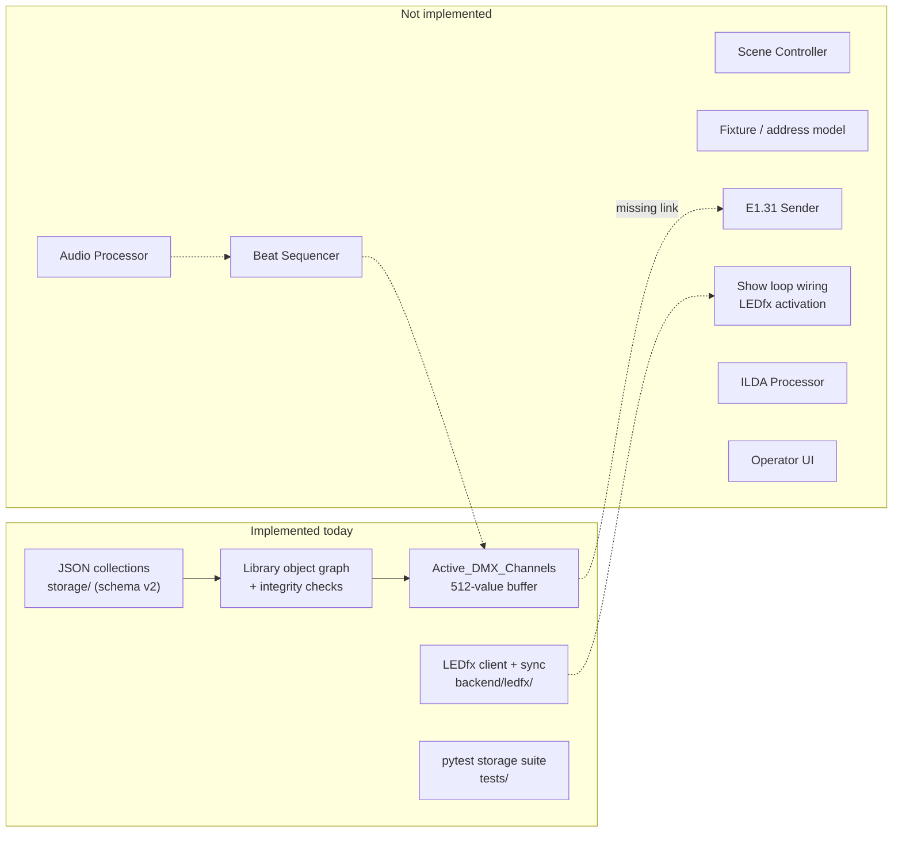

# Project Overview

Entry point for the Lights App documentation set. Read this first, then
[architecture.md](architecture.md).

---

## Purpose

Lights App is a show-control application for a single, specific installation: a
home/basement lighting rig. An operator manually selects a **scene**; the scene
drives conventional DMX fixtures, addressable LED strips (via WLED/LEDfx), and —
eventually — an ILDA laser projector. Sequencing within a scene is meant to be
driven by beats detected from live audio.

The immediate target is *one reliable room*, not a general-purpose lighting
console. See [decisions.md](decisions.md#d-009-basement-deployment-is-the-immediate-target).

## Intended users

A single operator (the repository owner) running the app on a Windows machine on
the same LAN as the lighting hardware. There is no multi-user, authentication, or
remote-access requirement in the repository today.

---

## Current maturity

> **The repository is a persistence layer with an unwired LEDfx adapter. It is not
> yet a running show application.**

There is no entry point, no server, and no UI. Audio input and DMX network output
are absent. A pytest storage suite and an optional LEDfx HTTP client exist; nothing
is wired into a show loop.

| Layer | Status | Evidence |
| --- | --- | --- |
| Persistence / storage | **Substantially implemented** | [`backend/storage/`](../backend/storage/) — schema v2, migrations, integrity |
| Data model | **Partially implemented** | 11 models; `WLED_Preset_List` registered; per-entry beats still absent |
| Runtime state | **Prototype seed (82 lines)** | [`backend/runtime/active.py`](../backend/runtime/active.py) |
| Scene controller | **Absent** | no equivalent module |
| Audio / BPM / beat detection | **Absent (configuration placeholders only)** | `AudioConfig` and `Scene.sensitivity` persist settings; no signal processing |
| DMX transport (E1.31/sACN) | **Absent** | no sACN/E1.31 sender |
| WLED / LEDfx integration | **Client exists, unwired** | [`backend/ledfx/`](../backend/ledfx/); `LedfxConfig.enabled` defaults false |
| ILDA processing | **Storage only** | [`.ild` blob store](../backend/storage/ilda_blobs.py); nothing parses or plays |
| UI / frontend | **Absent** | no `frontend/` directory |
| Tests | **Storage suite (32 tests)** | [`tests/`](../tests/), `pytest.ini` |
| CI | **Absent** | no workflow files |
| Logging | **Implemented** | [`backend/logging_setup.py`](../backend/logging_setup.py); storage events log to `logs/` |

Roughly 1,500+ lines of Python across backend and tests; the storage layer remains
the largest single subsystem.

---

## Supported lighting systems

Nothing is *supported* yet in the sense of working output. The repository models
three intended output domains:

1. **DMX512 over E1.31/sACN** — data modelled ([`DMX_Preset`](../backend/models/DMX_Preset.py),
   [`DMX_Device_Preset`](../backend/models/DMX_Device_Preset.py),
   [`Active_DMX_Channels`](../backend/models/Active_DMX_Channels.py)); transport absent.
2. **WLED via LEDfx** — [`WLED_Preset`](../backend/models/WLED_Preset.py) stores the
   LEDfx scene name as `id`; [`WLED_Preset_List`](../backend/models/WLED_Preset_List.py)
   is persisted and referenced from [`Preset`](../backend/models/Preset.py). HTTP
   client in [`backend/ledfx/`](../backend/ledfx/); not wired to a show loop.
3. **ILDA laser** — file storage and reference-tracking only; no processing, and
   **no output path exists or should be enabled**. See
   [laser_and_haze_safety.md](laser_and_haze_safety.md).

---

## Current capabilities

What the code actually does today:

- Opens a per-user data folder (`%LOCALAPPDATA%\LightsApp` on Windows) and creates
  the `data/`, `ilda/`, `backups/`, `logs/` layout — [`storage/paths.py`](../backend/storage/paths.py).
- Loads and saves nine normalized JSON collections, one file per model class,
  with crash-safe atomic writes and corrupt-file quarantine —
  [`storage/json_store.py`](../backend/storage/json_store.py).
- Enforces referential integrity across the object graph on load, on save, and on
  insert; supports cascade delete, orphan pruning, and referrer lookup —
  [`storage/library.py`](../backend/storage/library.py).
- Versions the data folder (schema **v2**), snapshots before migrating, and
  wraps legacy `Preset.wled_preset_id` values into one-entry WLED lists —
  [`storage/migrations.py`](../backend/storage/migrations.py).
- Exports/imports the whole data folder as a zip, with zip-slip protection —
  [`storage/archive.py`](../backend/storage/archive.py).
- Imports `.ild` files as opaque blobs and reconciles the folder with the
  database on load — [`storage/ilda_blobs.py`](../backend/storage/ilda_blobs.py).
- Resolves a scene to a flat 512-value DMX channel buffer in memory —
  [`runtime/active.py`](../backend/runtime/active.py).
- Polls LEDfx for scene names and upserts `WLED_Preset` rows when enabled —
  [`ledfx/scene_sync.py`](../backend/ledfx/scene_sync.py).
- Runs a pytest storage suite against temp data roots — [`tests/`](../tests/).

## Major incomplete areas

Ranked by how much they block a working system:

1. **No physical device / fixture model.** DMX start addresses are *derived
   positionally* by packing device states end-to-end in `order` sequence
   ([`active.py:37-49`](../backend/runtime/active.py#L37-L49)). There is no fixture
   identity, universe, start address, or channel profile anywhere. See
   [fixture_and_transport_strategy.md](fixture_and_transport_strategy.md).
2. **Beat-driven sequencing is not represented.** `DMX_Preset_List` has no beat
   field; `WLED_Preset_List.beats` is a single scalar on the whole list, not per
   entry. No sequencer or show loop consumes either.
3. **No audio processor**, so `Scene.sensitivity` is persisted but never read.
4. **No DMX output transport.** LEDfx HTTP exists but is not wired to cue changes.
5. **Show-control architecture under review.** WS-2/3/4 in
   [current_sprint.md](current_sprint.md) are parked pending a redesigned model.

## System boundaries

The application is responsible for scene selection, preset resolution, beat
sequencing, DMX universe state, and E1.31 packet emission. It is **not**
responsible for:

- Rendering WLED pixels — LEDfx owns that. The app selects LEDfx presets.
- DMX512 electrical signalling — a custom DMX universe box receives E1.31 over
  Ethernet and drives the physical bus. Its internals are not described anywhere
  in this repository and are treated as an opaque boundary.
- Parsing or rendering ILDA content — `.ild` files are stored byte-for-byte and
  never inspected ([`ilda_blobs.py:62-66`](../backend/storage/ilda_blobs.py#L62-L66)).

---

## Key terminology

The repository uses "preset" for five different things at five different levels.
This documentation set uses the disambiguated terms in the left column and always
names the concrete repository type.

| Term used in docs | Meaning | Repository type |
| --- | --- | --- |
| **Scene** | The top-level unit an operator selects manually | [`Scene`](../backend/models/Scene.py) |
| **Lighting preset** | Pairs one DMX side with one WLED side | [`Preset`](../backend/models/Preset.py) |
| **DMX cue list** | Ordered, beat-advanced sequence of DMX looks | [`DMX_Preset_List`](../backend/models/DMX_Preset_List.py) |
| **DMX look** | One complete lighting state across all devices | [`DMX_Preset`](../backend/models/DMX_Preset.py) |
| **Device state** | One device's channel values inside a look | [`DMX_Device_Preset`](../backend/models/DMX_Device_Preset.py) |
| **Fixture** | Definition of a physical device (address, profile) | *does not exist* |
| **Universe buffer** | The live 512 channel values sent to the wire | [`Active_DMX_Channels`](../backend/models/Active_DMX_Channels.py) |
| **WLED cue list** | Ordered sequence of LEDfx presets | [`WLED_Preset_List`](../backend/models/WLED_Preset_List.py) |
| **LEDfx preset** | An effect configuration owned by LEDfx | [`WLED_Preset`](../backend/models/WLED_Preset.py) — `id` is the scene name |
| **Transport** | E1.31/sACN packet emission over Ethernet | *does not exist* |

Note the deliberate distinction between a **look** (a static state) and a **cue
list** (a time-ordered sequence of looks). The repository calls both a "preset".

---

## End-to-end summary

**Intended** flow, in one paragraph: the operator picks a scene; the scene's
sensitivity configures the audio processor, which emits beat events; the scene's
lighting preset resolves to a DMX cue list and a WLED cue list; a shared beat
sequencer advances both lists independently according to each entry's beat
duration; the DMX side resolves the current look into a 512-channel universe
buffer which an E1.31 sender transmits to the DMX universe box; the WLED side
calls the LEDfx HTTP API when the active preset changes; the scene's ILDA frame
list is handed to an ILDA processor.

**Actual** flow today: a `Library` is constructed, JSON is loaded and integrity
checked, and `update_active_dmx_channels(library, scene_id, index)` can flatten
one chosen look into an in-memory 512-value list. Nothing calls it, nothing picks
the index, and nothing transmits the result.

---

## Current state versus target state

---

## Where to go next

| Question | Document |
| --- | --- |
| How is the system structured, and how should it be? | [architecture.md](architecture.md) |
| How does a scene run? | [show_control_architecture.md](show_control_architecture.md) |
| Where do beats come from? | [audio_reactivity_architecture.md](audio_reactivity_architecture.md) |
| How does DMX reach the wire? | [fixture_and_transport_strategy.md](fixture_and_transport_strategy.md) |
| How does WLED work? | [wled_ledfx_architecture.md](wled_ledfx_architecture.md) |
| What about the laser? | [laser_and_haze_safety.md](laser_and_haze_safety.md) |
| What is wrong with the code today? | [audit_findings.md](audit_findings.md) |
| What should I build next? | [current_sprint.md](current_sprint.md) |
| What is the long-term plan? | [roadmap.md](roadmap.md) |
| Why was it built this way? | [decisions.md](decisions.md) |
| How do I run it? | [platform_support.md](platform_support.md) |
| What did the last contributor do? | [session_handoff.md](session_handoff.md) |
