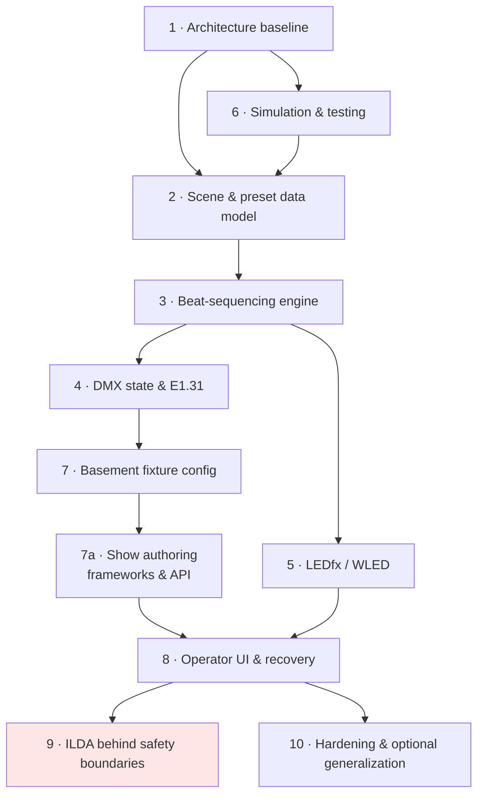

# Roadmap

Phases from the current state — a data model and persistence layer — to a reliable
basement installation. Near-term detail is in [current_sprint.md](current_sprint.md);
this document is the longer arc and the exit criteria.

No dates. The repository contains no schedule, and phases are sequenced by
dependency rather than by calendar.

**Guiding constraint:** a reliable one-room system beats a general-purpose platform.
See [D-010](decisions.md#d-010-basement-reliability-outranks-generality).

Phase 6 is threaded early rather than treated as a later phase: the schema changes
in phase 2 modify the least-verified code in the repository.

---

## Phase 1 · Repository and architecture baseline

**Scope.** Document the system as it exists, separate current from target, record
decisions, and reconcile the config split (`backend/config/` vs `storage/config/`),
clean `requirements.txt`, and add logging.

**Exit criteria.**
- `docs/` explains the architecture, the gaps, and the plan; every referenced path
  resolves.
- The three highest-impact model problems are written down with evidence
  ([AF-H01](audit_findings.md#af-h01)–[AF-H03](audit_findings.md#af-h03)).
- Open decisions are enumerated ([D-016](decisions.md#d-016-audio-event-delivery-mechanism)–[D-018](decisions.md#d-018-ledfx-preset-identifier-form)).
- Logging exists and writes to the `logs/` directory that is already created.

**Non-goals.** No refactor beyond hygiene. No show loop.

**Risks.** Documentation drifting from code — mitigated by citing file and line
throughout, so drift is visible as a broken reference.

**Dependencies.** None.

**Status.** **Done** — docs baseline, WS-1.2–1.4, WS-6.1, and partial WS-2.3
(WLED list registration) landed on `main`.

---

## Phase 2 · Stable scene and preset data model

**Scope.** The schema changes that unblock everything downstream: first-class
`Fixture` objects replacing positional addressing; per-entry beat durations on both
cue lists; a modellable WLED path; field validation. All additive, all migrated
through [`migrations.py`](../backend/storage/migrations.py).

**Exit criteria.**
- A look resolves to a universe buffer via fixture lookup, not a packing cursor.
- Non-contiguous addresses and multiple universes are expressible.
- Both cue lists carry per-entry beat counts, in one shared entry shape.
- `WLED_Preset_List` is registered and reachable; `WLED_Preset` names something in
  LEDfx; `Preset` references a WLED cue list.
- Out-of-range channel values, sensitivities, and beat counts are rejected.
- A migration converts existing data and is covered by a test.

**Non-goals.** No fixture *profile* library — semantic parameters (dimmer, pan,
tilt) stay deferred until raw values demonstrably hurt. No effects engine. No
runtime code.

**Risks.**
- Four-place edits per field ([AF-M04](audit_findings.md#af-m04)) make a missed
  converter update plausible. Mitigated by storage round-trip tests.

**Dependencies.** Phase 6 (testing) substantially complete; phase 1 done.

**Status.** **Partially done** — fixture model and WLED list registration landed
(schema v2–v3). Schema v4 added list-level `beats` and bounded `sensitivity`.
Per-entry beats and `channel_values` clamping remain open.

---

## Phase 3 · Shared beat-sequencing engine

**Scope.** One `CueSequencer` instantiated per cue list; a Scene Controller owning
activation, deactivation, sensitivity propagation, and sequencer lifecycle; runtime
state moved out of module globals into an owned object with locking.

**Exit criteria.**
- Sequencing is fully tested against synthetic beat events with zero I/O.
- Cue 0 applies on activation, not on the first beat.
- Scene changes discard outgoing sequence state deterministically.
- Silence holds the current look; no free-running fallback.
- One implementation serves both output paths.
- No mutable module-level state remains in `backend/runtime/`.

**Non-goals.** No audio input yet — beats come from a scripted source. No transport.
No crossfades, no bar/downbeat detection, no scene layering.

**Risks.** Beat logic leaking into the output controllers, which is exactly how DMX
and WLED sequencing drift apart
([D-003](decisions.md#d-003-dmx-and-wled-share-one-beat-sequencing-implementation)).
Guard by keeping the sequencer's consumer abstract and testing it with neither
output present.

**Dependencies.** Phase 2 (list-level beats).

**Status.** **Mostly done** — `CueSequencer`, `SceneController`, `DmxOutput`,
`WledOutput`, and `BeatSource`/`ManualBeatSource` are implemented and tested.
Operator server wires them via `ShowEngine` ([WS-11.1](current_sprint.md#111-app-entry-point-and-process-lifecycle)).
Remaining: real beat detection (WS-9); symbolic sender only until WS-4.4.

---

## Phase 4 · Reliable DMX universe state and E1.31 transport

**Scope.** Multi-universe buffers with dirty tracking and clamped writes; a sender
interface with null/real implementations; a network configuration that can
actually describe an sACN destination; the real sender with sequence numbers, hybrid
change-plus-keepalive cadence, and blackout on shutdown.

**Progress (2026-08-13).** WS-4.2 done: `DmxTransport`, `NullTransport`,
`SenderThread`, and `publish()`/`dmx_dirty` in the operator server. WS-4.4 (real
packets) not started — blocked on universe-box verification (WS-4.3, D-017).

**Audit (2026-08-13).** The server/runtime layer was independently audited at
`acc52a7` ([Audit v3](audit_findings.md#audit-v3--operator-server--runtime)):
**READY WITH MINOR FIXES** — the `DmxTransport` seam is sound, no blocker to
beginning this phase, and the phase order (box verification → E1.31 → real
beats → authoring → frontend) is confirmed. Recommended fixes F-01/F-02/F-04/F-05
fold into this phase's window and are **not yet implemented**. The existing
latency evidence is a software path ending at `NullTransport.send` — not
hardware-proven; the p99 budget must be re-proven with the real transport.

**Exit criteria.**
- Packet bytes are asserted in tests without opening a socket.
- Sequence numbers increment per universe and wrap correctly.
- Change-detection sends immediately on change and keeps a slow keepalive.
- A destination-unreachable condition logs, retries, and never takes the show down.
- Clean shutdown sends a blackout frame before closing.
- Real output is opt-in; null is the default.
- **Verified against the physical universe box:** universe numbering, unicast vs
  multicast, and behaviour when packets stop.

**Non-goals.** No Art-Net. No DMX input or merging. No multi-source priority
arbitration beyond a configurable default. No RDM.

**Risks.**
- The universe box is undocumented ([fixture_and_transport_strategy.md](fixture_and_transport_strategy.md#6-the-custom-universe-box-boundary)).
  Its expectations must be measured, not assumed — this is the main source of
  schedule risk in the whole roadmap.
- First production network dependency; needs explicit sign-off.
- The sender must never block on anything but its own timer, or DMX output stutters
  when LEDfx or audio misbehaves.

**Dependencies.** Phases 2, 3. [D-017](decisions.md#d-017-sacn-unicast-versus-multicast)
resolved.

---

## Phase 5 · LEDfx / WLED integration

**Scope.** Resolve the LEDfx identifier question against a running instance; build
the client adapter with timeouts, bounded retry, dedup, and reachability tracking;
wire it to the WLED sequencer.

**Exit criteria.**
- N beats within one cue entry produce exactly one API call.
- The dedup cache is invalidated on unreachability and the current preset re-applied
  on recovery.
- Every call has an explicit timeout; none runs on the beat thread.
- LEDfx being down or hung never stalls beat handling, DMX output, or scene
  selection.
- Shutdown behaviour is a deliberate decision, not an accident — LEDfx keeps
  rendering after this app exits.
- Fully testable against a stub; null is the default.

**Non-goals.** No pixel rendering, no direct WLED protocol, no device discovery, no
app-side virtual-device model unless LEDfx demonstrably cannot express the grouping
the rig needs ([D-004](decisions.md#d-004-ledfx-owns-wled-output)).

**Risks.** LEDfx preset identifiers may not be stable across restarts, which would
mean storing names and resolving at activation. Establish this *before* the schema
lands ([D-018](decisions.md#d-018-ledfx-preset-identifier-form)).

**Dependencies.** Phases 2, 3.

---

## Phase 6 · Hardware-independent simulation and testing

**Scope.** pytest and the storage suite first; then null and recording
implementations for every output; then a scripted audio processor enabling an
end-to-end scene test with no hardware at all.

**Exit criteria.**
- The full suite runs with no network, no audio device, no LEDfx, and no rig.
- The storage layer's subtle logic is covered: recursive cascade with cycle
  guarding, reachability pruning, atomic writes, corrupt-file quarantine, ILDA
  folder reconciliation, migration version handling.
- Tests never touch the real user data folder — always a temp `root`.
- No test can transmit a packet or make an HTTP call.
- A scene can be activated end to end and its effects asserted, entirely in memory.

**Non-goals.** No 3D visualiser or graphical preview. No hardware-in-the-loop
automation. No coverage target treated as an end in itself — cover the cascade,
pruning, and address-resolution logic properly rather than chasing a percentage.

**Risks.** `Library.load()` writes to disk ([AF-M05](audit_findings.md#af-m05)), so
a test that omits `root` will mutate real data. Make the temp-root fixture the only
way tests construct a `Library`.

**Dependencies.** None. Should start immediately and precede phase 2.

**Status.** **Substantially done** — 84 tests covering storage, migrations, DMX
devices, sequencer, scene controller, and outputs. LEDfx client/sync still uncovered.
App entry point and end-to-end in-process integration remain future work.

---

## Phase 7 · Basement-specific fixture configuration

**Scope.** Capture the real rig — every fixture, its address, universe,
channel count, and what it physically is — as configuration data. Build the looks
that the room actually uses.

**Exit criteria.**
- The configured patch matches the fixtures' physical DIP switches, verified fixture
  by fixture.
- Every fixture responds correctly to a manually applied look.
- The universe box's IP, universe, and transport mode are configured and confirmed
  working.
- No IPs, hostnames, or MAC addresses appear anywhere in the repository — they live
  in the user's `config.json`, outside git
  ([`paths.py:26-32`](../backend/storage/paths.py#L26-L32)).

**Non-goals.** No fixture profile library for hardware the room does not have. No
attempt to be portable to a different rig.

**Risks.** Patch drift between the config and the physical rig, which produces
baffling symptoms. Mitigate with a documented patch table and a simple "identify"
action per fixture.

**Dependencies.** Phases 2, 4.

---

## Phase 7a · Show authoring frameworks and API

**Scope.** Typed creation and update helpers for scenes, lighting presets, and both
cue list types; a single `Library` mutation owner; HTTP endpoints and a documented
frontend contract. Detail in [WS-10](current_sprint.md#ws-10--show-authoring-frameworks).

**Exit criteria.**
- A caller can create a playable scene (preset + non-empty DMX and WLED cue lists)
  without hand-editing JSON or calling `Library.add()` out of order.
- DMX and WLED cue list APIs are symmetric (create, reorder, set `beats`).
- Deletes expose cascade impact before execution ([AF-H04](audit_findings.md#af-h04)).
- HTTP CRUD exists for scenes, presets, and cue lists; errors map consistently.
- Request/response shapes are documented for the future `frontend/` client.

**Non-goals.** No pixel editor, no DMX look authoring UI (channel sliders) in v1 —
looks may still be authored via JSON or a later pass. No auth beyond single-operator
LAN. No WebSocket show stream yet.

**Risks.** Duplicating graph rules in the API layer instead of delegating to one
authoring service ([WS-10.5](current_sprint.md#105-authoring-service-owner)).

**Dependencies.** Phases 2, 3.

**Status.** Not started — tracked as WS-10 in [current_sprint.md](current_sprint.md).

---

## Phase 8 · Operator UI and recovery behaviour

**Scope.** The interface an operator actually uses: scene selection, current state
display, BPM and audio level, output health, and manual overrides. Plus the failure
behaviour that makes the system trustworthy mid-show. **Authoring** (creating scenes,
presets, and cue lists) goes through phase 7a / WS-10; phase 8 can start with
selection-only UI once transport and LEDfx paths exist.

**Exit criteria.**
- A scene can be selected in one action.
- Audio state (BPM, level, and crucially *silent vs. device failed*) is visible.
- DMX and LEDfx reachability are visible.
- A blackout / panic control exists and works regardless of the show state.
- Deletion is confirmed before it cascades ([AF-H04](audit_findings.md#af-h04)).
- Failures surface in the UI, not only in the log.
- *(With WS-11)* Authoring forms use the phase 7a API — no parallel graph logic in
  the client.

**Non-goals.** Full scene editor on day one is acceptable if JSON + phase 7a API
cover creation; grow into WS-11 forms incrementally. No remote or mobile control.
No multi-user.

**Risks.** UI work expanding to fill available time. The operator interface for a
manually-driven one-room show is small; keep it small.

**Dependencies.** Phases 4, 5, 7; phase 7a for authoring UI ([WS-11](current_sprint.md#ws-11--frontend-and-http-server)).

**Checkpoint.** This is the natural point to re-evaluate
[D-010](decisions.md#d-010-basement-reliability-outranks-generality). If the system
runs a real show reliably, generalisation becomes a real question. Until then it is
not.

---

## Phase 9 · ILDA integration behind safety boundaries

**Scope.** Only after the lighting system is reliably running shows. Begins with the
prerequisite list in
[laser_and_haze_safety.md](laser_and_haze_safety.md#4-what-must-exist-before-output-is-enabled),
not with code.

**Exit criteria.** Every item in that list, including: identified hardware with
manufacturer documentation; a physical emergency stop independent of this software;
hardware scan-fail protection; fixed, constrained projection geometry; output
disabled by default with a deliberate opt-in; a watchdog halting output when the
show loop stalls; beam-off as the safe state on every failure path; and independent
review by someone with laser display experience.

**Non-goals.** No laser output before those are met. No ILDA content parsing,
generation, or editing. No beam-effect library.

**Risks.** This phase carries physical risk that no other phase does. The mitigation
is procedural, not technical: do not begin it early, and do not treat "the code
looks right" as sufficient.

**Dependencies.** Phase 8, plus hardware and review that are outside this
repository's control.

**Status.** Not scheduled. The interface stub
([WS-7](current_sprint.md#ws-7--ilda-interface-only)) is the only ILDA work
currently contemplated.

---

## Phase 10 · Hardening and optional generalization

**Scope.** Whatever a season of real use shows is actually needed. Candidates, in no
committed order: crash recovery and restart behaviour, richer logging and diagnostics,
config validation with clear operator-facing errors, performance under sustained
load, and — only if a second real installation appears — the abstractions that would
make the system portable.

**Exit criteria.** Deliberately undefined. Setting exit criteria for this phase now
would be exactly the speculative planning that
[D-010](decisions.md#d-010-basement-reliability-outranks-generality) warns against.

**Non-goals until there is evidence of need.** Plugin architectures. Multi-protocol
output layers. A fixture profile database. Cloud or remote control. Multi-user
support. Packaging as a product.

**Risks.** Generalising on imagined requirements — abstractions that are never
exercised and make the real path harder to debug.

**Dependencies.** Phase 8, and real operating experience.
