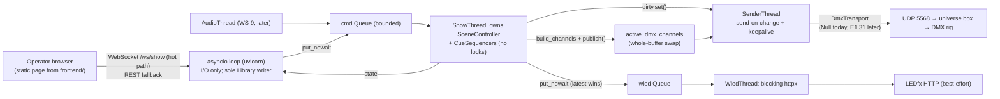

# Web Server Plan — Combined (uvicorn, sub-10 ms control path)

This is the merged, authoritative version of `server_plan_1.md`, `server_plan_2.md`, and `server_plan_3.md`. Plans 1 and 2 are word-for-word identical, so there were two distinct designs to reconcile; every conflict between them is resolved here with rationale, and the full reconciliation ledger is in the appendix. All code citations and "already exists" claims were re-verified against the repo before merging.

The plan specifies a single-process uvicorn/FastAPI server on `0.0.0.0:8800` that serves the web UI and drives the existing show-control core (`SceneController`, `Library`, LEDfx client), architected around a ~10 ms software latency budget. It slots into the repo's planned workstreams: WS-10.6 (HTTP API), WS-11 (server/frontend), and parked WS-4 (E1.31).

---

## 1. Latency contract (drives every decision)

- Total budget **25 ms**; 15 ms is allocated to hardware/audio input, leaving **~10 ms for software**: browser click → server → scene activation → E1.31 UDP packet leaving the NIC.
- The guarantee applies to the **DMX path only**. The WLED path goes through LEDfx (external process, own render pipeline) and is physically outside our control — it is explicitly **best-effort** and kept off the critical path entirely.
- The 15 ms hardware allowance is an assumption, not a measurement; recorded as such.
- WiFi operator devices add 2–10 ms of client/network jitter on top of the server-side numbers; wired LAN or localhost is the reference configuration.

## 2. Why the current code cannot meet the budget

Three verified findings shape the whole design.

**Finding 1 — synchronous WLED on the activation path (~200x over budget).** `SceneController.activate()` calls the WLED output synchronously:

```74:75:backend/runtime/scene_controller.py
        self._dmx_output.apply(dmx.current)
        self._wled_output.apply(wled.current)
```

`WledOutput.apply` → `LedFxClient.activate_scene` → blocking `httpx.put` with a **2000 ms timeout**, plus a possible extra blocking `GET /api/scenes` when the slug is uncached (`_resolve_slug`, `backend/ledfx/client.py:125`). This sits directly on the scene-selection path and must move to a fire-and-forget worker with latest-wins coalescing.

**Finding 2 — a fixed-cadence sender alone blows the budget.** `docs/show_control_architecture.md` describes a "~30–44 Hz" send loop: polling at 40 Hz adds 12.5 ms average / 25 ms worst-case before a changed buffer ever leaves the machine. Even at the configured 120 Hz (`DMXConfig.refresh_hz` default in `backend/storage/config.py`) the tick adds up to 8.3 ms of queueing delay. **Send-on-change is mandatory, not an optimization** — the hybrid send-on-change + keepalive model that `docs/fixture_and_transport_strategy.md` §7 already recommends.

**Finding 3 — the GIL is a 5 ms tax.** Uvicorn's event loop and the show thread share one interpreter. `sys.getswitchinterval()` defaults to 0.005, so a CPU-bound chunk on the event loop (e.g. JSON-serializing a scene list) can stall the show thread for half the budget. This drives both the threading model (§3) and the jitter tuning (§9).

## 3. Architecture

Single process, `--workers 1` — show state is in-process, and multiple workers would mean multiple engines fighting over one universe.

**Threading model (resolved conflict).** Plan 1/2 proposed the event loop mutating show state under a show lock; plan 3 proposed a dedicated show thread owning `SceneController` outright with a command queue and no locks. **The command-queue model wins**: it removes lock contention from the hot path, contains the GIL hand-off to one well-understood point (queue put → thread wake), and leaves the queue as the seam where the WS-9 audio/beat thread later drops in. Plan 1/2's single-writer rule is retained where it applies: the **event loop is the only writer to `Library`** (authoring/CRUD), which also fixes the `LedFxSceneSync` thread-safety debt (AF2-H01).



**Thread roster:** `MainThread` (event loop), `ShowThread`, `SenderThread`, `WledThread`, the existing `LedFxSceneSync` poller, and `AudioThread` later.

**Standing rules:**

- No blocking I/O anywhere on the control path — not on the event loop's control handlers, not in the show thread.
- Single-writer rule for `Library`: event loop only. Route handlers never call `Library.add()` directly; authoring goes through the WS-10.5 authoring service.
- Null output by default per D-013.
- Async logging via `QueueHandler` so file writes never sit on the hot path.

## 4. DMX path (the guaranteed path)

- **Send-on-change seam lands in the active classes** (`backend/runtime/active.py`): a module-level `threading.Event` plus a `publish()` helper, with `DmxOutput.apply` routing through it. The universe buffer is already swapped whole rather than mutated in place (`backend/runtime/outputs.py:36-39`), so a reader that grabs one reference can never see a torn frame.
- **`SenderThread`** does `dirty.wait(timeout=keepalive)`: wakes immediately on change, and re-sends periodically when idle so receivers don't time out (cadence per `docs/fixture_and_transport_strategy.md` §7).
- **`DmxTransport` interface**, whose only implementation is `NullTransport`. Real E1.31 is not in the tree — it drops in later as one class, reading the existing `DMXConfig` (universe, host, port 5568, priority — currently unread by any transport).
- Hardware validation stays **gated on universe-box verification** (D-017, transport doc §6).

## 5. WLED path (best-effort)

- A new **`AsyncCueOutput`** implements the same `CueOutput` protocol from `backend/runtime/outputs.py` but only does `queue.put_nowait(preset_id)`. `SceneController` and `WledOutput` are untouched, so the existing test suite (84 tests) still passes.
- **`WledThread`** drains the queue with **latest-wins coalescing** — a burst of beats never backs up LEDfx — and confines the blocking `httpx` calls (including the 2 s timeout and the uncached-slug re-fetch) to itself.
- LEDfx reachability is surfaced in `/api/status`; failures cost the strips, never the show.

## 6. Routing

**Static** — `GET /` and `/assets/*` from `frontend/` (folder does not exist yet and will be created; per `AGENTS.md` all client code lives there). Milestone 1 ships a minimal no-build operator page (scene buttons + latency readout) that doubles as the measurement harness; the full built UI stays WS-11.

**Control (hot path)** — `WS /ws/show`:

- Client sends `{"t":"activate","id":...}`, `deactivate`, `blackout`, `beat` (manual tap until WS-9).
- Server pushes `state`, `cue`, and timing `ack`s.

**Control (REST mirrors, for scripting and fallback)** — `POST /api/show/{activate,deactivate,blackout,beat}`, `GET /api/show/state`.

**Read / ops:**

- `GET /api/scenes` — picker data.
- `GET /api/status` — aggregate: active scene, sender health, LEDfx reachability, latency p50/p99 summary.
- `GET /api/health` — minimal liveness.
- `GET /api/diag/latency` — full percentiles from the ring buffer; `POST /api/diag/selftest`.

**Authoring (later milestone, WS-10.5/10.6)** — `GET|POST /api/{collection}` and `GET|PATCH|DELETE /api/{collection}/{id}` for all ten collections in `backend/storage/records.py` (scenes, presets, dmx_preset_lists, dmx_presets, dmx_device_presets, dmx_devices, wled_preset_lists, wled_presets, ilda_frame_lists, ilda_frames), delegating to the authoring service with consistent error JSON.

**Aux** — `GET /api/dmx/universe`, `GET /api/ledfx/scenes`, `POST /api/ledfx/refresh`, `GET|PATCH /api/config`.

## 7. Config & deployment

- New **`ServerConfig` block in `AppConfig`** (`backend/storage/config.py`), which currently has no server section.
- **Host `0.0.0.0`, port `8800`**, reachable at `http://<lan-ip>:8800`. (Resolved conflict: plan 1/2 said 8000; 8800 wins because it avoids 8888 (LEDfx) and the commonly-taken 8000/8080.)
- **No auth**, matching the documented single-operator LAN scope (phase 7a); binding `0.0.0.0` exposes the server to the LAN and this is recorded as an accepted risk.
- Windows Firewall: an inbound rule for the chosen port is required for other LAN devices to connect.
- **Dependencies**, pinned in `requirements.txt` per `AGENTS.md`: `fastapi==0.141.1`, `uvicorn[standard]==0.52.1`, `orjson==3.11.9`. uvloop is Linux-only and skipped on Windows by marker, so the loop is stock asyncio; httptools and websockets come with `[standard]`. Verify pins against the venv at install time.

## 8. Latency budget ledger (software half of the 25 ms)

Both control paths (WS and REST) funnel through the same show thread, so they share one ledger. Per-stage worst-case estimates:

| Stage | Worst case |
|---|---|
| WS frame receive + JSON parse | 0.2 ms |
| Queue put + show-thread wake (GIL hand-off dominated) | 1.0 ms |
| `activate()`: 4 dict lookups, 2 sequencers, `build_channels` over 512 ints | 0.3 ms |
| WLED enqueue (`put_nowait`) | 0.01 ms |
| Publish + sender wake | 1.0 ms |
| E1.31 packet build + `sendto` | 0.3 ms |
| **Total (server-side)** | **~3 ms** |

Roughly 3 ms worst case against a 10 ms budget (plan 1/2's coarser 2–3 ms estimate agrees). The remaining headroom absorbs client/network jitter — which WiFi operator devices spend 2–10 ms of.

## 9. Jitter engineering

The headroom is protected by tuning, applied at startup:

- `sys.setswitchinterval(0.001)` — cap GIL hold time (Finding 3).
- `gc.freeze()` after startup with relaxed thresholds — no surprise collection pauses.
- `ORJSONResponse` as the FastAPI default — keeps event-loop serialization short.
- `timeBeginPeriod(1)` on Windows — 1 ms timer resolution for waits.
- Raised thread priority for the show and sender threads.
- Verify `TCP_NODELAY` on accepted sockets (Nagle would add up to 40 ms on its own).
- Async logging via `QueueHandler` (no file writes on the hot path).
- Windows notes: Python 3.12 high-res timers make the keepalive loop and sub-ms waits fine; no uvloop (winloop only if measurements demand it).

## 10. Instrumentation & acceptance

Measurement is part of the design, not an afterthought:

- `perf_counter_ns()` stamps at **frame-received → dequeued → published → sent**, written into a preallocated ring buffer (no allocation on the hot path).
- Reported as p50/p95/p99/max via `GET /api/diag/latency`, with a p50/p99 summary in `GET /api/status`.
- **Acceptance: p99 click→packet-out ≤ 10 ms over 1000 activations, on both the WS and REST paths, on wired LAN/localhost.** The M1 operator page doubles as the measurement harness.

## 11. File map & new code

Verified against the repo — note that `backend/routes/` and `backend/sender/` do **not** exist (plan 1/2 claimed they did); plan 3's layout is adopted:

- `backend/main.py` — entry point (WS-11.1).
- `backend/server/{app,engine,commands,ws,deps,latency}.py` — app factory + lifespan, show-runtime engine, command types, WebSocket handler, dependencies, ring-buffer instrumentation.
- `backend/server/routes/` — routers (show, scenes, authoring, config, diag).
- `backend/runtime/sender.py` — `SenderThread`, `DmxTransport`, `NullTransport`. No E1.31 class.
- Seam edits in `backend/runtime/active.py` (`publish()` + dirty `Event`) and a queue-backed `AsyncCueOutput` alongside `backend/runtime/outputs.py`.
- `frontend/` — new folder; M1 minimal no-build operator page, later the WS-11 build output.
- `ServerConfig` added to `backend/storage/config.py`.

## 12. Milestones

- **M1 — server skeleton + control plane + instrumentation (null sender).** App factory, lifespan, ShowThread + command queue, `WS /ws/show` + REST control mirrors, minimal operator page, latency ring buffer, `NullTransport`. The ≤ 10 ms acceptance is measured here (click → publish → null-send).
- **M2 — E1.31 sender.** Parked. Framing, sockets, and packet tests are not in the tree; the wake loop already lives in M1's `SenderThread`. Lands only after the universe box is verified (D-017).
- **M3 — LEDfx dispatcher wiring.** `AsyncCueOutput` + `WledThread` with latest-wins coalescing; AF2-H01 single-writer fix confirmed.
- **M4 — authoring API.** CRUD for the ten collections via the WS-10.5 authoring service, plus config endpoints (WS-10.6).

**Out of scope:** real audio capture and beat detection (WS-9) — the command queue is the seam where a WASAPI-loopback source drops in (`backend/audio/beat_source.py` already stubs the domain); the full frontend (WS-11).

## 13. Recorded deviations & open items

- Phase 7a's "no WebSocket yet" non-goal is **overridden** by the latency requirement.
- Parked WS-4's *symbolic* sender (null transport + send-on-change thread) landed with M1. Packet framing did not.
- E1.31 transport stays `NullTransport` until the DMX universe box is verified (D-017, transport doc §6).
- The 15 ms hardware allowance is an assumption, not a measurement.

---

## Appendix: source reconciliation

`server_plan_1.md` and `server_plan_2.md` are byte-identical and count as one source below.

| Topic | Plan 1/2 | Plan 3 | Resolution |
|---|---|---|---|
| Port | 8000 | 8800 | **8800** — only plan 3 gave a rationale (avoids LEDfx's 8888 and common 8000/8080) |
| Threading | Event loop mutates show state under a show lock | ShowThread owns state, command queue, no locks | **Plan 3** — removes lock contention, contains GIL hand-off, seam for WS-9; plan 1/2's Library single-writer rule retained on the event loop |
| WS route | `/ws` | `/ws/show` | **`/ws/show`** — leaves room for other sockets |
| REST control | `POST /api/scenes/{id}/activate` + `/api/show/*` | `POST /api/show/{activate,...}` | **`/api/show/*`** — one uniform verb group; `GET /api/scenes` kept for picker data |
| Status endpoints | `GET /api/status` only | `/api/health`, `/api/show/state`, `/api/diag/latency` | **Both** — `/api/status` aggregates; health/state/diag keep distinct purposes |
| Sender location | `backend/sender/e131.py` ("folder already exists" — **false**, verified) | `backend/runtime/sender.py` + seam in `active.py` | **Plan 3** — matches the actual repo layout |
| Routes location | `backend/routes/` ("already exists" — **false**, verified) | `backend/server/routes/` | **Plan 3** |
| Dependencies | Unpinned, "pin at install" | `fastapi==0.141.1`, `uvicorn[standard]==0.52.1`, `orjson==3.11.9` | **Pinned** (verify against venv at install) |
| Sender cadence framing | 120 Hz tick → up to 8.3 ms | 40 Hz → 12.5/25 ms | **Both cited** — either way send-on-change is mandatory |
| GIL / jitter tuning | Not covered | switchinterval, gc.freeze, orjson, timeBeginPeriod, thread priority, TCP_NODELAY | **Included** (plan 3) plus plan 1/2's QueueHandler logging |
| Deliverable | Milestones M1–M4 (implementation) | One design doc, no code | **Milestones retained**; this document satisfies plan 3's design-doc deliverable |
| Beat until WS-9 | Manual tap via WS `beat` | AudioThread later via command queue | **Both** — manual tap now, queue is the seam later |
