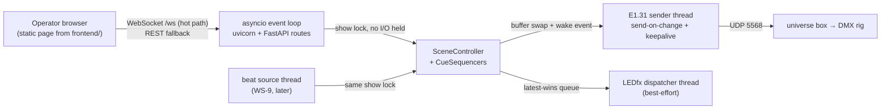

# Web Server Plan Document (uvicorn, sub-13 ms control path)

This document specifies the architecture, routing, and latency engineering for a uvicorn-hosted FastAPI web app serving the lights rig on the LAN. It builds on what already exists (`SceneController`, `Library`, LEDfx client) and slots into the repo's planned workstreams (WS-10.6 HTTP API, WS-11 server/frontend, parked WS-4 E1.31).

> **Terminology.** A "look" is a `dmx_preset` (`DMX_Preset`). Use `dmx_preset` going
> forward — [D-023](../decisions.md#d-023-a-look-is-a-dmx_preset).

## Latency framing (drives every decision)

- Total budget 28 ms; user allocates 15 ms to hardware/audio input, leaving **13 ms for software**: browser click → server → scene activation → sender (`DmxTransport.send`).
- The guarantee applies to the **DMX path**. The WLED path goes through LEDfx (external process, own render pipeline) and is physically outside our control — it becomes explicitly best-effort and is kept off the critical path entirely.
- Current code would blow the budget in two places, and the doc calls these out as required changes:
  - `WledOutput.apply` is a synchronous HTTP call (2 s timeout) invoked inside `SceneController.activate()` — must move to a fire-and-forget worker (latest-wins queue).
  - A fixed 120 Hz sender tick adds up to 8.3 ms of queueing delay — the sender must wake immediately on change (hybrid send-on-change + keepalive, which `docs/fixture_and_transport_strategy.md` §7 already recommends).

Budget table in the doc (typical, wired LAN): WS frame + parse ~0.5 ms, activate + buffer build ~0.5–1 ms, sender wake + packet send ~0.5 ms — roughly 2–3 ms server-side, leaving headroom for client/network jitter. WiFi operator devices add 2–10 ms and the doc flags that.

## Architecture in the document

Single process, `workers=1` (show state is in-process): uvicorn's event loop owns HTTP/WS and all `Library` mutations; a show lock guards `SceneController`; dedicated threads for the sACN sender and the LEDfx dispatcher.

Key rules the doc records: no blocking I/O under the show lock or on the event loop's control path; single-writer rule for `Library` (event loop only — also fixes the `LedFxSceneSync` thread-safety debt AF2-H01); null output by default per D-013; async logging (QueueHandler) so file writes never sit on the hot path.

## Routing spec in the document

- Control (hot path, also available as REST): `WS /ws` with JSON messages — `activate`, `deactivate`, `blackout`, `beat` (manual tap until WS-9), server-pushed `state` and timing `ack`s; REST mirrors at `POST /api/scenes/{id}/activate`, `POST /api/show/deactivate|blackout|beat`.
- Read: `GET /api/status` (active scene, sender health, LEDfx reachability, latency p50/p99), `GET /api/scenes` (picker data).
- Authoring (later milestone, per WS-10.5/10.6): CRUD for scenes/presets/cue lists delegating to the authoring service, consistent error JSON; route handlers never call `Library.add()` directly.
- Static: `frontend/` mounted at `/`; milestone 1 ships a minimal no-build operator page (scene buttons + latency readout) that doubles as the measurement harness; the full UI stays WS-11.
- No auth (single-operator LAN, matching phase 7a scope). Host `0.0.0.0`, port 8000 via a new `ServerConfig` in `storage/config.py`; Windows Firewall inbound note included.

## Also specified in the doc

- File map for implementation: `backend/main.py` (entry point, WS-11.1), `backend/server/` (app factory, lifespan, `ShowRuntime`), `backend/routes/` (routers — folder already exists), `backend/sender/e131.py` (framing + sender thread — folder already exists).
- Dependencies: `fastapi`, `uvicorn[standard]` (uvloop auto-excluded on Windows; httptools/websockets included), pinned in `requirements.txt` at install time.
- E1.31 sender design: hand-rolled packet framing recommended (fixed ~638-byte layout, byte-asserted unit tests per WS-4.4) so the send-on-change wake is fully ours; `sacn` library noted as the alternative. Hardware validation gated on end-to-end box sign-off — universe **1**, switch destination, and **unicast** ([D-017](../decisions.md#d-017-sacn-unicast-versus-multicast)) recorded; code lands behind the null default.
- Instrumentation + acceptance: `perf_counter_ns` spans per hop, rolling p50/p99 in `/api/status`, acceptance = p99 scene selection→sender ≤ 13 ms on wired LAN/localhost.
- Windows notes: Python 3.12 high-res timers make the keepalive loop and sub-ms waits fine; no uvloop (winloop only if measurements demand).
- Milestones: M1 server skeleton + control plane + instrumentation (null sender), M2 E1.31 sender, M3 LEDfx dispatcher wiring, M4 authoring API. Recorded deviations from existing docs: phase 7a's "no WebSocket yet" non-goal is overridden by the latency requirement; parked WS-4 lands as code behind null default.
