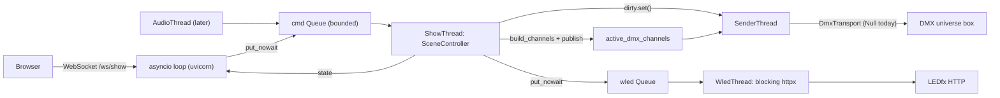

# Web Server Plan Document (uvicorn, sub-10 ms control path)

Design a single-process uvicorn/FastAPI server on 0.0.0.0:8800 that serves the web UI and drives the existing show-control core, architected around a ~10 ms software latency budget.

## Deliverable

One design document: `docs/server_plan/server_architecture.md`. No code is written in this pass. The folder `docs/server_plan/` does not exist yet and will be created (`docs/` is the documented home for design docs per `AGENTS.md`).

## Three findings that shape the design

**1. Existing code violates the budget by ~200x.** `SceneController.activate()` calls the WLED output synchronously:

```74:75:backend/runtime/scene_controller.py
        self._dmx_output.apply(dmx.current)
        self._wled_output.apply(wled.current)
```

`WledOutput.apply` → `LedFxClient.activate_scene` → blocking `httpx.put` with a 2000 ms timeout, plus a possible extra `GET /api/scenes` when the slug is uncached (`_resolve_slug`, `backend/ledfx/client.py:125`). This sits directly on the scene-selection path.

**2. A fixed-cadence sender alone blows the budget.** `docs/show_control_architecture.md` describes a "~30-44 Hz" send loop. Polling at 40 Hz adds 12.5 ms average / 25 ms worst-case before a changed buffer ever leaves the machine. Send-on-change is mandatory, not an optimization.

**3. The GIL is a 5 ms tax.** Uvicorn's event loop and the show thread share one interpreter. `sys.getswitchinterval()` defaults to 0.005, so a CPU-bound chunk in the loop (JSON-serializing a scene list) can stall the show thread for half the budget.

## Architecture

Single process, `--workers 1` (multiple workers would mean multiple engines fighting over one universe). The asyncio loop does I/O only and never touches show state; one show thread owns `SceneController` outright, so no locks are needed anywhere.



Threads: `MainThread` (event loop), `ShowThread`, `SenderThread`, `WledThread`, existing `LedFxSceneSync` poller, `AudioThread` later.

## Key decisions

- **WebSocket for the hot path, REST for everything else.** `/ws/show` carries scene selection and state push on an already-open connection; CRUD authoring (WS-10.6) stays on HTTP where a few ms doesn't matter.
- **Non-blocking WLED via a wrapper, not a rewrite.** A new `AsyncCueOutput` implements the same `CueOutput` protocol from `backend/runtime/outputs.py` but only does `queue.put_nowait(preset_id)`. `SceneController` and `WledOutput` are untouched, so all 84 tests still pass. Latest-wins coalescing on the queue so a burst of beats doesn't back up LEDfx.
- **Send-on-change seam in `active.py`.** Per your note, the sender lands as an update to the active classes: a module-level `threading.Event` plus a `publish()` helper, with `DmxOutput.apply` routing through it. The buffer is already swapped whole rather than mutated in place (`backend/runtime/outputs.py:36-39`), so a reader that grabs one reference can never see a torn frame. `SenderThread` does `dirty.wait(timeout=keepalive)` and calls a `DmxTransport` interface whose only implementation today is `NullTransport` — real E1.31 drops in later as one class.
- **Port 8800 on 0.0.0.0**, reachable at `http://<lan-ip>:8800`. Avoids 8888 (LEDfx) and 8000/8080. Added as a `ServerConfig` block in `AppConfig` (`backend/storage/config.py`).
- **No auth**, matching the documented single-operator LAN scope; noted as an accepted risk since binding `0.0.0.0` exposes it to the LAN.

## Routing

- `GET /` and `/assets/*` — static frontend from `frontend/dist`
- `WS /ws/show` — client sends `{"t":"activate","id":...}`, `beat`, `deactivate`, `blackout`; server pushes `state`, `cue`, `ack`
- `POST /api/show/{activate,deactivate,blackout,beat}`, `GET /api/show/state` — HTTP equivalents for scripting
- `GET|POST /api/{collection}` and `GET|PATCH|DELETE /api/{collection}/{id}` for all ten collections in `backend/storage/records.py`, delegating to the WS-10.5 authoring service rather than `Library.add()` directly
- `GET /api/dmx/universe`, `GET /api/ledfx/scenes`, `POST /api/ledfx/refresh`
- `GET|PATCH /api/config`, `GET /api/health`
- `GET /api/diag/latency`, `POST /api/diag/selftest`

## Latency budget (software half of the 25 ms)

Both paths funnel through the same show thread, so they share one ledger. Per-stage estimates, worst case:

- WS frame receive + JSON parse: 0.2 ms
- Queue put + show-thread wake (GIL hand-off dominated): 1.0 ms
- `activate()`: 4 dict lookups, 2 sequencers, `build_channels` over 512 ints: 0.3 ms
- WLED enqueue: 0.01 ms
- Publish + sender wake: 1.0 ms
- Packet build + `sendto`: 0.3 ms

Roughly 3 ms worst case against a 10 ms budget. The remaining headroom absorbs jitter, which is where the tuning goes: `sys.setswitchinterval(0.001)`, `gc.freeze()` after startup with relaxed thresholds, `ORJSONResponse` as the default to keep the loop short, `timeBeginPeriod(1)` on Windows, raised thread priority for the show and sender threads, and verifying `TCP_NODELAY` on accepted sockets (Nagle would add up to 40 ms on its own).

Measurement is part of the design, not an afterthought: `perf_counter_ns()` stamps at frame-received, dequeued, published, and sent, into a preallocated ring buffer, reported as p50/p95/p99/max. Acceptance is p99 under 10 ms over 1000 activations on both paths.

## New files the doc specifies

`backend/server/{app,engine,commands,ws,deps,latency}.py` plus `backend/server/routes/`, `backend/runtime/sender.py`, `backend/main.py`. Dependencies to add and pin: `fastapi==0.141.1`, `uvicorn[standard]==0.52.1`, `orjson==3.11.9` (uvloop is Linux-only and is skipped on Windows by marker, so the loop is stock asyncio).

## Open items the doc will flag

- Real audio capture and beat detection (WS-9) is out of scope; the plan leaves the command queue as the seam so a WASAPI-loopback source drops in.
- E1.31 transport stays `NullTransport` until wire verification completes (D-017, transport doc §6).
- The 15 ms hardware allowance is an assumption, not a measurement; the doc records it as such.
