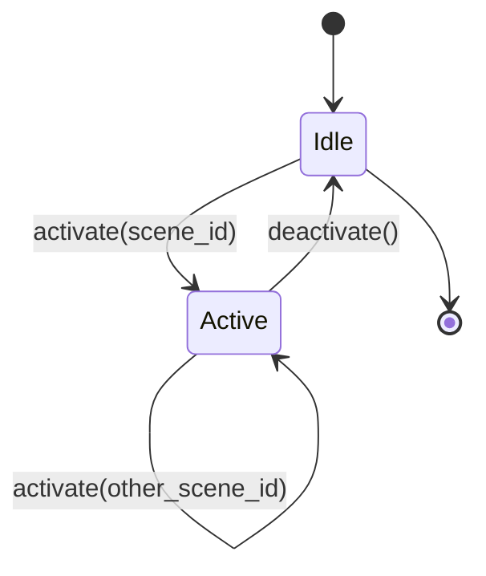
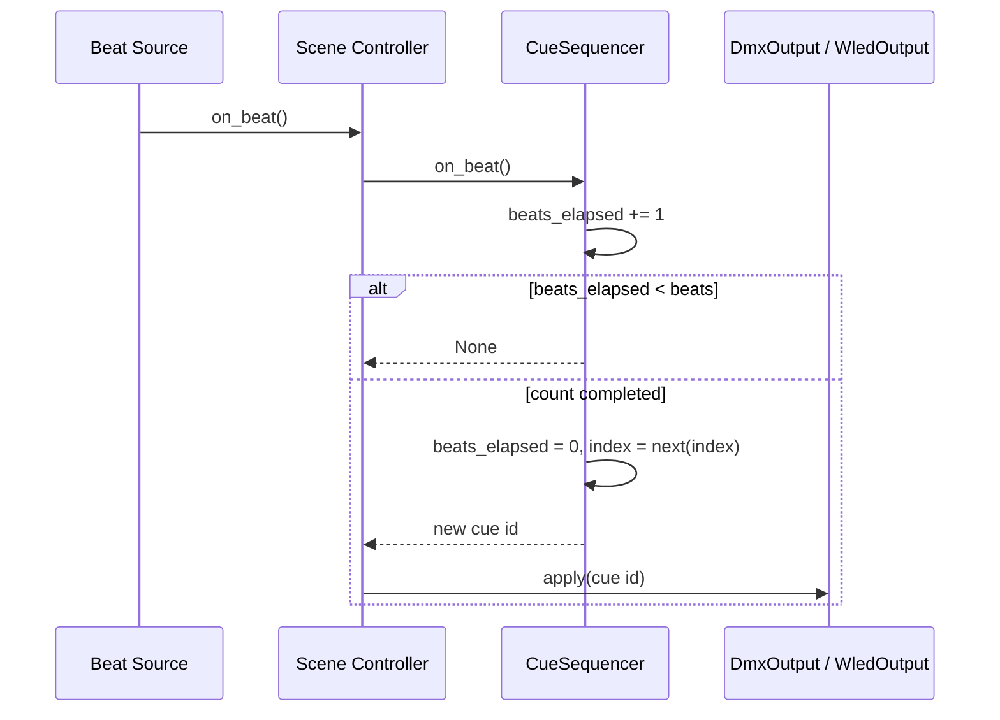

# Show Control Architecture

How a scene runs. Companion to [architecture.md](architecture.md); terminology from
[project_overview.md](project_overview.md#key-terminology).

> **Status: the core is now implemented.** A scene can be activated and will cycle
> both its cue lists off a beat stream, sending looks to the DMX universe buffer and
> LEDfx scenes to the LEDfx API:
> [`runtime/sequencer.py`](../backend/runtime/sequencer.py),
> [`runtime/outputs.py`](../backend/runtime/outputs.py),
> [`runtime/scene_controller.py`](../backend/runtime/scene_controller.py), and
> [`audio/beat_source.py`](../backend/audio/beat_source.py).
>
> What is still **Target**: real beat detection (the beat source is a protocol with a
> manual implementation, no audio library chosen), the E1.31 sender that would put the
> universe buffer on the wire, concurrency (§6), and any operator UI. Laser output is
> severed from this path entirely — see
> [laser_and_haze_safety.md](laser_and_haze_safety.md).

---

## 1. The four kinds of state

Keeping these apart is the point of this document. They have different lifetimes,
different owners, and different persistence rules.

| Kind | Contains | Lifetime | Persisted? | Current owner |
| --- | --- | --- | --- | --- |
| **Preset configuration** | Scenes, lighting presets, DMX cue lists, looks, device states, fixtures, and how many beats each cue list holds per entry | Edited by the operator; survives restart | **Yes** — `data/*.json` | [`storage/library.py`](../backend/storage/library.py) |
| **Scene state** | Which scene is active and its sensitivity | One scene activation | No | [`runtime/scene_controller.py`](../backend/runtime/scene_controller.py) |
| **Sequence state** | Per-cue-list: current index, beats elapsed, loop mode | One scene activation | No | [`runtime/sequencer.py`](../backend/runtime/sequencer.py), one instance per cue list |
| **Output state** | Universe buffer; LEDfx's own idea of the active scene | Process lifetime | **No** | [`runtime/active.py`](../backend/runtime/active.py) (still a module global — [AF-M03](audit_findings.md#af-m03)) |

A recurring failure mode in show-control software is letting sequence state leak into
preset configuration — e.g. storing "current index" on the cue list object. The
division now holds: `beats` on a cue list is configuration (how long each entry
holds), while `index` and `beats_elapsed` live only on a `CueSequencer`, which is
created at activation and thrown away at the next one.

`beats` is a single scalar per list, so every entry in a list holds for the same
number of beats. Per-entry beat shape remains absent
([AF-H02](audit_findings.md#af-h02)) — it needs cue lists to hold
`{preset_id, beats}` entries rather than a flat list of ids, which in turn needs the
integrity checker, orphan pruner, and cascade delete to understand nested references.
Deferred until a real show proves it necessary.

---

## 2. Manual scene selection

**Current:** `SceneController.activate(scene_id)` is the sole entry point, and
`active_scene_id` is the answer to "which scene is running". There is no UI to call it
from yet, and `AppConfig.ui.last_scene_id`
([`storage/config.py`](../backend/storage/config.py)) is still unread — persisting the
last selection is a UI concern and belongs with one
([AF-L03](audit_findings.md#af-l03)).

There are no automatic, timed, or cue-stack transitions — this is a manually operated
show. That constraint is deliberate and significantly simplifies the design; see
[decisions.md](decisions.md#d-001-scene-is-the-top-level-manually-selected-unit).

---

## 3. Scene lifecycle

**Implemented.** A scene has exactly three transitions:

`activate` on an already-active controller is a **replace**, not a stack push.
There is no scene stack, no crossfade, and no layering in the intended design.

### 3.1 Activation sequence

1. Read `Scene` → `Preset` → DMX cue list and WLED cue list from the `Library`.
   Resolution is read-only and happens once, at activation, not per beat.
2. Validate: a cue list with zero entries raises `StorageError` naming the scene and
   the empty list, so the operator learns which list is unplayable.
3. Build both sequencers with `index = 0`, `beats_elapsed = 0`.
4. Apply cue index 0 on both paths **immediately**, without waiting for a beat.

Two properties worth stating explicitly because they are easy to get wrong:

**Cue index 0 is applied on activation, not on the first beat.** Otherwise selecting a
scene during a quiet passage produces darkness.

**Validation happens before anything is swapped in.** Both sequencers are constructed
before the controller mutates its own state, so a scene that fails to resolve leaves
the previous one running rather than half-replacing it and leaving the rig in a state
that matches no scene at all.

`scene.sensitivity` is exposed as `SceneController.sensitivity` for an audio processor
to read, rather than pushed. Nothing consumes it yet.

### 3.2 Deactivation

**Implemented as hold.** `deactivate()` stops sequencing and leaves the universe buffer
exactly as it was, so there is no gap between scenes. It is idempotent — deactivating
when nothing is active does nothing.

| Policy | Behaviour | Trade-off |
| --- | --- | --- |
| **Hold** | Leave the universe buffer at the last look | No flicker between scenes; a stuck app leaves lights on |
| **Blackout** | Zero the universe buffer | Predictable; produces a visible gap on every scene change |
| **Hold, blackout on shutdown only** | Hold between scenes; zero on clean exit | **Chosen** |

`DmxOutput.blackout()` exists for the shutdown half, but nothing calls it yet: there is
no process lifecycle to hang it off, and with no sender the buffer reaches no hardware
either way. See
[decisions.md](decisions.md#d-011-hold-between-scenes-blackout-on-clean-shutdown).

The LEDfx side has no equivalent choice: LEDfx keeps rendering whatever preset it
was last told to run. Deactivating a scene without telling LEDfx anything leaves
the strips lit. See
[wled_ledfx_architecture.md](wled_ledfx_architecture.md#64-shutdown).

---

## 4. Sensitivity propagation

**Current:** `Scene.sensitivity` is bounded to 0.0–1.0
([`models/Scene.py`](../backend/models/Scene.py)), which closes
[AF-M02](audit_findings.md#af-m02) — negatives and NaN no longer validate, and the
schema 3 → 4 migration clamped any value already on disk. It is exposed as
`SceneController.sensitivity` and read by nothing, because no audio processor exists.

One gap remains: **undefined precedence.** Is `AudioConfig.default_sensitivity` a
fallback for scenes that omit the value (they cannot — it is required), a global
multiplier, or dead config? Unresolved; see
[audio_reactivity_architecture.md](audio_reactivity_architecture.md#51-sensitivity).

**Target:** sensitivity flows one way only — Scene → Scene Controller → Audio
Processor. The Audio Processor never reads the `Library`.

---

## 5. Beat-driven sequencing

**Implemented** as `CueSequencer` in
[`runtime/sequencer.py`](../backend/runtime/sequencer.py), instantiated once per cue
list. Its entire input is `on_beat()`; its entire output is the id of the cue to show,
or `None` for "nothing changed". It holds no library reference and performs no I/O,
which is what makes a show's timing testable without audio or hardware.

State per instance: `entries`, `beats`, `loop`, `index`, `beats_elapsed`.

### 5.1 Switching rules

- Advance **on** the beat that completes the entry's count, not the one after.
- A `beats` below 1 is a configuration error, not an infinitely-fast advance. It is
  rejected by the model (`ge=1`) and again by the sequencer's constructor.
- The two sequencers advance **independently**. A DMX cue list of 4 entries at 8
  beats each and a WLED cue list of 3 entries at 4 beats each are not synchronised
  beyond sharing the same beat stream, and are not expected to be.
- A one-entry list reports no change, ever. It has nowhere to advance to, so the cue is
  never re-applied — which matters most on the WLED side, where re-applying would mean
  telling LEDfx to activate the scene it is already running, on every beat.
- `entries` is a snapshot taken at activation, not a live view of the library, so
  editing a cue list cannot disturb a running show.

### 5.2 Loop behaviour

`CueSequencer` supports both loop-forever (the default) and hold-last, where the list
settles on its final cue and stops counting beats. **There is still no field for this
in the data model** — neither `DMX_Preset_List` nor `WLED_Preset_List` has a loop flag,
so the controller always builds looping sequencers. Adding the field is the only thing
between hold-last and being usable.

### 5.3 Reset behaviour

Reset means `index = 0, beats_elapsed = 0` and applying cue 0. Activation gets this by
construction, since it builds fresh sequencers. `CueSequencer.reset()` covers the other
cases — cue-list reload after an operator edit, and explicit operator reset — though
nothing calls it yet. It must **not** happen on BPM change or on temporary beat loss
(§7, §8).

---

## 6. Concurrency and race conditions

**Current:** no threads exist. The sequencing core is synchronous — a beat source calls
`SceneController.on_beat()` on whatever thread it likes, and nothing guards that. The
universe buffer in [`runtime/active.py`](../backend/runtime/active.py) is still a module
global. This is survivable only because nothing else runs yet; a real beat source with
its own audio thread makes every hazard below live.

**Target:** the design will have at least three concurrent activities:

| Activity | Frequency | Touches |
| --- | --- | --- |
| Audio analysis | continuous (audio callback) | emits beat events |
| E1.31 send loop | fixed cadence (~30–44 Hz) | reads universe buffers |
| Operator UI | sporadic | activates scenes, edits the library |

The hazards:

1. **Torn universe reads.** The sender reading a 512-value buffer while the
   sequencer rewrites it can transmit a frame that is half old look, half new.
   `DmxOutput.apply` builds the whole buffer to the side and then assigns it, so the
   window is one reference swap — atomic under CPython's GIL. **Still unmitigated by
   design rather than by accident:** there is no lock, and the guarantee rests on an
   implementation detail of the interpreter.
2. **Scene change mid-beat.** A beat arriving while the controller is swapping cue
   lists could advance a sequencer that is being replaced. Partly mitigated: sequencers
   are replaced wholesale by reference rather than mutated, and both are built before
   either is installed. Not fully safe without a lock shared with beat handling.
3. **Library edits during playback.** The Scene Controller now holds resolved
   snapshots rather than live library references, so editing or deleting a cue list
   cannot corrupt a running show mid-cue — the change simply takes effect at the next
   activation. `force=True` deletes can still take a Scene down with a required parent
   ([AF-H04](audit_findings.md#af-h04)), though optional references such as
   `ilda_frame_list_id` are now detached instead.
4. **LEDfx HTTP latency.** Still unmitigated: `WledOutput.apply` calls LEDfx
   synchronously on whatever thread handled the beat. A hung LEDfx will stall beat
   handling, and with it DMX. The timeout (`request_timeout_s`, default 2s) bounds the
   damage but does not remove it. An API call must never run on the beat-handling
   thread; moving it off is outstanding work.

The single most useful concurrency rule: **the E1.31 sender must never block on
anything except its own timer.**

---

## 7. Behaviour when BPM changes

Beat events, not BPM, drive sequencing. If BPM drifts from 120 to 128, beats simply
arrive faster and cue lists advance faster. Nothing resets and no index moves.

BPM as a *number* is only useful for display and for any future time-based (rather
than beat-based) effects. Treating BPM as the sequencing input instead of discrete
beat events would introduce a resync problem that the event-based design does not
have. See
[decisions.md](decisions.md#d-002-audio-processing-owns-timing-not-lighting-decisions).

---

## 8. Behaviour when beats are not detected

Silence, a quiet passage, or a failed audio device all look the same to a
sequencer: no events arrive. The correct behaviour is:

- **Cue lists hold.** The current look stays lit. This is why cue 0 is applied on
  activation rather than on the first beat (§3.1).
- **No timeout-driven advance.** Do not invent beats. A "free-run at last known
  BPM" fallback is tempting and is explicitly *not* recommended for the initial
  system — it makes silence indistinguishable from music in the output and hides
  audio device failures.
- **Audio failure must be visible.** A dead input device should surface in the UI,
  not merely present as a static-looking show. Logging exists now, but there is no UI
  and no beat-source health signal, so this remains unaddressed.

The first two are implemented and tested: with no beats, `SceneController` applies
nothing after cue 0, and `ManualBeatSource` emits nothing at all while stopped.

---

## 9. Behaviour when the scene changes mid-sequence

Deterministic and simple, and implemented: the outgoing scene's sequencers are dropped,
and the incoming scene builds fresh ones starting at index 0. Sequence state is never
preserved, restored, or resumed across scene changes.

Rejected alternatives, for the record:
- *Resume where the scene left off* — requires persisting sequence state per scene
  and makes the show non-reproducible.
- *Wait for the next bar boundary before switching* — requires bar/downbeat
  detection the Audio Processor is not specified to provide, and makes the operator
  wait on a manual action.

---

## 10. Testability

§5 is a pure state machine over a beat stream, tested with synthetic beats and zero I/O
in [`tests/test_sequencer.py`](../tests/test_sequencer.py) — no audio device, no socket,
no LEDfx. [`tests/test_scene_controller.py`](../tests/test_scene_controller.py) covers
the wiring the same way, using a recording output to assert the exact sequence of cues a
run of beats produces, and `ManualBeatSource` to drive it.

This is what makes show timing verifiable before any hardware exists: the questions
"does an 8-beat cue advance on beat 8" and "does switching scenes reset the index" are
answered by tests that run in milliseconds. Two things it cannot cover, because they are
properties of a running process rather than of the state machine: concurrency (§6) and
whether real beat detection is accurate.
