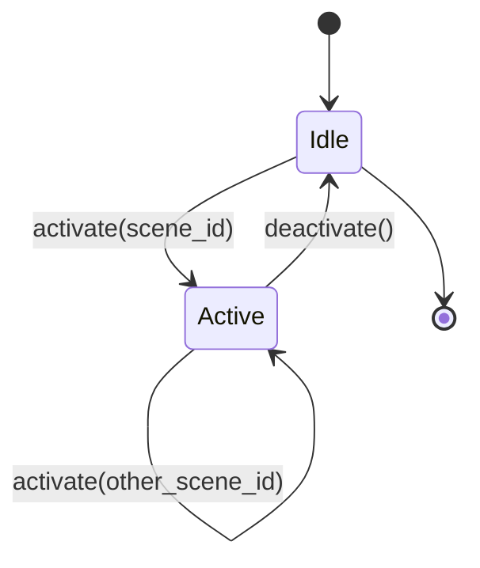
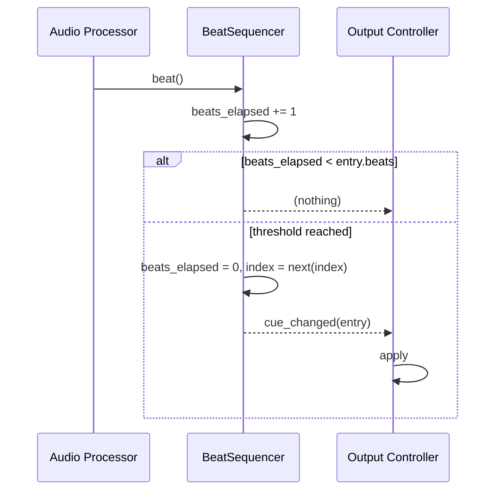

# Show Control Architecture

How a scene runs. Companion to [architecture.md](architecture.md); terminology from
[project_overview.md](project_overview.md#key-terminology).

> **Status: almost entirely Target.** The repository contains no scene controller,
> no sequencer, and no activation logic. The only current code on this path is
> [`runtime/active.py`](../backend/runtime/active.py), which resolves a scene to a
> look given an explicitly supplied index. Everything below marked **Target** is a
> proposal, not a description.

---

## 1. The four kinds of state

Keeping these apart is the point of this document. They have different lifetimes,
different owners, and different persistence rules.

| Kind | Contains | Lifetime | Persisted? | Current owner |
| --- | --- | --- | --- | --- |
| **Preset configuration** | Scenes, lighting presets, DMX cue lists, looks, and device states; fixtures once introduced | Edited by the operator; survives restart | **Yes** — `data/*.json` | [`storage/library.py`](../backend/storage/library.py) for the implemented types |
| **Scene state** | Which scene is active, when it was activated, its sensitivity | One scene activation | No | *nothing — Target* |
| **Sequence state** | Per-cue-list: current index, beats elapsed, loop mode | One scene activation | No | *nothing — the `index` parameter at [`active.py:53`](../backend/runtime/active.py#L53) is a placeholder for it* |
| **Output state** | Universe buffers, dirty flags, currently-active LEDfx preset, socket handles | Process lifetime | **No** | [`runtime/active.py:19-20`](../backend/runtime/active.py#L19-L20) (DMX only, as module globals) |

A recurring failure mode in show-control software is letting sequence state leak
into preset configuration — e.g. storing "current index" on the cue list object.
`WLED_Preset_List.beats` is arguably an early instance of this ambiguity: it is a
single scalar on the list, and it is unclear whether it is meant as configuration
(a per-entry duration, misplaced) or as a runtime counter (which must not be
persisted). It is currently neither, because the model is unreachable.

---

## 2. Manual scene selection

**Current:** no selection mechanism exists. `AppConfig.ui.last_scene_id`
([`storage/config.py:36`](../backend/storage/config.py#L36)) is the only
acknowledgement that a scene can be "current", and nothing reads or writes it.

**Target:** the operator picks a scene from a list; the Scene Controller is the
sole entry point for activation. There are no automatic, timed, or cue-stack
transitions — this is a manually operated show. That constraint is deliberate and
significantly simplifies the design; see
[decisions.md](decisions.md#d-001-scene-is-the-top-level-manually-selected-unit).

---

## 3. Scene lifecycle

**Target.** A scene has exactly three transitions:

`activate` on an already-active controller is a **replace**, not a stack push.
There is no scene stack, no crossfade, and no layering in the intended design.

### 3.1 Activation sequence

1. If a scene is active, run deactivation (§3.2) first.
2. Read `Scene` → `Preset` → DMX cue list and WLED cue list from the `Library`.
   Resolution is read-only and happens once, at activation, not per beat.
3. Validate: a cue list with zero entries is an activation error. The current code
   already raises `StorageError` for this on the DMX side
   ([`active.py:58-59`](../backend/runtime/active.py#L58-L59)) — that behaviour
   should be preserved and surfaced to the operator rather than crashing the show.
4. Push `scene.sensitivity` to the Audio Processor.
5. Reset both sequencers: `index = 0`, `beats_elapsed = 0`.
6. Apply cue index 0 on both paths **immediately**, without waiting for a beat. A
   scene must produce light the moment it is selected, even in silence.
7. Hand `scene.ilda_frame_list_id` to the ILDA Controller (which is a stub — see
   [laser_and_haze_safety.md](laser_and_haze_safety.md)).

Step 6 is a real design decision and worth stating explicitly: **cue index 0 is
applied on activation, not on the first beat.** Otherwise selecting a scene during
a quiet passage produces darkness.

### 3.2 Deactivation

**Target**, and currently undefined anywhere in the repository. The open question
is the DMX policy:

| Policy | Behaviour | Trade-off |
| --- | --- | --- |
| **Hold** | Leave the universe buffer at the last look | No flicker between scenes; a stuck app leaves lights on |
| **Blackout** | Zero the universe buffer | Predictable; produces a visible gap on every scene change |
| **Hold, blackout on shutdown only** | Hold between scenes; zero on clean exit | Recommended |

The recommended policy is the third. It is recorded as **proposed** in
[decisions.md](decisions.md#d-011-hold-between-scenes-blackout-on-clean-shutdown)
because the repository contains no evidence either way.

The LEDfx side has no equivalent choice: LEDfx keeps rendering whatever preset it
was last told to run. Deactivating a scene without telling LEDfx anything leaves
the strips lit. See
[wled_ledfx_architecture.md](wled_ledfx_architecture.md#64-shutdown).

---

## 4. Sensitivity propagation

**Current:** `Scene.sensitivity: float` ([`models/Scene.py:9`](../backend/models/Scene.py#L9))
is persisted through `SceneRecord` and round-tripped by the library. Nothing reads
it. There is a separate `AudioConfig.default_sensitivity: float = 0.5`
([`storage/config.py:31`](../backend/storage/config.py#L31)) with no defined
relationship to the scene field.

Two gaps worth fixing early:

- **No bounds.** `sensitivity` has no `ge`/`le` constraint, so any float validates,
  including negatives and NaN. See [AF-M02](audit_findings.md#af-m02).
- **Undefined precedence.** Is `AudioConfig.default_sensitivity` a fallback for
  scenes that omit the value (they cannot — it is required), a global multiplier,
  or dead config? Unresolved; see
  [audio_reactivity_architecture.md](audio_reactivity_architecture.md#51-sensitivity).

**Target:** sensitivity flows one way only — Scene → Scene Controller → Audio
Processor. The Audio Processor never reads the `Library`.

---

## 5. Beat-driven sequencing

**Target.** One `BeatSequencer` class, instantiated once per cue list. Its entire
input is a stream of beat events; its entire output is a "cue changed" signal.

State per instance: `entries`, `index`, `beats_elapsed`, `loop_mode`.

### 5.1 Switching rules

- Advance **on** the beat that completes the entry's count, not the one after.
- An entry with `beats <= 0` is a configuration error, not an infinitely-fast
  advance. Reject it at load. Nothing validates this today.
- The two sequencers advance **independently**. A DMX cue list of 4 entries at 8
  beats each and a WLED cue list of 3 entries at 4 beats each are not synchronised
  beyond sharing the same beat stream, and are not expected to be.

### 5.2 Loop behaviour

The intended default is loop-forever. A `hold-last` mode is worth supporting for
cue lists meant to run once and settle. There is **no field for this in the data
model today** — neither `DMX_Preset_List` nor `WLED_Preset_List` has a loop flag.

### 5.3 Reset behaviour

Reset means `index = 0, beats_elapsed = 0` and applying cue 0. It happens on:
scene activation, cue-list reload (operator edited it), and explicit operator
reset. It must **not** happen on BPM change or on temporary beat loss (§7, §8).

---

## 6. Concurrency and race conditions

**Current:** no threads exist, and the two runtime singletons in
[`runtime/active.py`](../backend/runtime/active.py) have no synchronisation. This
is fine only because nothing runs.

**Target:** the design will have at least three concurrent activities:

| Activity | Frequency | Touches |
| --- | --- | --- |
| Audio analysis | continuous (audio callback) | emits beat events |
| E1.31 send loop | fixed cadence (~30–44 Hz) | reads universe buffers |
| Operator UI | sporadic | activates scenes, edits the library |

The hazards:

1. **Torn universe reads.** The sender reading a 512-value buffer while the
   sequencer rewrites it can transmit a frame that is half old look, half new.
   Mitigation: build the new buffer off to the side and swap the reference under a
   lock, or guard the write with the same lock the sender takes. Note that
   `update_active_dmx_channels` today *does* assign a freshly built list
   ([`active.py:73-75`](../backend/runtime/active.py#L73-L75)) — with CPython's
   GIL, that particular assignment is atomic. This is an accident of the
   implementation, not a designed guarantee, and should be made explicit.
2. **Scene change mid-beat.** A beat event arriving while the Scene Controller is
   swapping cue lists could advance a sequencer that is being replaced. Mitigation:
   activation takes the same lock as beat handling, or the sequencer is replaced
   wholesale by reference rather than mutated.
3. **Library edits during playback.** Deleting a look that the active DMX
   sequencer is pointing at. `Library.delete` refuses by default when referrers
   exist ([`library.py:324-329`](../backend/storage/library.py#L324-L329)), which
   helps, but `force=True` cascades and can delete Scenes — see
   [AF-H04](audit_findings.md#af-h04). The Scene Controller should hold resolved
   snapshots, not live library references, so an edit cannot corrupt a running
   show mid-cue.
4. **LEDfx HTTP latency.** An API call must never run on the beat-handling thread.
   A slow or hung LEDfx must not stall DMX output.

The single most useful concurrency rule: **the E1.31 sender must never block on
anything except its own timer.**

---

## 7. Behaviour when BPM changes

Beat events, not BPM, drive sequencing. If BPM drifts from 120 to 128, beats simply
arrive faster and cue lists advance faster. Nothing resets and no index moves.

BPM as a *number* is only useful for display and for any future time-based (rather
than beat-based) effects. Treating BPM as the sequencing input instead of discrete
beat events would introduce a resync problem that the event-based design does not
have. See
[decisions.md](decisions.md#d-002-audio-processing-owns-timing-not-lighting-decisions).

---

## 8. Behaviour when beats are not detected

Silence, a quiet passage, or a failed audio device all look the same to a
sequencer: no events arrive. The correct behaviour is:

- **Cue lists hold.** The current look stays lit. This is why cue 0 is applied on
  activation rather than on the first beat (§3.1).
- **No timeout-driven advance.** Do not invent beats. A "free-run at last known
  BPM" fallback is tempting and is explicitly *not* recommended for the initial
  system — it makes silence indistinguishable from music in the output and hides
  audio device failures.
- **Audio failure must be visible.** A dead input device should surface in the UI,
  not merely present as a static-looking show. Nothing in the repository logs
  anything at all today ([AF-M08](audit_findings.md#af-m08)).

---

## 9. Behaviour when the scene changes mid-sequence

Deterministic and simple: the outgoing scene's sequence state is discarded
entirely, and the incoming scene starts at index 0. Sequence state is never
preserved, restored, or resumed across scene changes.

Rejected alternatives, for the record:
- *Resume where the scene left off* — requires persisting sequence state per scene
  and makes the show non-reproducible.
- *Wait for the next bar boundary before switching* — requires bar/downbeat
  detection the Audio Processor is not specified to provide, and makes the operator
  wait on a manual action.

---

## 10. Testability

The whole of §5 is a pure state machine over a beat stream and should be tested
with a synthetic list of beat events and zero I/O. That is the highest-value test
suite in the project and it can be written before any audio or transport code
exists. See [current_sprint.md](current_sprint.md#ws-3--shared-beat-sequencing).
