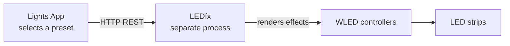
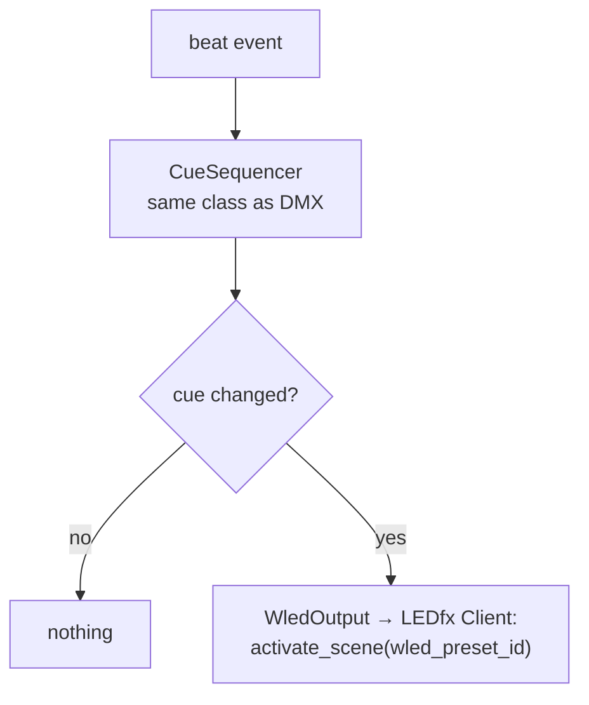

# WLED / LEDfx Architecture

> **Terminology.** A "look" is a `dmx_preset` (`DMX_Preset`). Use `dmx_preset` going
> forward — [D-023](decisions.md#d-023-a-look-is-a-dmx_preset). WLED has no equivalent
> object; LEDfx scene names are `WLED_Preset` ids.

> **Status: LEDfx client, scene sync, and WLED cue-list storage exist; no show loop
> yet.** `backend/ledfx/` talks to LEDfx over HTTP when `ledfx.enabled` is true and
> can autopopulate `WLED_Preset` rows from scene names. `Preset` references a
> `WLED_Preset_List`; beat sequencing and Scene Controller wiring are still absent.

---

## 1. Ownership boundary

**This application does not produce WLED output. LEDfx does.**



The application's entire responsibility on this path is: **decide which LEDfx
preset should be active, and tell LEDfx about it when that changes.** It does not
generate pixel data, does not implement the WLED JSON API, does not implement DDP
or E1.31-to-WLED, and does not talk to WLED controllers at all.

This boundary must be stated wherever the WLED path is described, because the
alternative architecture — the app rendering pixels itself — is a substantially
different and much larger system. See
[decisions.md](decisions.md#d-004-ledfx-owns-wled-output).

Contrast with DMX, which uses a completely separate transport: **E1.31 carries DMX
universe data to the DMX box; LEDfx handles WLED.** The two paths share only the
beat stream (when a show loop exists).

---

## 2. Current state

### 2.1 Models and storage

```python
# backend/models/WLED_Preset.py
class WLED_Preset(BaseModel):
    """A LedFx scene mirrored into the library. ``id`` is the LedFx scene name."""
    id: str
```

```python
# backend/models/WLED_Preset_List.py
class WLED_Preset_List(BaseModel):
    id: str = Field(default_factory=lambda: uuid4().hex)
    wled_preset_ids: List[str] = []
    beats: int = 0
```

```python
# backend/models/Preset.py
class Preset(BaseModel):
    id: str = Field(default_factory=lambda: uuid4().hex)
    dmx_preset_list_id: str
    wled_preset_list_id: str
```

`WLED_Preset_List` is registered in [`storage/records.py`](../backend/storage/records.py)
(`wled_preset_lists` collection). `Preset` references a list on both sides. Schema
**v2** migration wraps legacy `wled_preset_id` values into one-entry lists — see
[`storage/migrations.py`](../backend/storage/migrations.py).

### 2.2 `WLED_Preset.id` is the LEDfx scene name

**Accepted ([D-018](decisions.md#d-018-ledfx-preset-identifier-form)).** The
entity in LEDfx is a *scene*. The app stores that scene's human-readable `name`
as `WLED_Preset.id` — there is no separate LEDfx id field and no generated UUID.
`LedFxSceneSync` polls `GET /api/scenes` and inserts any missing names into
`wled_presets`. Activation resolves name → LEDfx slug in memory from the latest
list. See §6.

### 2.3 Remaining model gaps

- **Per-entry beats are absent.** `WLED_Preset_List.beats` is one scalar for the
  whole list; `DMX_Preset_List` has no beat field at all. Beat-driven sequencing
  cannot be built on the current shape ([AF-H02](audit_findings.md#af-h02)).
- **No show loop.** Nothing advances cue indices or calls `activate_scene` on beat
  changes.

### 2.4 Configuration

```python
# backend/storage/config.py
class LedfxConfig(BaseModel):
    enabled: bool = False
    base_url: str = "http://127.0.0.1:8888"
    scene_refresh_s: float = 25.0
    request_timeout_s: float = 2.0
```

Compile-time defaults in [`backend/config/config.py`](../backend/config/config.py)
seed these fields when `config.json` is first written. Nothing opens a socket unless
`enabled` is true.

### 2.5 Implemented modules

| Module | Role |
| --- | --- |
| [`ledfx/client.py`](../backend/ledfx/client.py) | `LedFxClient`, `NullLedFxClient`, HTTP to `/api/scenes` |
| [`ledfx/scene_sync.py`](../backend/ledfx/scene_sync.py) | Background poll; upserts missing scene names |
| [`ledfx/service.py`](../backend/ledfx/service.py) | `build_ledfx_stack` factory |

---

## 3. Target model (partially landed)

**Done:** `Preset.wled_preset_list_id`, registered `WLED_Preset_List`, `WLED_Preset.id`
= scene name.

**Still proposed** (parked with WS-2 in [current_sprint.md](current_sprint.md)):

```text
WLED_Preset_List
└── entries[]                CHANGED: was flat wled_preset_ids + one scalar beats
    ├── wled_preset_id
    └── beats                per entry
```

The same per-entry beat shape should apply to `DMX_Preset_List` when the show-control
model is redesigned.

### 3.1 Preset identifiers

**Decided ([D-018](decisions.md#d-018-ledfx-preset-identifier-form)).**

| Question | Answer |
| --- | --- |
| LEDfx entity | Scene (`/api/scenes`) |
| Stored identifier | Scene **name** as `WLED_Preset.id` |
| Activate identifier | LEDfx **slug** (list map key), resolved in memory from the latest poll |
| Gone from LEDfx | Leave the library row; do not auto-delete |

LEDfx list response shape (simplified):

```json
{
  "status": "success",
  "scenes": {
    "living-room": { "name": "Living Room", "active": true }
  }
}
```

Sync stores `"Living Room"`; activate sends
`{"id": "living-room", "action": "activate"}`.

---

## 4. Beat-driven iteration

**Implemented.** The same `CueSequencer` class as the DMX side, driven by the same beat
stream but advancing independently; see
[show_control_architecture.md](show_control_architecture.md#5-beat-driven-sequencing).



Two things stop this from generating pointless HTTP traffic. The sequencer reports
nothing when the cue has not changed, and a one-entry list never reports a change at
all — so a scene with a single LEDfx cue results in exactly one activation, not one per
beat. `LedFxClient.activate_scene` then dedupes again on its own against the last scene
it activated.

`WledOutput` swallows `LedFxError` after logging it, because LEDfx being unreachable
should cost the strips and not the show. The call is still synchronous on the
beat-handling path, which is a real limitation — see
[show_control_architecture.md](show_control_architecture.md#6-concurrency-and-race-conditions).

Runtime behaviour, per the intended design:

1. On scene activation, activate entry 0 immediately (not on the first beat).
2. Count beat events.
3. Hold the current LEDfx scene for the entry's configured beat count.
4. Advance; loop or hold at the end according to list behaviour.
5. **Call the LEDfx API only when the active scene name actually changes.**

---

## 5. Virtual and logical devices

A physical LED installation is often divided into several LEDfx *virtual devices*
so sections can run different effects independently — for example, one strip split
into left/right halves.

**Current status: not modelled.** Virtual-device layout stays LEDfx's business;
activating a scene applies whatever virtuals that scene captured. Do not build an
app-side device mapping unless LEDfx cannot express the grouping the rig needs.

---

## 6. LEDfx API client and scene sync

**Implemented** under [`backend/ledfx/`](../backend/ledfx/).

| Component | Owns | Does not own |
| --- | --- | --- |
| `LedFxClient` | Base URL, HTTP, timeouts, name→slug map, activate dedup, reachability | `Library`, beat counting, when to change scene |
| `LedFxSceneSync` | 25s poll, inserting missing `WLED_Preset` rows | Creating/editing scenes in LEDfx, deleting vanished names |
| `NullLedFxClient` | Default when `ledfx.enabled` is false | Network |

Activate path: `PUT {base_url}/api/scenes` with
`{"id": "<slug>", "action": "activate"}`. List path: `GET /api/scenes`.

### 6.1 Call deduplication

The client tracks the currently-active preset in memory and drops any request to
activate what is already active. This matters because the sequencer emits on cue
change, but activation, operator actions, and reconnect logic can all re-request the
same preset. Deduplication belongs in the client so no caller has to remember it.

The dedup cache must be **invalidated when LEDfx becomes unreachable** — after a
LEDfx restart the app's belief about the active preset is stale, and blindly
deduplicating against it leaves the strips showing the wrong effect.

### 6.2 Timeouts and threading

An HTTP call must never run on the beat-handling thread and must never block DMX
output. A hung LEDfx has to be survivable. Every call needs an explicit, short
timeout — a missing timeout on a `requests` call is the classic way this becomes a
show-stopping hang.

### 6.3 Error handling and recovery

| Condition | Behaviour |
| --- | --- |
| LEDfx not running at startup | Start normally with WLED disabled; DMX unaffected; surface the state |
| Connection refused mid-show | Log once (not per beat), mark unreachable, back off, keep sequencing internally |
| Recovered | Invalidate dedup cache, re-apply the current cue's preset |
| HTTP 4xx (bad preset id) | Log with the id; do not retry; do not advance or reset the sequencer |
| HTTP 5xx / timeout | Retry with bounded backoff |

The rule throughout: **a LEDfx failure degrades the WLED path only.** It must never
stall beat handling, DMX output, or scene selection.

### 6.4 Shutdown

Unlike DMX, there is no "stop sending and it goes dark" — LEDfx keeps rendering the
last preset it was told to run, indefinitely, after this app exits. If lights-out on
exit is wanted, shutdown must explicitly ask LEDfx to stop or activate a blackout
preset. This is a deliberate decision to make, not an oversight to inherit.

---

## 7. Configuration

```text
LedfxConfig                         AppConfig.ledfx
├── enabled: bool = False           nothing calls out unless switched on
├── base_url: str                   default http://127.0.0.1:8888
├── scene_refresh_s: float = 25     LedFxSceneSync interval
└── request_timeout_s: float = 2.0
```

Compile-time defaults: [`backend/config/config.py`](../backend/config/config.py).
No credentials belong in the repository; overrides live in the user's `config.json`.

---

## 8. Testing without physical devices

Three layers, none requiring a strip, a controller, or a running LEDfx:

1. **Fake client.** `NullLedFxClient` is the default when disabled. Dedup logic is
   testable once a show loop exists.
2. **HTTP-level.** Test the real client against a stub HTTP server or mocked
   transport. Never against a real LEDfx in CI.
3. **Live LEDfx, no hardware.** LEDfx runs without physical WLED devices attached,
   which makes it a genuine manual integration target that risks nothing.

As with DMX, the null implementation should be the **default**, so no test run or
development session can emit a call by accident.
