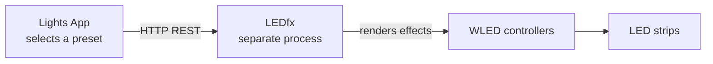
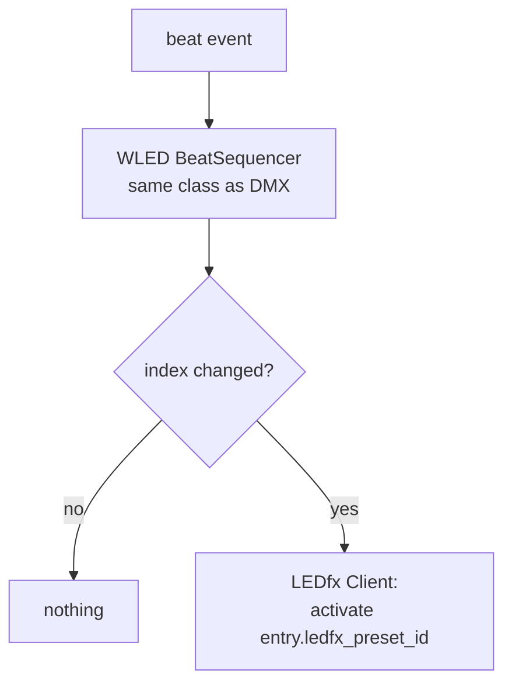

# WLED / LEDfx Architecture

> **Status: the least implemented subsystem in the repository.** There is no LEDfx
> code, no HTTP client, no networking dependency, and no WLED logic. The source
> contains only WLED configuration/model placeholders; it contains no LEDfx call,
> HTTP client, or WebSocket implementation. One of the two WLED models below is
> unreachable.

---

## 1. Ownership boundary

**This application does not produce WLED output. LEDfx does.**



The application's entire responsibility on this path is: **decide which LEDfx
preset should be active, and tell LEDfx about it when that changes.** It does not
generate pixel data, does not implement the WLED JSON API, does not implement DDP
or E1.31-to-WLED, and does not talk to WLED controllers at all.

This boundary must be stated wherever the WLED path is described, because the
alternative architecture — the app rendering pixels itself — is a substantially
different and much larger system. See
[decisions.md](decisions.md#d-004-ledfx-owns-wled-output).

Contrast with DMX, which uses a completely separate transport: **E1.31 carries DMX
universe data to the DMX box; LEDfx handles WLED.** The two paths share only the
beat stream.

---

## 2. Current state

Two models exist. Neither is usable.

```python
# backend/models/WLED_Preset.py — complete file body
class WLED_Preset(BaseModel):
    id: str = Field(default_factory=lambda: uuid4().hex)
```

```python
# backend/models/WLED_Preset_List.py — complete file body
class WLED_Preset_List(BaseModel):
    id: str = Field(default_factory=lambda: uuid4().hex)
    wled_preset_ids: List[str] = []
    beats: int = 0
```

### 2.1 `WLED_Preset` has no LEDfx identifier

It carries only a generated UUID hex string. There is no field naming an LEDfx
preset, scene, virtual device, or effect. As stored, a `WLED_Preset` cannot
identify anything in LEDfx. It is registered with the storage layer
([`records.py:47`](../backend/storage/records.py#L47),
[`records.py:69`](../backend/storage/records.py#L69)) and is reachable from
`Preset.wled_preset_id`, so it round-trips correctly — it just carries no
information. Tracked as [AF-H03](audit_findings.md#af-h03).

### 2.2 `WLED_Preset_List` is unreachable

`WLED_Preset_List` appears **nowhere** outside its own file. It is absent from
`RECORD_TYPES`, `COLLECTION_ORDER`, `REFERENCES`, and `ROOT_COLLECTIONS` in
[`records.py`](../backend/storage/records.py), and from `MODEL_TYPES` in
[`library.py:59-68`](../backend/storage/library.py#L59-L68). Consequences:

- It cannot be loaded or saved — `Library` has no map for it.
- `Library.add()` raises `StorageError("... is not a storable model")` for it
  ([`library.py:263-265`](../backend/storage/library.py#L263-L265)).
- Nothing can reference it, because `Preset.wled_preset_id` points at
  `WLED_Preset`, not at the list.

It is dead code that describes an intended design. Verified by direct search:

```
$ grep -rn "WLED_Preset_List\|wled_preset_list" --include=*.py .
./backend/models/WLED_Preset_List.py:5:class WLED_Preset_List(BaseModel):
```

### 2.3 The beats field is on the wrong object

`beats: int = 0` is a single scalar on the *list*, while the intended design gives
each **entry** its own beat duration. As written, every preset in a list would hold
for the same number of beats — and the default of `0` is not a valid duration under
any interpretation.

### 2.4 The `Preset` asymmetry

```python
# backend/models/Preset.py
class Preset(BaseModel):
    id: str
    dmx_preset_list_id: str    # → a sequenceable list
    wled_preset_id: str        # → a single preset, NOT a list
```

The DMX side references a cue list and can therefore be sequenced. The WLED side
references one preset and cannot. **Beat-driven WLED sequencing is structurally
impossible on the current model**, which is the concrete blocker for this
subsystem.

### 2.5 Configuration

```python
# backend/storage/config.py:19
class WLEDConfig(BaseModel):
    devices: List[str] = []
    discovery_enabled: bool = True
```

Anticipates the integration but does not fit it: there is no LEDfx base URL, no
port, and no API token field, and `devices: List[str]` is untyped and unread.
`discovery_enabled` implies the app discovers WLED devices — which contradicts §1,
where LEDfx owns device management. This config section will need reshaping.

---

## 3. Target model

**Proposed.** Two changes bring the WLED path level with the DMX path:

```text
Preset
├── dmx_preset_list_id
└── wled_preset_list_id      CHANGED: was wled_preset_id

WLED_Preset_List             REGISTERED with the storage layer
└── entries[]                CHANGED: was a flat id list + one scalar `beats`
    ├── wled_preset_id
    └── beats                per entry

WLED_Preset
├── id
└── ledfx_preset_id          NEW: the identifier LEDfx actually understands
```

The same per-entry beat problem exists on the DMX side —
`DMX_Preset_List.dmx_preset_ids` is a flat list with no beat field at all — so the
entry shape should be introduced for **both** lists in one change, or they will
diverge. See [current_sprint.md](current_sprint.md#ws-2--scene-and-preset-model).

All of this is additive/migratable through the existing
[`migrations.py`](../backend/storage/migrations.py) mechanism, and registering
`WLED_Preset_List` is a matter of adding it to `RECORD_TYPES`, `COLLECTION_ORDER`,
`MODEL_TYPES`, and `REFERENCES` — the reference-graph machinery does the rest.

### 3.1 Preset identifiers

**Open question, unanswerable from the repository.** LEDfx addresses things by
several kinds of identifier, and the right one depends on the LEDfx version and how
the rig is configured. Before implementation, establish and record:

1. What LEDfx entity does a "preset" map to — a scene applied across the whole
   instance, or a per-virtual-device effect preset?
2. Is the identifier a slug, a UUID, or a name?
3. Is it stable across LEDfx restarts and config edits?

Question 3 matters most: if identifiers are not stable, storing them in
`data/wled_presets.json` produces a config that silently breaks. If they are not
stable, store the human-readable name and resolve at activation.

Until answered, `ledfx_preset_id: str` is the honest field — an opaque string the
app stores and passes through.

---

## 4. Beat-driven iteration

Identical state machine to the DMX side, and **it must be the same class** — see
[show_control_architecture.md](show_control_architecture.md#5-beat-driven-sequencing).
The only difference is the consumer:



Runtime behaviour, per the intended design:

1. On scene activation, activate entry 0 immediately (not on the first beat).
2. Count beat events.
3. Hold the current LEDfx preset for the entry's configured beat count.
4. Advance; loop or hold at the end according to list behaviour.
5. **Call the LEDfx API only when the active preset actually changes.**

---

## 5. Virtual and logical devices

A physical LED installation is often divided into several LEDfx *virtual devices*
so sections can run different effects independently — for example, one strip split
into left/right halves.

**Current status: not modelled.** `WLEDConfig.devices: List[str]` is the only
gesture toward it, and it is unused and untyped.

This is an area where the temptation to over-model is high. Recommended minimum:
treat the LEDfx virtual-device layout as **LEDfx's business**, and have the app
reference whatever LEDfx-level identifier applies a preset to the right set of
devices. Only introduce an app-side device mapping if it turns out LEDfx cannot
express the grouping the rig needs. Do not build a device abstraction speculatively.

---

## 6. LEDfx API client responsibilities

**Proposed.** A single adapter module, the only place in the codebase that knows
LEDfx exists.

| Owns | Does not own |
| --- | --- |
| Base URL and connection config | When to change preset |
| HTTP calls and their encoding | Beat counting or cue indices |
| Timeouts, retries, backoff | Reading the `Library` |
| Deduplication of repeat calls | Any DMX or ILDA concern |
| Reachability state, surfaced upward | Persisting anything |

### 6.1 Call deduplication

The client tracks the currently-active preset in memory and drops any request to
activate what is already active. This matters because the sequencer emits on cue
change, but activation, operator actions, and reconnect logic can all re-request the
same preset. Deduplication belongs in the client so no caller has to remember it.

The dedup cache must be **invalidated when LEDfx becomes unreachable** — after a
LEDfx restart the app's belief about the active preset is stale, and blindly
deduplicating against it leaves the strips showing the wrong effect.

### 6.2 Timeouts and threading

An HTTP call must never run on the beat-handling thread and must never block DMX
output. A hung LEDfx has to be survivable. Every call needs an explicit, short
timeout — a missing timeout on a `requests` call is the classic way this becomes a
show-stopping hang.

### 6.3 Error handling and recovery

| Condition | Behaviour |
| --- | --- |
| LEDfx not running at startup | Start normally with WLED disabled; DMX unaffected; surface the state |
| Connection refused mid-show | Log once (not per beat), mark unreachable, back off, keep sequencing internally |
| Recovered | Invalidate dedup cache, re-apply the current cue's preset |
| HTTP 4xx (bad preset id) | Log with the id; do not retry; do not advance or reset the sequencer |
| HTTP 5xx / timeout | Retry with bounded backoff |

The rule throughout: **a LEDfx failure degrades the WLED path only.** It must never
stall beat handling, DMX output, or scene selection.

### 6.4 Shutdown

Unlike DMX, there is no "stop sending and it goes dark" — LEDfx keeps rendering the
last preset it was told to run, indefinitely, after this app exits. If lights-out on
exit is wanted, shutdown must explicitly ask LEDfx to stop or activate a blackout
preset. This is a deliberate decision to make, not an oversight to inherit.

---

## 7. Configuration

Proposed replacement for the current `WLEDConfig`:

```text
LedfxConfig
├── enabled: bool = False        nothing calls out unless switched on
├── base_url: str                e.g. http://127.0.0.1:8888
├── request_timeout_s: float
└── retry_backoff_s: float
```

`discovery_enabled` should be dropped — device discovery is LEDfx's job (§1). No
credentials, tokens, IPs, or hostnames belong in the repository; they belong in the
user's `config.json`, which lives in the per-user data folder and is not tracked by
git.

---

## 8. Testing without physical devices

Three layers, none requiring a strip, a controller, or a running LEDfx:

1. **Fake client.** A `NullLedfxClient` (records calls, succeeds) and a
   `FlakyLedfxClient` (fails on demand) let the sequencer and Scene Controller be
   tested end-to-end. Dedup logic is fully testable here: assert that N beats
   across one entry produce exactly one call.
2. **HTTP-level.** Test the real client against a stub HTTP server or a mocked
   transport, asserting on method, path, and body. Never against a real LEDfx.
3. **Live LEDfx, no hardware.** LEDfx runs without physical WLED devices attached,
   which makes it a genuine manual integration target that risks nothing. This is
   the recommended place to answer the identifier questions in §3.1.

As with DMX, the null implementation should be the **default**, so no test run or
development session can emit a call by accident.
